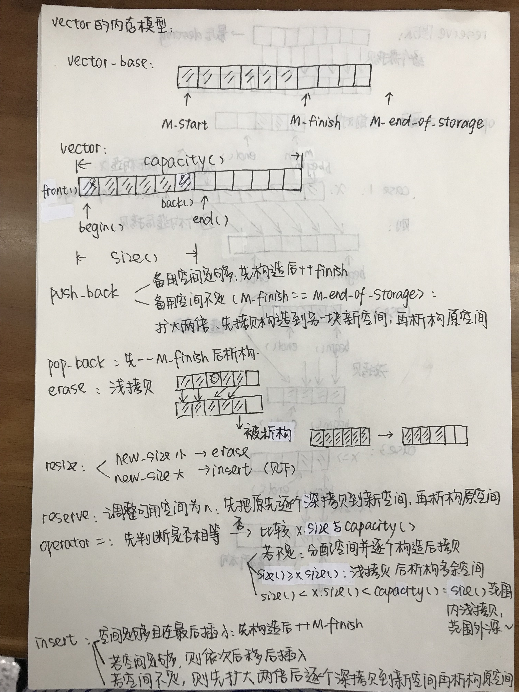
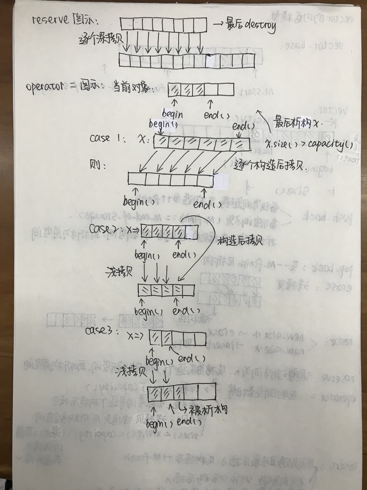
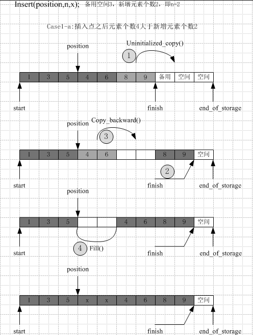
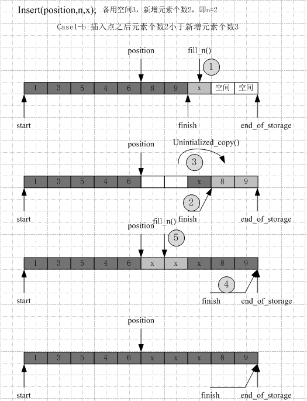
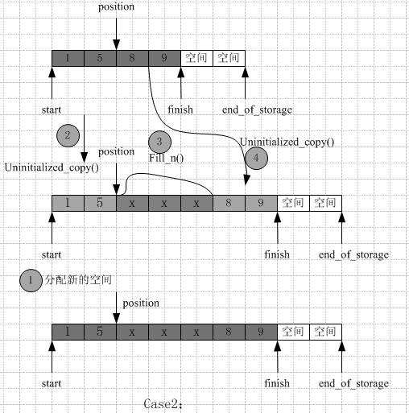

### 思考题2

Q：为什么实现了uninitialized_xxx和copy/fill这样两组不同的函数

A：uninitialized_xxx函数针对未初始化的空间，先判断传入的类型是否是POD（可以默认构造函数/拷贝构造函数/...），如果不是则逐个构造被拷贝的对象并赋值，如果是则直接调用copy/fill函数

copy/fill函数针对已初始化的空间，操作是逐个拷贝被拷贝的对象到结果空间中去

那么思考的问题就变成了为什么针对未初始化的空间需要考虑先进行构造，可不可以直接拷贝？

我的思考主要是未初始化的空间填充了垃圾数据，并且有些类不能依赖默认构造函数，比如说在类中有数组或指针这类内置类型或复合类型，默认构造时它们的值是未定义的，那我们假如我们针对这样的类进行单纯的拷贝，可能会出现把被拷贝的对象赋值到未定义的空间，很可能是非法地址上，则会导致错误。

（并不知道是否正确，只是一点想法Orz）

### 思考题3

Q： 理解每个容器的内存模型 

A：

insert函数有以下几种情况：

### 思考题1

我的考虑主要是对有含有动态分配操作的类进行不恰当的构造/析构  比如没有考虑对类内申请的内存进行正确的申请和释放 就有可能造成double free的情况  

但是没有写出poc dbq 我会跟着师傅们好好学习然后把这部分补上的！ dbqdbq不要嫌弃我...

其它学习的内容都在边抄的过程中写到注释中了