# Lab 1

## 理论部分

## Chapter2 启动、中断、异常和系统调用

### BIOS

#### 启动时计算机内存和磁盘布局

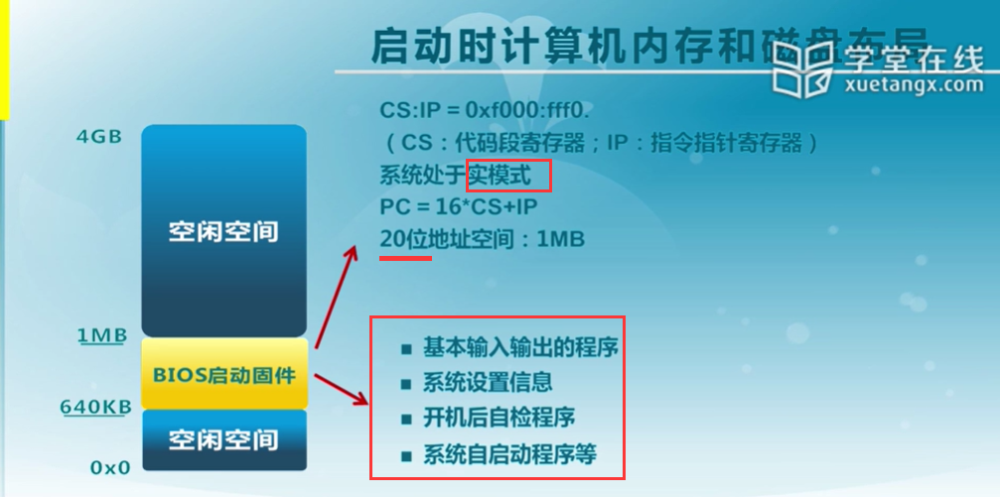

#### 加载程序的内存地址空间


磁盘上有各种各样的文件系统，无法在BIOS中包含所有的文件系统格式，为了增加文件系统的灵活性，BIOS先将加载程序从磁盘的引导扇区加载到内存，在加载程序中识别磁盘上的文件系统，然后再读内核镜像并加载到内存，最后把控制权交给操作系统内核代码。

#### BIOS系统调用

BIOS以中断调用的方式提供了基本的I/O功能：

INT 10h：字符显示

INT 13h：磁盘扇区读写

INT 15h：检测内存大小

INT 16h：键盘输入

限制：只能在X86的实模式下工作

### 系统启动流程

#### 计算机启动流程


#### CPU初始化

CPU加电稳定后从0xFFFF0读第一条指令

- CS:IP=0xF0000:FFFF0
- 第一条指令是跳转指令

CPU初始状态是16位实模式，于是：

- CS:IP是16位寄存器
- 指令指针PC=16*CS+IP
- 最大地址空间是1MB

#### BIOS初始化

- 硬件自检POST
- 检测系统中内存和显卡等关键部件的存在和工作状态
- 查找并执行显卡等接口卡BIOS，进行设备初始化
- 执行系统BIOS，进行系统检测
  - 检测和配置系统中安装的即插即用设备
- 更新CMOS中的扩展系统配置数据ESCD
- 按指定启动顺序从软盘、硬盘或者光驱启动

#### 主引导记录MBR格式


启动代码：446字节

- 检查分区表正确性
- 加载并跳转到磁盘上的引导程序

硬盘分区表：64字节

- 描述分区状态和位置
- 每个分区描述信息占据16字节

结束标志字：2字节（0x55AA)

- 主引导记录的有效标志

#### 分区引导扇区格式

跳转指令：跳转到启动代码（与平台相关）

文件卷头：文件系统描述信息

启动代码：跳转到加载程序

结束标志：55AA

#### 加载程序（bootloader)

加载程序：从文件系统中读取启动配置信息

启动菜单：可选的操作系统内核列表和加载参数

操作系统内核：依据配置加载指定内核并跳转到内核执行

#### 系统启动规范

BIOS

- 固化到计算机主板上的程序
- 包括系统设置、自检程序和系统自启动程序
- BOIS-MBR（主引导记录）、BIOS-GPT（全局唯一标识分区表，解决多于四个分区的情况）、PXE（从网络启动）

UEFI

- 接口标准
- 在所有平台上一致的操作系统启动服务
- ==>安全性问题

### 中断、异常和系统调用

#### 内核的进入与退出

内核与外界打交道的途径如下：


- 系统调用：应用程序主动向操作系统发出服务请求
- 异常：非法指令或者其他原因导致当前指令执行失败后的处理请求
- 中断：来自硬件设备的处理请求

#### 中断、异常和系统调用的比较

##### 源头

中断：外设

异常：应用程序意想不到的行为

系统调用：应用程序请求操作提供服务

##### 响应方式

中断：异步

异常：同步

系统调用：异步或者同步

##### 处理机制

中断：持续，对用户应用程序是透明的

异常：杀死或者重新执行意想不到的应用程序指令

系统调用：等待和持续

#### 中断处理机制

硬件处理：

- 在CPU初始化时设置中断使能标志
  - 依据内部或者外部事件**设置中断标志**
  - 依据中断向量**调用相应中断服务例程**

软件：

- 现场保存（编译器）
- 中断服务例程（服务例程）
- 清除中断标记（服务例程）
- 现场恢复（编译器）

#### 中断嵌套

硬件中断服务例程可以被打断：

- 不同硬件中断源可能会在硬件中断处理时出现
- 硬件中断服务例程需要临时禁止中断请求
- 中断请求会保持到CPU做出响应

异常服务例程可被打断：

- 异常服务例程执行时可能出现硬件中断

异常服务例程可嵌套：

- 异常服务例程可能出现缺页

#### 系统调用

系统调用使用INT 和 IRET 指令，用于堆栈切换和特权级的转换

函数调用使用CALL和RET指令，没有堆栈切换

##### 开销

系统调用比函数调用的开销大：

- 引导机制
- 建立内核堆栈
- 验证参数
- 内核态映射到用户态的地址空间：更新页面映射权限
- 内核态独立地址空间：TLB

系统调用的实现：

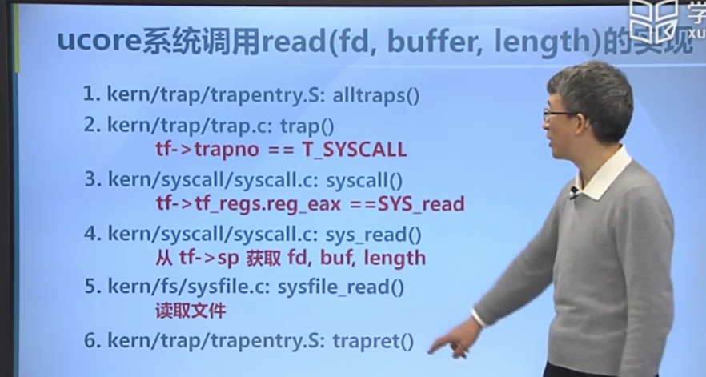

#### 课后错题

下列选项中，会导致用户进程从用户态切换到内核态的操作是（ ） 

1）整数除以0        2）sin()函数调用             3）read系统调用

答案：1、3

中断处理和子程序调用都需要压栈以保护现场。中断处理一定会保存而子程序调用不需要保存其内容的是（ ）

A. 程序计数器

B. 程序状态字寄存器 

C. 通用数据寄存器

D. 通用地址寄存器

答案：B

补充： 程序状态寄存器PSW是计算机系统的核心部件——运算器的一部分，PSW用来存放两类信息：一类是体现当前指令执行结果的各种状态信息，如有无进位（CY位），有无溢出（OV位），结果正负（SF位），结果是否为零（ZF位），奇偶标志位（P位）等；另一类是存放控制信息，如允许中断(IF位)，跟踪标志（TF位）等。

## 实验部分

### Lab 1

#### 实验目的

完成一个能够切换到X86保护模式并显示字符的bootloader，为启动操作系统ucore做准备。

lab1中包含一个bootloader和一个OS，其中bootloader：切换到X86保护模式、读磁盘并加载ELF执行文件格式、显示字符；OS：处理时钟中断、显示字符

#### 练习1

问题：

 操作系统镜像文件ucore.img是如何一步一步生成的？  (需要比较详细地解释Makefile中每一条相关命令和命令参数的含义，以及说明命令导致的结果) 

首先在lab1_result目录下执行如下命令，通过make命令生成可执行文件：

```
make V= >> make_result.txt
```

首先把当前文件夹各目录下的.c文件和.s文件编译生成相应的.o文件，具体文件有：

```
kern/init/init.c
kern/libs/stdio.c
kern/libs/readline.c
kern/debug/panic.c
kern/debug/kdebug.c
kern/debug/kmonitor.c
kern/driver/clock.c
kern/driver/console.c
kern/driver/picirq.c
kern/driver/intr.c
kern/trap/trap.c
kern/trap/vectors.S
kern/trap/trapentry.S
kern/mm/pmm.c
libs/string.c
libs/printfmt.c
```

执行的命令例如：

```makefile
+ cc kern/init/init.c
gcc -Ikern/init/ -fno-builtin -Wall -ggdb -m32 -gstabs -nostdinc  -fno-stack-protector -Ilibs/ -Ikern/debug/ -Ikern/driver/ -Ikern/trap/ -Ikern/mm/ -c kern/init/init.c -o obj/kern/init/init.o
```

以及：

```
+ cc kern/trap/vectors.S
gcc -Ikern/trap/ -fno-builtin -Wall -ggdb -m32 -gstabs -nostdinc  -fno-stack-protector -Ilibs/ -Ikern/debug/ -Ikern/driver/ -Ikern/trap/ -Ikern/mm/ -c kern/trap/vectors.S -o obj/kern/trap/vectors.o
```

相关参数：

-Idir：使用-I 指定目录，在`#include "file"`的时候会先在dir目录下查找file，如果查找不到则到系统缺省的头文件目录查找

-fno-builtin：无法识别不以`__builtin_`作为前缀的内置函数，防止内核代码函数名与内置函数名冲突

-Wall：显示所有的编译警告

-ggdb：令gcc为gdb生成专用的更为丰富的调试信息

-m32：生成32位

-gstabs：以stabs格式声称调试信息，但是不包括gdb调试信息

-nostdinc：使编译器不在系统缺省的头文件目录中找头文件，与-Idir选项一起使用，明确限定了头文件的位置

-fno-stack-protector：禁用栈保护措施

-c：只做预处理、编译和汇编，只生成obj目标文件

-o：指定生成的输出文件

随后，指定`tools/kernel.ld`脚本文件链接上面生成的所有目标文件，生成 bin/kernel 内核文件

```
+ ld bin/kernel
ld -m    elf_i386 -nostdlib -T tools/kernel.ld -o bin/kernel  obj/kern/init/init.o obj/kern/libs/stdio.o obj/kern/libs/readline.o obj/kern/debug/panic.o obj/kern/debug/kdebug.o obj/kern/debug/kmonitor.o obj/kern/driver/clock.o obj/kern/driver/console.o obj/kern/driver/picirq.o obj/kern/driver/intr.o obj/kern/trap/trap.o obj/kern/trap/vectors.o obj/kern/trap/trapentry.o obj/kern/mm/pmm.o  obj/libs/string.o obj/libs/printfmt.o
```

相关参数：

-m：模拟指定的链接器

-nostdlib：不链接系统标准启动文件和标准库文件，只把指定的文件传递给链接器

-T：从指定的命令文件读取命令

-o：指定输出文件的名称

接着使用gcc命令将bootasm.S、bootmain.c、sign.c文件生成相应的目标文件，将生成的sign.o文件生成可执行文件bin/sign，随后将bootasm.o文件和bootmain.o文件链接生成bootblock.o文件

```
+ cc boot/bootasm.S
gcc -Iboot/ -fno-builtin -Wall -ggdb -m32 -gstabs -nostdinc  -fno-stack-protector -Ilibs/ -Os -nostdinc -c boot/bootasm.S -o obj/boot/bootasm.o
+ cc boot/bootmain.c
gcc -Iboot/ -fno-builtin -Wall -ggdb -m32 -gstabs -nostdinc  -fno-stack-protector -Ilibs/ -Os -nostdinc -c boot/bootmain.c -o obj/boot/bootmain.o
+ cc tools/sign.c
gcc -Itools/ -g -Wall -O2 -c tools/sign.c -o obj/sign/tools/sign.o
gcc -g -Wall -O2 obj/sign/tools/sign.o -o bin/sign
+ ld bin/bootblock
ld -m    elf_i386 -nostdlib -N -e start -Ttext 0x7C00 obj/boot/bootasm.o obj/boot/bootmain.o -o obj/bootblock.o
'obj/bootblock.out' size: 500 bytes
build 512 bytes boot sector: 'bin/bootblock' success!
```

补充ld命令的相关参数：

-N：指定读取/写入文本和数据段  

-e： 使用指定的符号作为程序的初始执行点  ，这里是start

-Ttext：使用指定的地址作为text段（代码段）的起始点，这里是0x7C00

最后，使用dd命令生成最终的ucore.img镜像文件：

```
dd if=/dev/zero of=bin/ucore.img count=10000
dd if=bin/bootblock of=bin/ucore.img conv=notrunc
dd if=bin/kernel of=bin/ucore.img seek=1 conv=notrunc
```

相关参数说明：

if=file：输入文件名， 从file读取。/dev/zero设备无穷尽地提供0。
of=file：输出文件名， 向file写出，可以写文件，可以写裸设备。
seek=blocks ：从输出文件开头跳过 blocks 个块后再开始复制。
count=blocks ：仅拷贝 blocks 个块
conv=conversion：用指定的参数转换文件

所以，这三条dd命令是先用10000个块的空字符填充ucore.img，每个块的大小为512字节，所以共5120000B。随后把bootblock文件复制到ucore.img的文件头处，共512B大小。最后把kernel文件复制到第一个块后的文件位置处，也就是512B之后，notrunc模式表示不会缩减输出文件，只复制指定字节并保留输出文件的剩余部分。

问题：

一个被系统认为是符合规范的硬盘主引导扇区的特征是什么？

sign程序将bootblock.o文件添加主引导扇区标志：

```C
#include <stdio.h>
#include <errno.h>
#include <string.h>
#include <sys/stat.h>

int
main(int argc, char *argv[]) {
    struct stat st;
    if (argc != 3) {
        fprintf(stderr, "Usage: <input filename> <output filename>\n");
        return -1;
    }
    if (stat(argv[1], &st) != 0) {
        fprintf(stderr, "Error opening file '%s': %s\n", argv[1], strerror(errno));
        return -1;
    }
    printf("'%s' size: %lld bytes\n", argv[1], (long long)st.st_size);
    if (st.st_size > 510) {
        fprintf(stderr, "%lld >> 510!!\n", (long long)st.st_size);
        return -1;
    }
    char buf[512];
    memset(buf, 0, sizeof(buf));
    FILE *ifp = fopen(argv[1], "rb");
    int size = fread(buf, 1, st.st_size, ifp);
    if (size != st.st_size) {
        fprintf(stderr, "read '%s' error, size is %d.\n", argv[1], size);
        return -1;
    }
    fclose(ifp);
    buf[510] = 0x55;
    buf[511] = 0xAA;
    FILE *ofp = fopen(argv[2], "wb+");
    size = fwrite(buf, 1, 512, ofp);
    if (size != 512) {
        fprintf(stderr, "write '%s' error, size is %d.\n", argv[2], size);
        return -1;
    }
    fclose(ofp);
    printf("build 512 bytes boot sector: '%s' success!\n", argv[2]);
    return 0;
}
```

可以看到读取输入文件（小于等于510字节），随后将第511和512字节设置为0x55AA。

#### 练习2

问题：                                                                                                                          

1. 从CPU加电后执行的第一条指令开始，单步跟踪BIOS的执行。
2. 在初始化位置0x7c00设置实地址断点,测试断点正常。
3. 从0x7c00开始跟踪代码运行,将单步跟踪反汇编得到的代码与bootasm.S和 bootblock.asm进行比较。

根据实验提示，需要我们尝试执行：

```
make lab1-mon
```

我们先使用：

```
less Makefile
```

命令查看lab1-mon执行的是什么命令，可以看到：

```makefile
$(UCOREIMG)
$(V)$(TERMINAL) -e "$(QEMU) -S -s -d in_asm -D $(BINDIR)/q.log -monitor stdio -hda $< -serial null"
$(V)sleep 2
$(V)$(TERMINAL) -e "gdb -q -x tools/lab1init"
```

lab1init的内容如下：

```
file bin/kernel
target remote :1234
set architecture i8086
b *0x7c00
continue
x /2i $pc
```

但是，我尝试执行`make lab1-mon`会报错，原因应该是gnome-terminal出现问题，所以手动输入命令调试，首先从CPU加电后执行的第一条指令开始，单步跟踪BIOS的执行：

可以看到第一条是跳转指令：

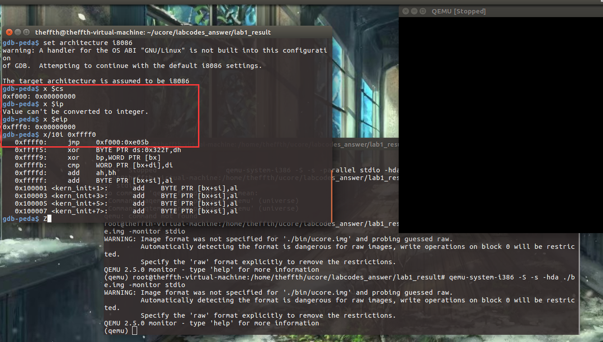

接着执行BIOS代码，将加载程序从磁盘的引导扇区加载到0x7c00，在初始化位置0x7c00设置实地址断点,测试断点正常：

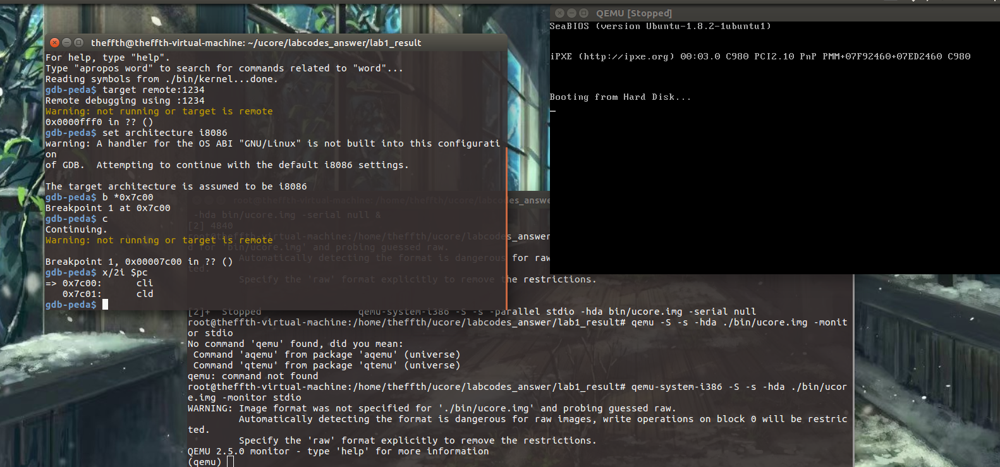

从0x7c00开始跟踪代码运行，将单步跟踪反汇编得到的代码与bootasm.S和 bootblock.asm进行比较：

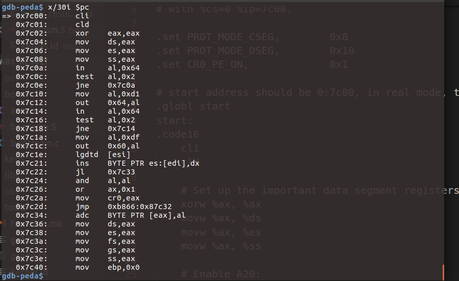

可以看到从0x7c00开始执行的代码与bootasm.S和bootblock.asm中的汇编代码相同：

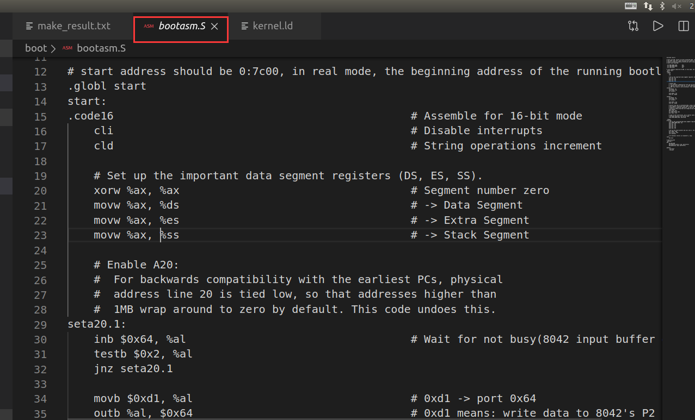

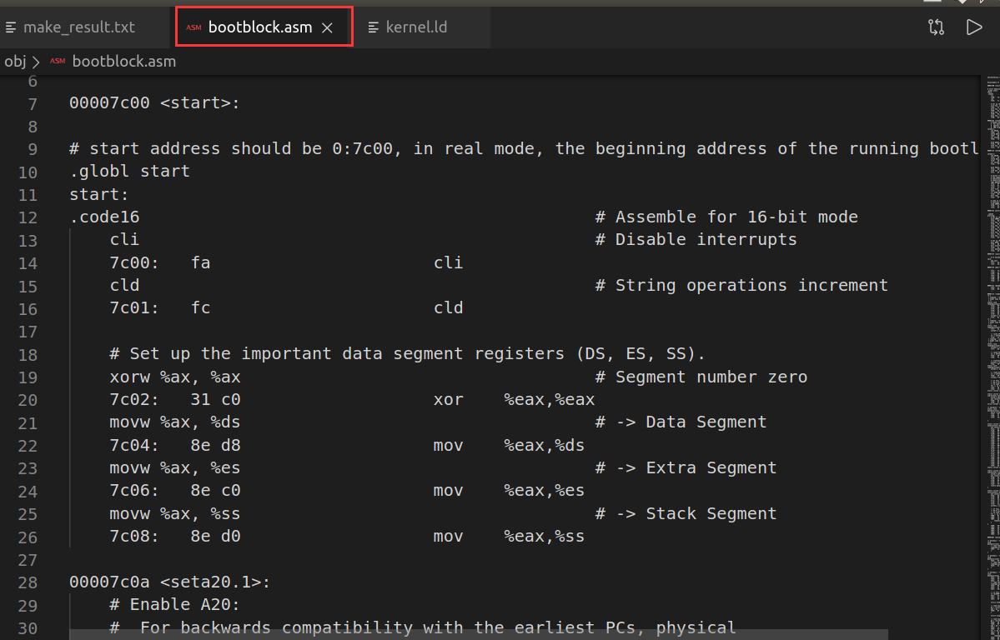

#### 练习3

实验内容：分析bootloader进入保护模式的过程

背景知识：参考资料“保护模式和分段机制”一节

此练习需要我们重点分析bootasm.S文件中16-56行代码：

bootloader从start汇编代码段开始执行，首先关闭中断，初始化DS、ES、SS寄存器的内容为0：

```assembly
.globl start
start:
.code16                                             # Assemble for 16-bit mode
    cli                                             # 关闭中断
    cld                                             # 字串操作由前往后递增处理

    # 设置重要的数据段寄存器（DS，ES，SS）内容为0
    xorw %ax, %ax                                   # eax寄存器内容为0
    movw %ax, %ds                                   # -> Data Segment
    movw %ax, %es                                   # -> Extra Segment
    movw %ax, %ss                                   # -> Stack Segment
```

为何开启A20，以及如何开启A20？

背景知识：参考附录“关于A20 Gate”

在保护模式下，由于使用32位地址线，如果A20恒等于0，那么系统只能访问奇数兆的内存，即只能访问0--1M、2-3M、4-5M......为了避免这种情况的发生，必须开启A20。

开启A20的步骤是：

- 等待8042 Input buffer为空；    

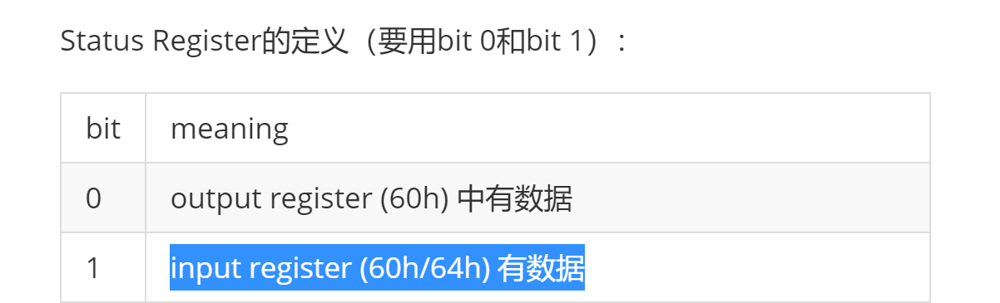

- 发送Write 8042 Output Port （P2）命令到8042 Input buffer；

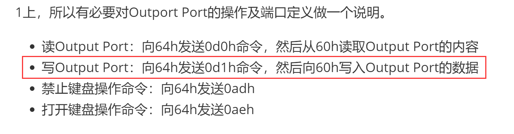

- 等待8042 Input buffer为空；
- 将8042 Output Port（P2）得到字节的第2位置1，然后写入8042 Input buffer

具体代码如下：

```assembly
    # 开启A20，取消回卷操作
seta20.1:
    inb $0x64, %al                            #读Status Register到al寄存器
    testb $0x2, %al                           #判断input buffer是否为空
    jnz seta20.1

    movb $0xd1, %al                           # 0xd1 -> port 0x64
    outb %al, $0x64                           # 0xd1 means: write data to 8042's P2 port

seta20.2:
    inb $0x64, %al                          # Wait for not busy(8042 input buffer empty).
    testb $0x2, %al
    jnz seta20.2

    movb $0xdf, %al             # 0xdf -> port 0x60
    outb %al, $0x60             # 0xdf = 11011111, means set P2's A20 bit(the 1 bit) to 1
```

如何初始化GDT表？

asm.h文件中关于段描述符的初始化：

```c
#define SEG_NULLASM                                             \
    .word 0, 0;                                                 \
    .byte 0, 0, 0, 0

#define SEG_ASM(type,base,lim)                                  \
    .word (((lim) >> 12) & 0xffff), ((base) & 0xffff);          \
    .byte (((base) >> 16) & 0xff), (0x90 | (type)),             \
        (0xC0 | (((lim) >> 28) & 0xf)), (((base) >> 24) & 0xff)

/* Application segment type bits */
#define STA_X       0x8     // Executable segment
#define STA_E       0x4     // Expand down (non-executable segments)
#define STA_C       0x4     // Conforming code segment (executable only)
#define STA_W       0x2     // Writeable (non-executable segments)
#define STA_R       0x2     // Readable (executable segments)
#define STA_A       0x1     // Accessed
```

```assembly
# Bootstrap GDT
.p2align 2                                          # 强制4字节对齐
gdt:
    SEG_NULLASM                                     # 空段
    SEG_ASM(STA_X|STA_R, 0x0, 0xffffffff)           # code seg for bootloader and kernel
    SEG_ASM(STA_W, 0x0, 0xffffffff)                 # data seg for bootloader and kernel

gdtdesc:
    .word 0x17                                      # sizeof(gdt) - 1
    .long gdt                                       # address gdt
```

```assembly
lgdt gdtdesc                                        #加载全局描述符
```

如何使能和进入保护模式？

使能：

CR0寄存器是系统内的控制寄存器之一。0位是保护使能位PE(Protedted Enable)，用于启动保护模式，如果PE位置1，则保护模式启动，如果PE=0，则在实模式下运行。 

```assembly
    movl %cr0, %eax
    orl $CR0_PE_ON, %eax
    movl %eax, %cr0
```

进入保护模式：

```assembly
    # Jump to next instruction, but in 32-bit code segment.
    # Switches processor into 32-bit mode.
    ljmp $PROT_MODE_CSEG, $protcseg
```

```assembly
.set PROT_MODE_CSEG,        0x8                     # kernel code segment selector
.set PROT_MODE_DSEG,        0x10                    # kernel data segment selector
.set CR0_PE_ON,             0x1                     # protected mode enable flag
```

```assembly
.code32                                             # Assemble for 32-bit mode
protcseg:
    # Set up the protected-mode data segment registers
    movw $PROT_MODE_DSEG, %ax                       # Our data segment selector
    movw %ax, %ds                                   # -> DS: Data Segment
    movw %ax, %es                                   # -> ES: Extra Segment
    movw %ax, %fs                                   # -> FS
    movw %ax, %gs                                   # -> GS
    movw %ax, %ss                                   # -> SS: Stack Segment

    # Set up the stack pointer and call into C. The stack region is from 0--start(0x7c00)
    movl $0x0, %ebp
    movl $start, %esp
    call bootmain

    # If bootmain returns (it shouldn't), loop.
spin:
    jmp spin
```

#### 练习4

分析bootloader加载ELF格式的OS的过程

问题： bootloader如何读取硬盘扇区的？ 

参考资料：“硬盘访问概述”一节

读一个扇区的流程（可参看boot/bootmain.c中的readsect函数实现）大致如下：

1. 等待磁盘准备好
2. 发出读取扇区的命令
3. 等待磁盘准备好
4. 把磁盘扇区数据读到指定内存

具体代码如下：

```C
/* waitdisk - wait for disk ready */
static void
waitdisk(void) {
    while ((inb(0x1F7) & 0xC0) != 0x40)
        /* do nothing */;
}

/* readsect - read a single sector at @secno into @dst */
static void
readsect(void *dst, uint32_t secno) {
    // wait for disk to be ready
    waitdisk();

    outb(0x1F2, 1);                            // 读取一个扇区
    outb(0x1F3, secno & 0xFF);                 // 设置LBA模式的参数
    outb(0x1F4, (secno >> 8) & 0xFF);
    outb(0x1F5, (secno >> 16) & 0xFF);
    outb(0x1F6, ((secno >> 24) & 0xF) | 0xE0); // 选择主盘
    outb(0x1F7, 0x20);                         // cmd 0x20 - read sectors

    // wait for disk to be ready
    waitdisk();

    // read a sector
    /* static inline void insl(uint32_t port, void *addr, int cnt)
     * __attribute__((always_inline));
     */
    insl(0x1F0, dst, SECTSIZE / 4);
}
```

问题： bootloader是如何加载ELF格式的OS？ 

kernel文件格式信息如下：

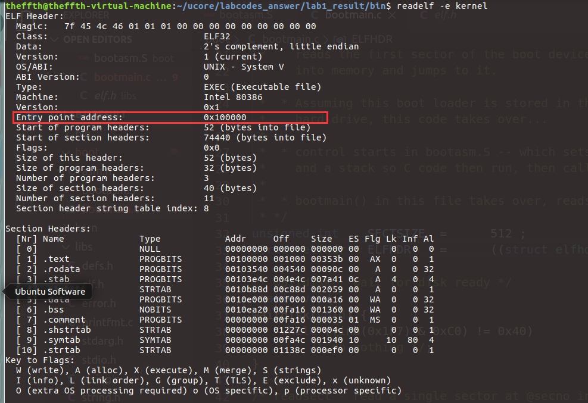

程序头信息如下:

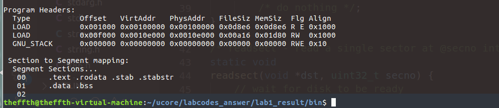

具体代码如下：

```C
/* bootmain - the entry of bootloader */
void
bootmain(void) {
    // 从硬盘0开始读取4KB（一页）到虚拟地址0x10000地址处
    readseg((uintptr_t)ELFHDR, SECTSIZE * 8, 0);

    // 检查ELF文件头的魔数，判断是否是合法的ELF文件
    if (ELFHDR->e_magic != ELF_MAGIC) {
        goto bad;
    }

    struct proghdr *ph, *eph;

    // load each program segment (ignores ph flags)
    ph = (struct proghdr *)((uintptr_t)ELFHDR + ELFHDR->e_phoff);//找到程序头表指针
    eph = ph + ELFHDR->e_phnum;  //找到程序头表尾指针
    for (; ph < eph; ph ++) {
        //把每一个段都加载到内存中
        readseg(ph->p_va & 0xFFFFFF, ph->p_memsz, ph->p_offset);
    }

    // 跳转到程序入口地址处开始执行,没有返回值
    ((void (*)(void))(ELFHDR->e_entry & 0xFFFFFF))();

bad:
    outw(0x8A00, 0x8A00);
    outw(0x8A00, 0x8E00);
    /* do nothing */
    while (1);
}
```

#### 练习5

实现函数调用堆栈跟踪函数

参考资料：“函数堆栈”一节

具体实现代码如下：

```C
void
print_stackframe(void) {
     /* LAB1 YOUR CODE : STEP 1 */
     /* (1) call read_ebp() to get the value of ebp. the type is (uint32_t);
      * (2) call read_eip() to get the value of eip. the type is (uint32_t);
      * (3) from 0 .. STACKFRAME_DEPTH
      *    (3.1) printf value of ebp, eip
      *    (3.2) (uint32_t)calling arguments [0..4] = the contents in address (unit32_t)ebp +2 [0..4]
      *    (3.3) cprintf("\n");
      *    (3.4) call print_debuginfo(eip-1) to print the C calling function name and line number, etc.
      *    (3.5) popup a calling stackframe
      *           NOTICE: the calling funciton's return addr eip  = ss:[ebp+4]
      *                   the calling funciton's ebp = ss:[ebp]
      */
    uint32_t ebp=read_ebp();
    uint32_t eip=read_eip();
    for(int i=0;i<STACKFRAME_DEPTH&&ebp!=0;i++){
        cprintf("ebp:0x%08x eip:0x%08x",ebp,eip);
        cprintf(" arg:0x%08x 0x%08x 0x%08x 0x%08x",((uint32_t*)ebp)[2],((uint32_t*)ebp)[3],((uint32_t*)ebp)[4]);
        cprintf("\n");
        print_debuginfo(eip-1);
        eip=((uint32_t*)ebp)[1];
        ebp=((uint32_t*)ebp)[0];
	}
}
```

运行结果：

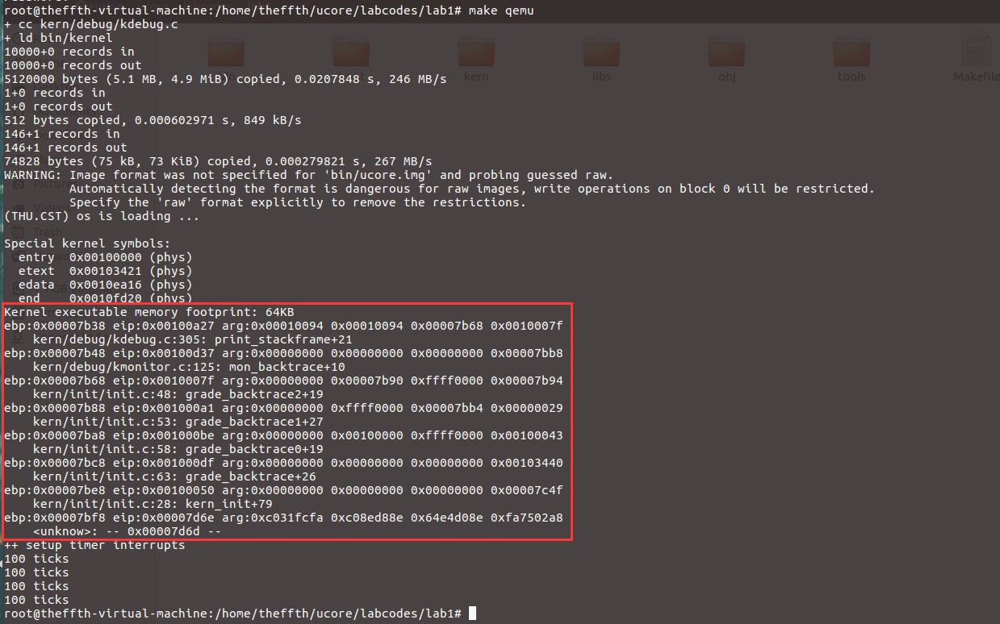

最后一行数值的含义：

由于BIOS加载bootloader代码到0x7c00地址处，所以0x7c00-开始为代码段，0x7c00-0为栈空间，一开始执行0x7c00处代码，没有参数，所以追踪到最后一个看到ebp的地址为0x7bf8（=0x7c00-8），参数为0x7c00地址开始的代码段的内容，也即0xc031fcfa...：

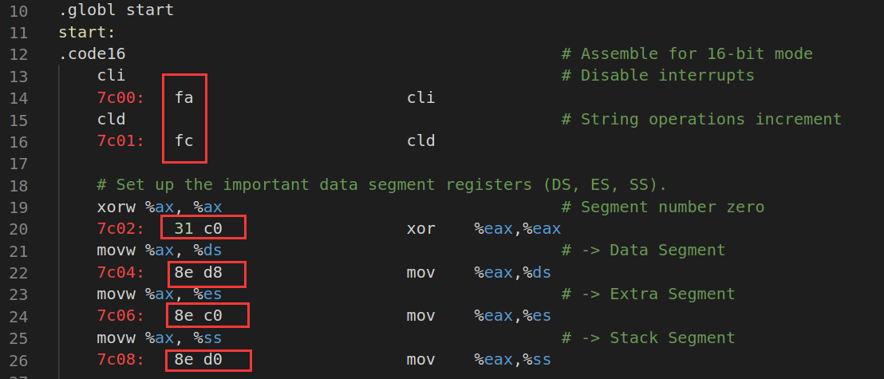

#### 练习6

完善中断初始化和处理 （需要编程） 

参考资料：“中断与异常”一节

问题：中断描述符表（也可简称为保护模式下的中断向量表）中一个表项占多少字节？其中哪几位代表中断处理代码的入口？  

中断描述符结构如下：

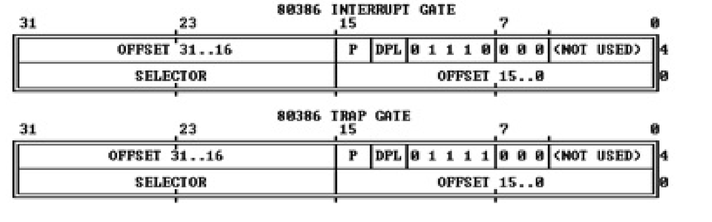

中断描述符表中一个表项占8字节，其中SELECTOR作为段选择子，段选择子从GDT中取得相应的段描述符，段描述符里保存了中断服务例程的段基址和属性信息，将段基址与中断描述符中的OFFSET偏移量相加即得到中断处理代码的入口地址。 

具体代码如下：

```C
// /kern/mm/mmu.h
/* Gate descriptors for interrupts and traps */
struct gatedesc {
    unsigned gd_off_15_0 : 16;        // low 16 bits of offset in segment
    unsigned gd_ss : 16;            // segment selector
    unsigned gd_args : 5;            // # args, 0 for interrupt/trap gates
    unsigned gd_rsv1 : 3;            // reserved(should be zero I guess)
    unsigned gd_type : 4;            // type(STS_{TG,IG32,TG32})
    unsigned gd_s : 1;                // must be 0 (system)
    unsigned gd_dpl : 2;            // descriptor(meaning new) privilege level
    unsigned gd_p : 1;                // Present
    unsigned gd_off_31_16 : 16;        // high bits of offset in segment
};
```

问题：编程完善kern/trap/trap.c中对中断向量表进行初始化的函数idt_init。在idt_init函数中， 依次对所有中断入口进行初始化。使用mmu.h中的SETGATE宏，填充idt数组内容。每个中断的入口由tools/vectors.c生成，使用trap.c中声明的vectors数组即可。

 具体实现如下：

```C
/* idt_init - initialize IDT to each of the entry points in kern/trap/vectors.S */
void
idt_init(void) {
     /* LAB1 YOUR CODE : STEP 2 */
     /* (1) Where are the entry addrs of each Interrupt Service Routine (ISR)?
      *     All ISR's entry addrs are stored in __vectors. where is uintptr_t __vectors[] ?
      *     __vectors[] is in kern/trap/vector.S which is produced by tools/vector.c
      *     (try "make" command in lab1, then you will find vector.S in kern/trap DIR)
      *     You can use  "extern uintptr_t __vectors[];" to define this extern variable which will be used later.
      * (2) Now you should setup the entries of ISR in Interrupt Description Table (IDT).
      *     Can you see idt[256] in this file? Yes, it's IDT! you can use SETGATE macro to setup each item of IDT
      * (3) After setup the contents of IDT, you will let CPU know where is the IDT by using 'lidt' instruction.
      *     You don't know the meaning of this instruction? just google it! and check the libs/x86.h to know more.
      *     Notice: the argument of lidt is idt_pd. try to find it!
      */
    extern uintptr_t __vectors[];
    //define SETGATE(gate, istrap, sel, off, dpl)
    //先全部初始化为interrupt-gate descriptor
    for(int i=0;i<256;i++)
    {
        SETGATE(idt[i],0,GD_KTEXT,__vectors[i],DPL_KERNEL);
    }
    //初始化从用户态到内核态的trap-gate descriptor
    //istrap==0 ?
    SETGATE(idt[T_SWITCH_TOK], 0 ,GD_KTEXT,__vectors[T_SWITCH_TOK],DPL_USER);
    lidt(&idt_pd);
}
```

首先声明__vectors数组，其数值由tools/vectors.c工具生成，具体在vector.S文件中：

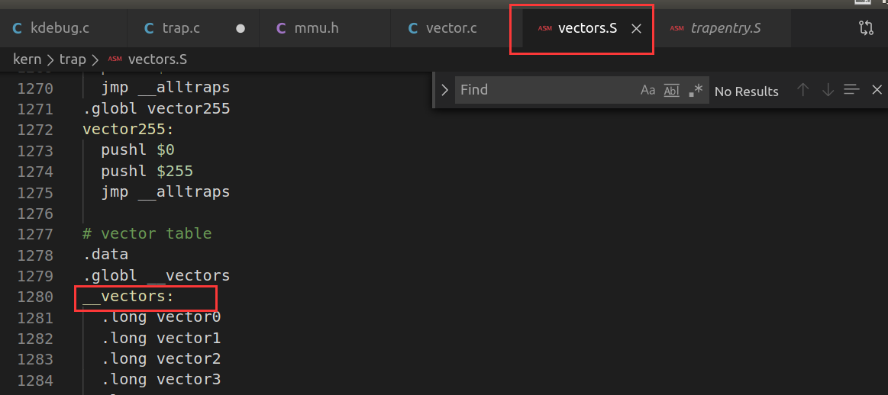

数组存储了中断入口地址中的偏移量部分，随后利用mmu.h文件中SETGATE函数来初始化idt表中的每一项，首先全部初始化为interrupt-gate描述符，则idt目标项地址为idt[i]，istrap=0，处理例程在内核态，代码段选择子为内核代码段，dpl为0；随后再设置trap-gate，最后使用lidt指令把idt的起始地址加载到IDTR寄存器中。

问题：编程完善trap.c中的中断处理函数trap，在对时钟中断进行处理的部分填写trap函数中处理时钟中断的部分，使操作系统每遇到100次时钟中断后，调用print_ticks子程序，向屏幕上打印一行文字”100 ticks”。

具体实现如下：

```C
    switch (tf->tf_trapno) {
    case IRQ_OFFSET + IRQ_TIMER:
        /* LAB1 YOUR CODE : STEP 3 */
        /* handle the timer interrupt */
        /* (1) After a timer interrupt, you should record this event using a global variable (increase it), such as ticks in kern/driver/clock.c
         * (2) Every TICK_NUM cycle, you can print some info using a funciton, such as print_ticks().
         * (3) Too Simple? Yes, I think so!
         */
        ticks++;
        if(ticks%TICK_NUM==0) print_ticks();
        break;
     //......
```

#### 扩展练习

#### 总结

通过lab1，我主要学习到了ucore项目的文件组成，镜像的生成过程。CPU加电后，到固定地址0xffff0处执行BIOS代码，BIOS加载bootloader代码到0x7c00地址处，bootloader加载程序首先进入保护模式，随后加载ELF格式的OS代码，也就是/bin/kernel文件。