# Lab 2

## 理论部分

### 物理内存管理：连续内存分配

#### 计算机体系结构和内存层次

计算机体系结构

- CPU:

- 内存：最小访问单位是8bit=1B

操作系统内存管理的目的

- 抽象：逻辑地址空间
- 保护：独立地址空间
- 共享：访问相同地址空间
- 虚拟化：更大地址空间

操作系统的内存管理方式

- 重定位
- 分段
- 分页
- 虚拟存储

#### 地址空间和地址生成

##### 地址空间定义

物理地址空间：硬件支持的地址空间

- 起始地址0，直到MAXsys（32位：0-4G-1）

逻辑地址空间：在CPU运行的进程看到的地址

- 起始地址为0，直到MAXprog

##### 地址生成时机和限制

- 编译时
  - 假设起始地址已知
  - 如果起始地址改变，必须重新编译
  - 例子：功能手机（老年机）
- 加载时
  - 编译时起始位置未知，编译器需要生成可重定位的代码
  - 加载时，生成绝对地址
  - 例子：智能手机
- 执行时
  - 执行时代码可移动
  - 需要地址转换的硬件支持
  - 例子：含有虚拟存储的系统

##### 地址生成过程

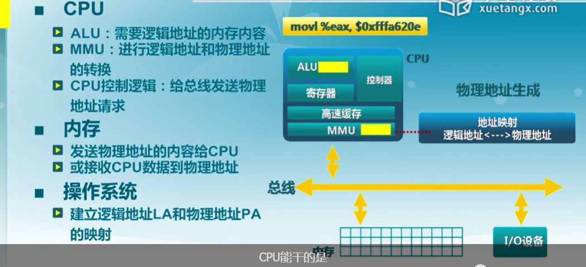

##### 地址检查


#### 连续内存分配

##### 内存碎片

连续内存分配：给进程分配一块不小于指定大小的连续的物理内存区域

内存碎片：空闲碎片不能被利用

- 外部碎片：分配单元之间的未被使用内存
- 内部碎片：分配单元内部的未被使用内存，取决于分配单元是否要取整

##### 动态分区分配

当程序被加载执行时，分配一个进程指定大小可变的分区（块、内存块），分区的地址是连续的

操作系统需要维护的数据结构：

- 所有进程的已分配分区
- 空闲分区：位置、大小

动态分区分配策略：

- 最先匹配（first-fit）
- 最佳匹配（best-fit）
- 最差匹配（last-fit）

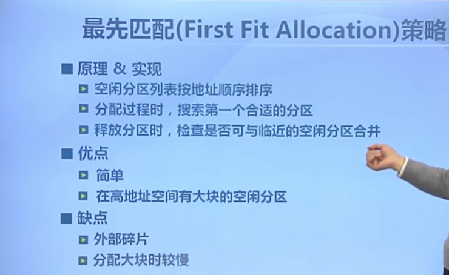


#### 碎片整理

通过调整进程占用的分区位置来减少或者避免分区碎片

碎片紧凑：

- 通过移动分配给进程的内存分区，以合并外部碎片
- 条件：所有的应用程序都是可动态重定位
- 需要考虑开销

分区对换：

- 通过抢占并回收处于等待状态进程的分区，以增大可用的内存空间
- 需要考虑交换哪个程序到外存？

#### 伙伴系统（Buddy System）

整个可分配的分区大小为2^u，当需要的分区大小为2^u-1<s≤2^u时，把整个块分配给该进程

- 如果s≤2^(i-1)-1，将大小为2^i的当前空闲分区划分为两个大小为2^(i-1)-1的空闲分区
- 重复划分过程，直到2^(i-1)<s<2^i，并把一个空闲分区分配给该进程

释放过程：

- 把释放的块放入空闲块数组
- 合并满足合并条件的空闲块，其中合并条件：大小相同2^i、地址相邻、起始地址较小的块的起始地址必须是2(i+1)的倍数

实例：Unix、Linux系统中内核存储分配

内碎片的最大为：2^s-1

伙伴系统的实现：

- 数据结构
  - 空闲块按大小和起始地址组织成二维数组
  - 初始状态：只有一个大小为2^u的空闲块
- 分配过程
  - 由小到大在空闲块数组中找最小的可用空闲块
  - 如果空闲块过大，对可用空闲块进行二等分，直到找到合适的可用空闲块

#### 课后错题

1.在使能分页机制的情况下，更合适的外碎片整理方法是( )

A.紧凑(compaction)

B.分区对换(Swapping in/out)

**C.都不是**

2.描述伙伴系统(Buddy System)特征正确的是()

**A.多个小空闲空间可合并为大的空闲空间**

**B.会产生外碎片**

**C.会产生内碎片**

D.都不对

解析：在伙伴系统中当空闲块满足一定条件时，多个小空闲空间可以合并成大的空闲空间；由于每次二分分配，可能会产生外碎片；由于每次分配的内存空间大小是2的整数幂，可能会产生内碎片

### 物理内存管理：非连续内存分配

#### 非连续分配的设计目标

连续分配的缺点：

- 分配给程序的物理内存必须连续
- 存在外碎片和内碎片
- 内存分配的动态修改困难
- => 内存利用率较低

非连续分配的设计目标：提高内存利用效率和管理灵活性

- 允许一个程序的使用非连续的物理地址空间
- 允许共享代码与数据
- 支持动态加载和动态链接

#### 段式存储管理

进程的段地址空间由多个段组成：

- 主代码段
- 子模块代码段
- 公用库代码段
- 堆栈段
- 堆数据
- 初始化数据段
- 符号表

更细粒度和灵活的分离与共享

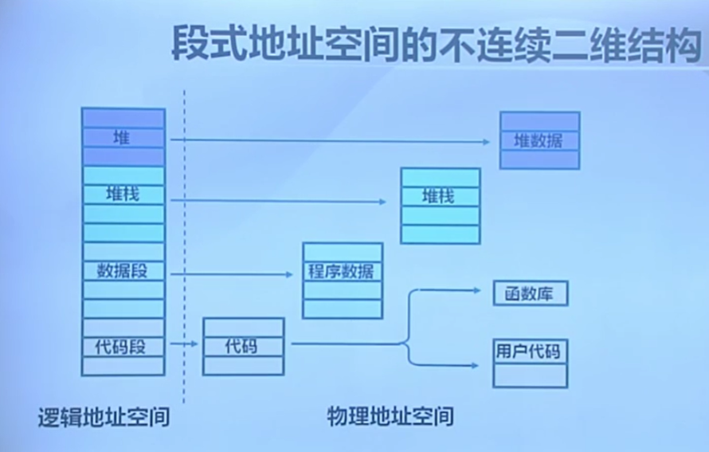

段的概念：

- 段表示访问方式和存储数据等属性相同的一段地址空间
- 对应一个连续的内存块
- 若干个段组成进程逻辑地址空间

段访问：逻辑地址由二元组(s,addr)表示

- s：段号
- addr：段内偏移

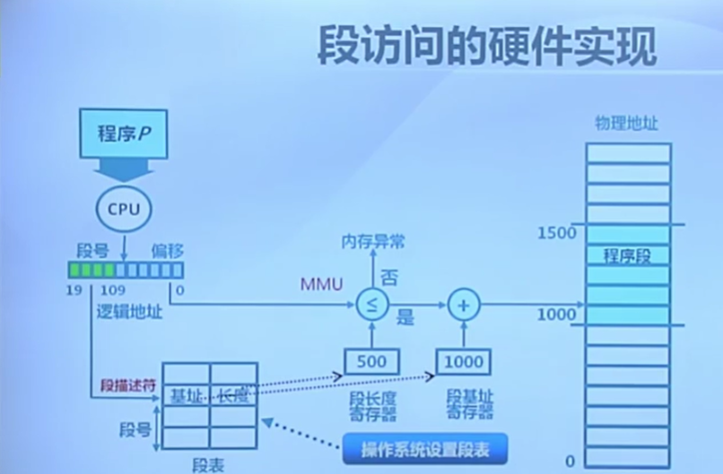

#### 页式存储管理

页帧： Frame

把物理地址空间划分为大小相同的基本分配单位（2的n次方）

页面：Page

把逻辑地址空间划分为相同大小的基本分配单位

=> 帧和页的大小必须是相同的

##### 帧（Frame）

内存物理地址的表示：二元组(f,o)

f：帧号（F位）  o：帧内偏移（S位）      物理地址=f*2^S+o

##### 页（Page）

进程逻辑地址的表示：二元组(p,o)

p：页号（P位）  o：页内偏移（S位）      虚拟地址=p*2^S+o

页内偏移=帧内偏移

通常：页号大小≠帧号大小

##### 页式存储中的地址映射

页到帧的映射

逻辑地址中的页号是连续的

物理地址中的帧号是不连续的

不是所有的页都有对应的帧

页表：保存了逻辑地址到物理地址之间的映射关系

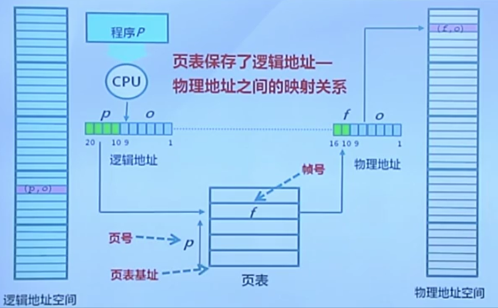

#### 页表

每个进程都有一个页表

- 每个页面对应一个页表项
- 随进程运行状态而动态变化
- 存放在页表基址寄存器（PTBR）

页表项组成：

- 帧号f
- 页表项标志：
  - 存在位：该页面是否有对应的物理页帧
  - 修改位
  - 引用位

##### 页式存储管理机制的性能问题

内存访问性能：访问一个内存单元需要2次内存访问（访问页表项和数据）

页表大小问题：页表可能非常大

如何处理？

- 缓存
- 间接访问

#### 快表和多级页表

对应于上述的两种解决方式，出现了快表和多级页表。

##### 快表TLB（Translation Look-aside Buffer）

缓存近期访问的页表项：

- TLB 使用关联存储实现，具备快速访问性能
- 如果TLB命中，物理页号可以很快被获取
- 如果TLB未命中，对应的表项被更新到TLB中

##### 多级页表

通过间接引用将页号分为k级：

- 建立页表“树”
- 减少每级页表的长度

访问次数：K+1次

访问过程：

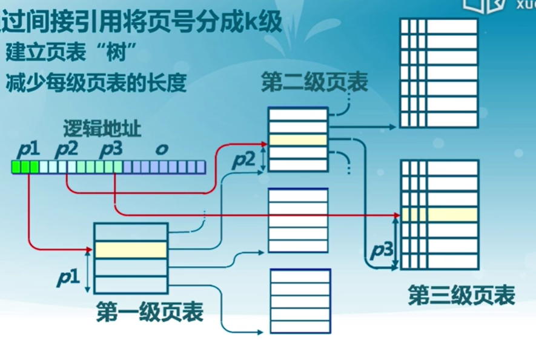

#### 反置页表

对用大地址空间（64-bit）系统，多级页表变得繁琐（访问内存次数大），逻辑地址空间增长速度快于物理地址空间

=> 页寄存器和反置页表：让页表与物理地址空间的大小相对应

每个帧与一个页寄存器关联，包括：

- 使用位：此帧是否被进程占用
- 占用页号：对应的页号p
- 保护位

页寄存器方案的特征:

- 优点：
  - 页表大小相对于物理内存而言比较小
  - 页表大小与逻辑地址空间大小无关
- 缺点：
  - 页表信息对调之后，需要依据帧号找对应的页号
  - 在页寄存器中搜索逻辑地址中的页号

 页寄存器机制中的地址转换：

- 对逻辑地址进行Hash映射，减少搜索范围
- 需要解决可能的冲突

用快表缓存页表项后的页寄存器搜索：

- 对逻辑地址进行Hash变换
- 在快表中查找对应的页表项
- 在有冲突时遍历冲突项链表
- 查找失败时，产生异常
- 受快表的容量和功耗限制

反置页表：基于Hash映射值查找对应页表项中的帧号，与页寄存器机制不同的是加入了进程表示PID一起做Hash，在快表中查找到符合的Hash值后检查PID和页号是否相同，若说明产生冲突，根据快表中存储的next字段遍历冲突链表，直到找到对应的物理帧号。

#### 段页式存储管理

段式存储在内存保护方面有优势，页式存储在内存利用和优化转移到后备存储方面有优势 ==> 段式和页式存储管理相结合

在段式存储管理的基础上，给每个段加一级页表

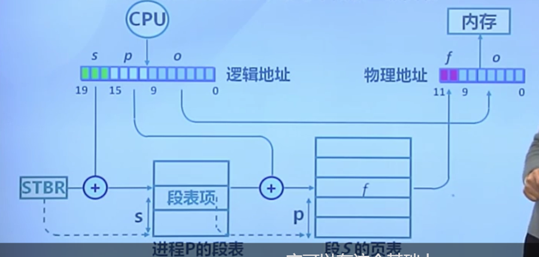

内存共享：

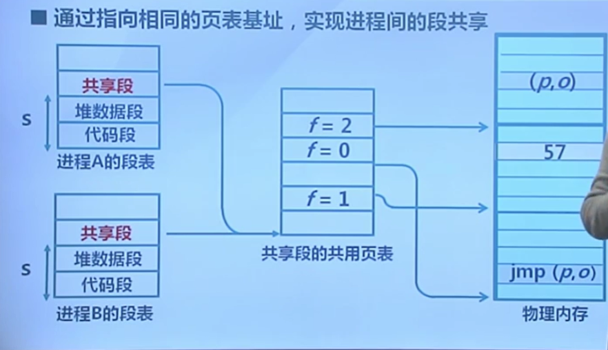

#### 课后错题

1.描述段管理机制正确的是( )

**A.段的大小可以不一致**

**B.段可以有重叠** 

**C.段可以有特权级** 

**D.段与段之间是可以不连续的**

2.描述页管理机制正确的是()

**A. 页表在内存中**

**B. 页可以是只读的**

**C. 页可以有特权级**

D. 上诉说法都不对

3.页表项标志位包括()

**A. 存在位(resident bit)**

**B. 修改位(dirty bit)**

**C. 引用位(clock/reference bit)**

**D. 只读位(read only OR read/write bit)** 

4.可有效应对大地址空间可采用的页表手段是()

**A. 多级页表**

**B. 反置页表**

C. 页寄存器方案

D. 单级页表

5.在ucore OS的管理下，如果CPU在ring3特权级执行访存指令，读属于ring0特权级的数据段中的内存单元，将出现的情况是（）

A. 产生外设中断

**B. 产生访存异常** 

C. CPU继续正常执行

D. 系统重启

## 实验部分

### Lab 2

#### 实验内容 

- 发现系统中的物理内存
- 建立对物理内存的初步管理（连续物理内存管理）
- 页表相关的操作，即建立页表来实现虚拟内存到物理内存之间的映射

#### 准备知识

##### x86特权级

ucore和Linux只使用 ring 0 和 ring 3，其中ring 0是内核态特权级，ring 2是用户态特权级

CPU检查特权级的情况：

- 访问数据段
- 访问页表
- 进入中断服务例程

检查过程：

段选择子（位于段寄存器中）：

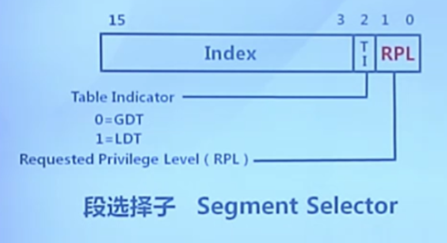

段描述符：

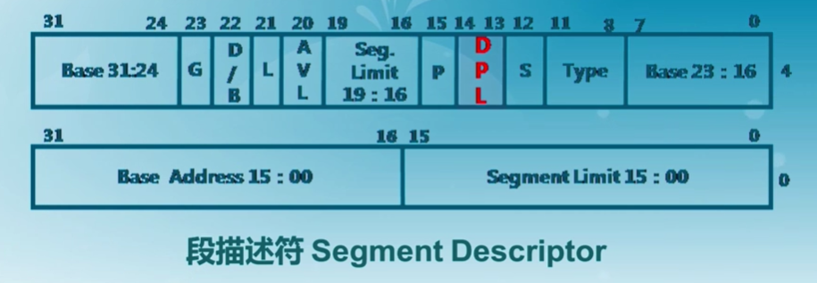

其中，

RPL：处于数据段，段寄存器DS，ES，FS，GS

CPL：处于代码段，段寄存器CS，SS

DPL：段/门描述符

执行一条指令，需要访问数据段时，当前特权级是CPL，需要访问的数据段的特权级是RPL

访问门（中断/陷入/异常）时：检查CPL ≤ DPL[门] & CPL ≥ DPL[段]

访问段时：MAX（CPL，RPL） ≤ DPL[段]

##### 通过中断切换特权级

从内核态转换到用户态：通过构造特殊的栈结合IRET指令

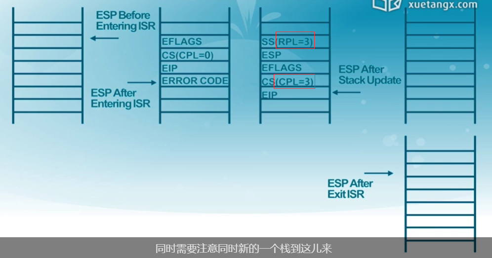

从用户态转换到内核态：通过修改内核态的栈，使IRET指令执行后仍然在内核态

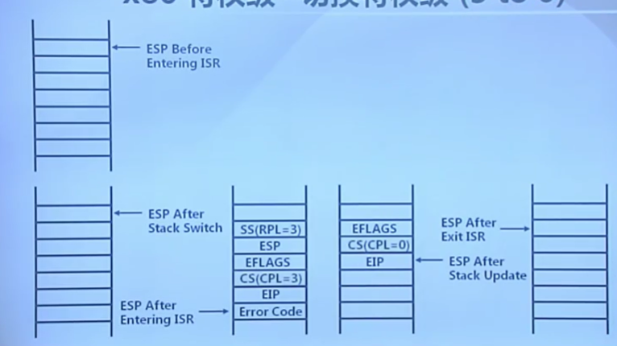

特权级转换时，不同特权级的堆栈信息保存在TSS段中：

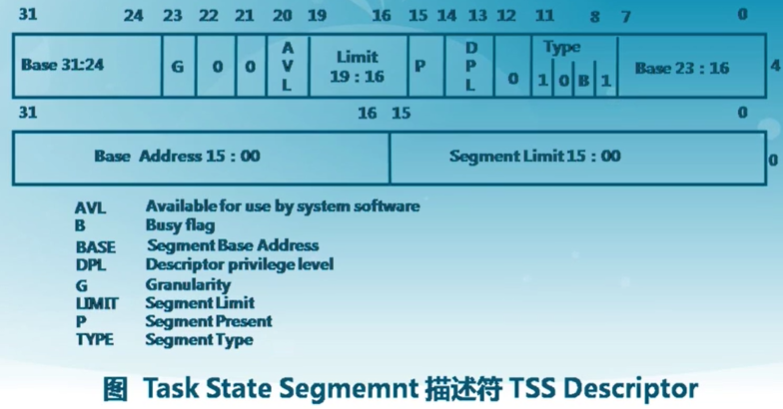

TSS段保存在内存中，通过Task Register特殊寄存器和全局描述符表GDT访问得到：

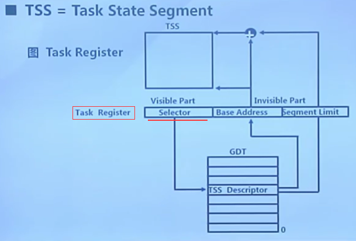

##### 段/页表

段机制概述：首先根据段寄存器中的段选择子部分到GDT中寻找对应的段描述符，最后对应到线性地址（物理地址，没有页机制时）

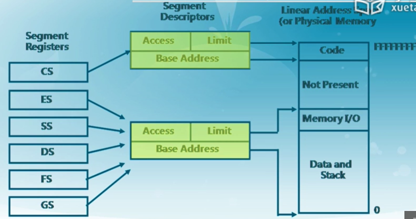

GDT表存放在内存中，访问效率低，因此，段选择子的隐藏部分中存放了Base Address部分，隐藏部分是由硬件控制的：


基址一直被存放在隐藏部分，直到选择子发生变化，才会更新基址内容。

##### Ucore建立段/页表

二级页表机制，首先建立页目录表、页表，页目录表的起始地址存放在CR3寄存器中：

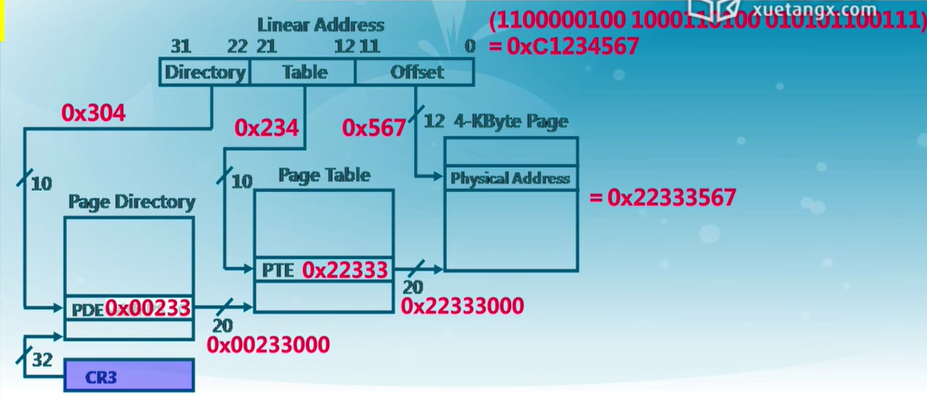

页目录表项：

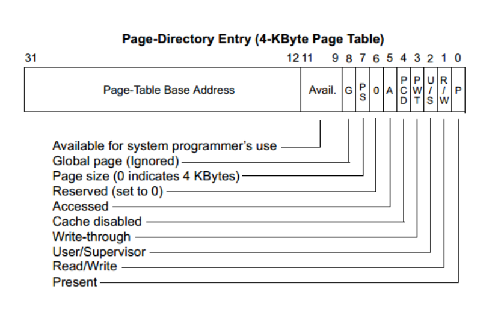

页表项：

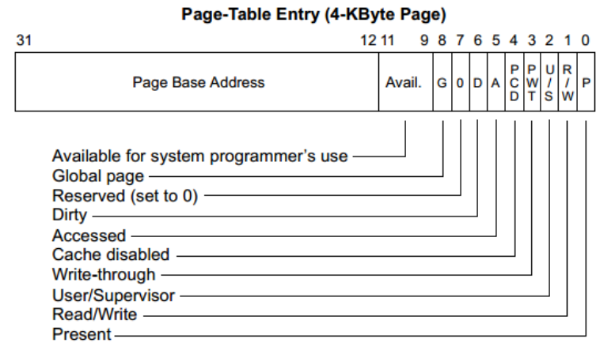

使能页机制：OS需要把CR0寄存器中的bit 31(PG)置为1

合并段机制和页机制：

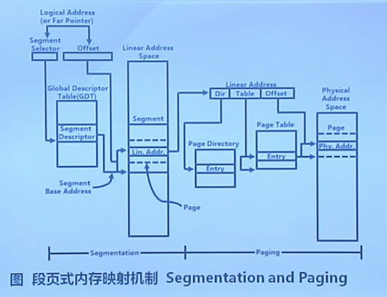

#### 练习1

实现 first-fit 连续物理内存分配算法（需要编程） 

实验要求：在实现first fit 内存分配算法的回收函数时，要考虑地址连续的空闲块之间的合并操作。提示：在建立空闲页块链表时，需要**按照空闲页块起始地址来排序**，形成一个有序的链表。**可能会修改default_pmm.c中的default_init，default_init_memmap，default_alloc_pages，default_free_pages等相关函数。**请仔细查看和理解default_pmm.c中的注释。 

first-fit连续物理内存分配算法以Page结构体为单位，其中空闲块链表按照起始地址排序，分配内存时，依次遍历空闲块，如果当前空闲块的大小大于等于所需大小，则分配该块内存，若有剩余内存部分，则插入原位置；释放内存时，依次遍历空闲块，若存在物理相邻的内存块，则合并，否则按照起始地址顺序插入适当的位置。

具体代码如下：

default_init()函数：（无改动）

初始化free_area结构体，free_list是链接Page中page_link部分的双向循环链表，nr_free是空闲内存块的总数。

```C
/*
 * (2) default_init: you can reuse the  demo default_init fun to init the free_list and set nr_free to 0.
 *              free_list is used to record the free mem blocks. nr_free is the total number for free mem blocks.
 */
static void
default_init(void) {
    list_init(&free_list);
    nr_free = 0;
}
```

default_init_memmap()函数：（无改动）

用具体的空闲页块的起始地址和空闲页块数初始化空闲块，首先需要初始化所有的空闲页块，也就是Page结构体的内容：

```C
/* *
 * struct Page - Page descriptor structures. Each Page describes one
 * physical page. In kern/mm/pmm.h, you can find lots of useful functions
 * that convert Page to other data types, such as phyical address.
 * */
struct Page {
    int ref;                        // page frame's reference counter
    uint32_t flags;                 // array of flags that describe the status of the page frame
    unsigned int property;          // the num of free block, used in first fit pm manager
    list_entry_t page_link;         // free list link
};
```

包括引用计数ref，页帧状态flags，只有连续页块中第一页的Page结构体中的property被设置为空闲页块数，之后页结构体中的property设置为0，page_link是Page结构中作为链表节点的部分。随后设置free_area结构体的内容，把当前空闲连续内存插入链表：

```C
/*
 * (3) default_init_memmap:   
 *              This fun is used to init a free block (with parameter: addr_base, page_number).
 *              First you should init each page (in memlayout.h) in this free block, include:
 *                  p->flags should be set bit PG_property (means this page is valid. In pmm_init fun (in pmm.c),
 *                  the bit PG_reserved is setted in p->flags)
 *                  if this page  is free and is not the first page of free block, p->property should be set to 0.
 *                  if this page  is free and is the first page of free block, p->property should be set to total num of block.
 *                  p->ref should be 0, because now p is free and no reference.
 *                  We can use p->page_link to link this page to free_list, (such as: list_add_before(&free_list, &(p->page_link)); )
 *              Finally, we should sum the number of free mem block: nr_free+=n
 */
static void
default_init_memmap(struct Page *base, size_t n) {
    assert(n > 0);
    struct Page *p = base;
    for (; p != base + n; p ++) {
        assert(PageReserved(p));
        p->flags = p->property = 0;
        set_page_ref(p, 0);
    }
    base->property = n;
    SetPageProperty(base);
    nr_free += n;
    list_add(&free_list, &(base->page_link));
}
```

default_alloc_pages()函数：（修改了//处内容）

分配连续空闲内存，遍历空闲块链表找到一块内存大小≥所需内存，若大小相同，则直接分配；若空闲块的内存大小大于所需内存，则先插入分配后剩余的续内存块，再把原先分配的内存块从空闲块链表中删除：

```C
/*
 * (4) default_alloc_pages: search find a first free block (block size >=n) in free list and resize the free block, return the addr
 *              of malloced block.
 *              (4.1) So you should search freelist like this:
 *                       list_entry_t le = &free_list;
 *                       while((le=list_next(le)) != &free_list) {
 *                       ....
 *                 (4.1.1) In while loop, get the struct page and check the p->property (record the num of free block) >=n?
 *                       struct Page *p = le2page(le, page_link);
 *                       if(p->property >= n){ ...
 *                 (4.1.2) If we find this p, then it' means we find a free block(block size >=n), and the first n pages can be malloced.
 *                     Some flag bits of this page should be setted: PG_reserved =1, PG_property =0
 *                     unlink the pages from free_list
 *                     (4.1.2.1) If (p->property >n), we should re-caluclate number of the the rest of this free block,
 *                           (such as: le2page(le,page_link))->property = p->property - n;)
 *                 (4.1.3)  re-caluclate nr_free (number of the the rest of all free block)
 *                 (4.1.4)  return p
 *               (4.2) If we can not find a free block (block size >=n), then return NULL
 */
static struct Page *
default_alloc_pages(size_t n) {
    assert(n > 0);
    if (n > nr_free) {
        return NULL;
    }
    struct Page *page = NULL;
    list_entry_t *le = &free_list;
    while ((le = list_next(le)) != &free_list) {
        struct Page *p = le2page(le, page_link);
        if (p->property >= n) {
            page = p;
            break;
        }
    }
    if (page != NULL) {
        if (page->property > n) {
            struct Page *p = page + n;
            p->property = page->property - n;
            //modified
            list_add_after(&(page->page_link), &(p->page_link));
    }
        //modified
        list_del(&(page->page_link));
        nr_free -= n;
        ClearPageProperty(page);
    }
    return page;
}
```

default_free_pages()函数：（修改了//处内容）

把已释放的内存块按起始地址的大小顺序插入空闲块链表，首先设置内存块为已释放的空闲状态，随后遍历空闲块链表，直到找到物理相邻的连续空闲内存并合并或者找到比当前连续空闲内存块尾指针大的连续空闲块并插入：

```C
/*
 * (5) default_free_pages: relink the pages into                                                                                                                                                                 free list, maybe merge small free blocks into big free blocks.
 *               (5.1) according the base addr of withdrawed blocks, search free list, find the correct position
 *                     (from low to high addr), and insert the pages. (may use list_next, le2page, list_add_before)
 *               (5.2) reset the fields of pages, such as p->ref, p->flags (PageProperty)
 *               (5.3) try to merge low addr or high addr blocks. Notice: should change some pages's p->property correctly.
 */
static void
default_free_pages(struct Page *base, size_t n) {
    assert(n > 0);
    struct Page *p = base;
    for (; p != base + n; p ++) {
        assert(!PageReserved(p) && !PageProperty(p));
        p->flags = 0;
        set_page_ref(p, 0);
    }
    base->property = n;
    SetPageProperty(base);
    list_entry_t *le = list_next(&free_list);
    while (le != &free_list) {
        p = le2page(le, page_link);
        le = list_next(le);
        if (base + base->property == p) {
            base->property += p->property;
            ClearPageProperty(p);
            list_del(&(p->page_link));
        }
        else if (p + p->property == base) {
            p->property += base->property;
            ClearPageProperty(base);
            base = p;
            list_del(&(p->page_link));
        }
        //modified
        else if (p > base + base -> property) {
            le=list_prev(le);
            break;
        }
    }
    //modified
    list_add_before(le,&(base->page_link));
    nr_free += n; 
}
```

#### 练习2

实现寻找虚拟地址对应的页表项 （需要编程）

通过设置页表和对应的页表项，可建立虚拟内存地址和物理内存地址的对应关系。其中的get_pte函数是设置页表项环节中的一个重要步骤。此函数找到一个虚地址对应的二级页表项的内核虚地址，如果此二级页表项不存在，则分配一个包含此项的二级页表。本练习需要补全get_pte函数 in kern/mm/pmm.c，实现其功能。 

重点参考：“ 建立虚拟页和物理页帧的地址映射关系 ”一节

这个实验中需要注意在memset函数和用指针进行引用的操作对象必须是虚拟地址（逻辑地址），所以我们需要提前把物理地址转换为对应的虚拟地址再使用。根据pmm.c文件中的注释，主要思路是首先根据逻辑地址的首10bit找到对应的页目录表项，判断页目录表项的Present位，也即对应的二级页表是否存在，若不存在则根据参数create判断是否需要我们分配对应二级页表的物理页面，若不需要则直接返回NULL，若需要则先分配物理页面page，并设置权限，最后返回页目录表（一级页表）项中对应的二级页表项的地址，即要求中的内核虚地址。

具体代码如下：

```C
//get_pte - get pte and return the kernel virtual address of this pte for la
//        - if the PT contians this pte didn't exist, alloc a page for PT
// parameter:
//  pgdir:  the kernel virtual base address of PDT
//  la:     the linear address need to map
//  create: a logical value to decide if alloc a page for PT
// return value: the kernel virtual address of this pte
pte_t *
get_pte(pde_t *pgdir, uintptr_t la, bool create) {
    /* LAB2 EXERCISE 2: YOUR CODE
     *
     * If you need to visit a physical address, please use KADDR()
     * please read pmm.h for useful macros
     *
     * Maybe you want help comment, BELOW comments can help you finish the code
     *
     * Some Useful MACROs and DEFINEs, you can use them in below implementation.
     * MACROs or Functions:
     *   PDX(la) = the index of page directory entry of VIRTUAL ADDRESS la.
     *   KADDR(pa) : takes a physical address and returns the corresponding kernel virtual address.
     *   set_page_ref(page,1) : means the page be referenced by one time
     *   page2pa(page): get the physical address of memory which this (struct Page *) page  manages
     *   struct Page * alloc_page() : allocation a page
     *   memset(void *s, char c, size_t n) : sets the first n bytes of the memory area pointed by s
     *                                       to the specified value c.
     * DEFINEs:
     *   PTE_P           0x001                   // page table/directory entry flags bit : Present
     *   PTE_W           0x002                   // page table/directory entry flags bit : Writeable
     *   PTE_U           0x004                   // page table/directory entry flags bit : User can access
     */
    // (1) find page directory entry
    // pgdir:  the kernel virtual base address of PDT
    // PDX(la) = the index of page directory entry of VIRTUAL ADDRESS la.
    pde_t* pdep = &pgdir[PDX(la)];
    // (2) check if entry is not present
    if( (*pdep & PTE_P ) == NULL ) {
        // (3) check if creating is needed, then alloc page for page table
        struct Page* page;
        if(!create || (page=alloc_page())==NULL ) return NULL;
        // (4) set page reference
        set_page_ref(page,1);
        // (5) get physical address of page
        uintptr_t pa=page2pa(page);
        // (6) clear page content using memset
        memset(KADDR(pa),0,PGSIZE);
        // (7) set page directory entry's permission
        *pdep= (pa&~0x0FFF) | PTE_P | PTE_W | PTE_U;
    }
    // (8) return page table entry
    return &((pte_t*)KADDR(PDE_ADDR(*pdep)))[PTX(la)];
}
```

问题1：请描述页目录项（Page Directory Entry）和页表项（Page Table Entry）中每个组成部分的含义以及对ucore而言的潜在用处。 

请见准备知识部分的“Ucore建立段/页表”部分

问题2：如果ucore执行过程中访问内存，出现了页访问异常，请问硬件要做哪些事情？ 

见lab3内容

#### 练习3

释放某虚地址所在的页并取消对应二级页表项的映射（需要编程） 

当释放一个包含某虚地址的物理内存页时，需要让对应此物理内存页的管理数据结构Page做相关的清除处理，使得此物理内存页成为空闲；另外还需把表示虚地址与物理地址对应关系的二级页表项清除。请仔细查看和理解page_remove_pte函数中的注释。为此，需要补全在 kern/mm/pmm.c中的page_remove_pte函数。

具体代码如下：

```C
//page_remove_pte - free an Page struct which is related linear address la
//                - and clean(invalidate) pte which is related linear address la
//note: PT is changed, so the TLB need to be invalidate 
static inline void
page_remove_pte(pde_t *pgdir, uintptr_t la, pte_t *ptep) {
    /* LAB2 EXERCISE 3: YOUR CODE
     *
     * Please check if ptep is valid, and tlb must be manually updated if mapping is updated
     *
     * Maybe you want help comment, BELOW comments can help you finish the code
     *
     * Some Useful MACROs and DEFINEs, you can use them in below implementation.
     * MACROs or Functions:
     *   struct Page *page pte2page(*ptep): get the according page from the value of a ptep
     *   free_page : free a page
     *   page_ref_dec(page) : decrease page->ref. NOTICE: if page->ref == 0 , then this page should be free.
     *   tlb_invalidate(pde_t *pgdir, uintptr_t la) : Invalidate a TLB entry, but only if the page tables being
     *                        edited are the ones currently in use by the processor.
     * DEFINEs:
     *   PTE_P           0x001                   // page table/directory entry flags bit : Present
     */
    //(1) check if this page table entry is present
    if(*ptep & PTE_P) {
        //(2) find corresponding page to pte
        struct Page* page = pte2page(*ptep);
        //(3) decrease page reference
        page_ref_dec(page);
        //(4) and free this page when page reference reachs 0
        if(page->ref==0) free_page(page);
        //(5) clear second page table entry
        *ptep=NULL;
        //(6) flush tlb
        tlb_invalidate(pgdir,la); 
    }
}
```

运行结果：


问题1：数据结构Page的全局变量（其实是一个数组）的每一项与页表中的页目录项和页表项有无对应关系？如果有，其对应关系是啥？ 

数据结构Page的全局变量管理所有的物理页面，当页目录项和页表项有效时，通过线性地址前10bit索引PDT，找到对应的页目录项，对应的页目录项中存放对应的二级页表物理地址，通过线性地址的中10bit索引PTE，找到对应的页表项，此时页表项中存放的就是数据结构Page的全局变量中管理的物理页面Page之一的物理地址。

问题2： 如果希望虚拟地址与物理地址相等，则需要如何修改lab2，完成此事？鼓励通过编程来具体完成这个问题。

在lab1中，虚拟地址即与物理地址相等，首先在kernel.ld中的加载地址应该为0x10000，其次应该关闭页机制。

总结：

在Lab2 中主要要求我们掌握物理内存管理中的连续空间分配算法的具体实现和如何建立二级页表，主要加深了对连续和非连续物理内存管理的理解。