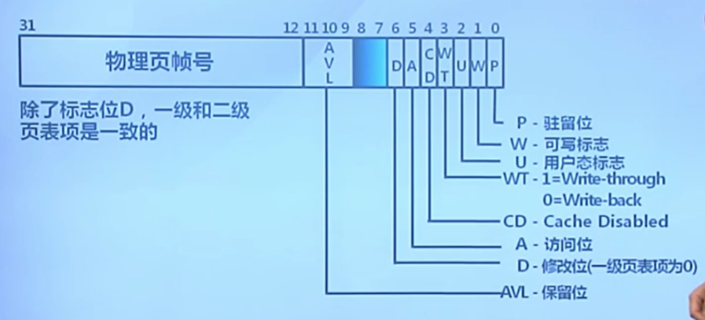
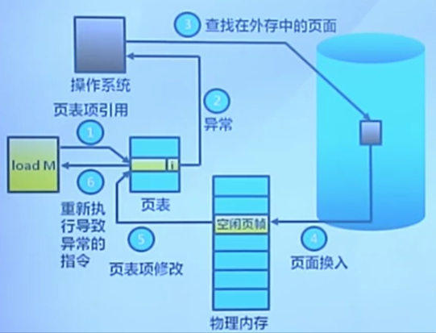
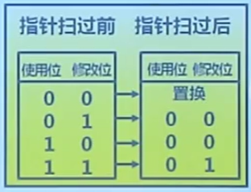
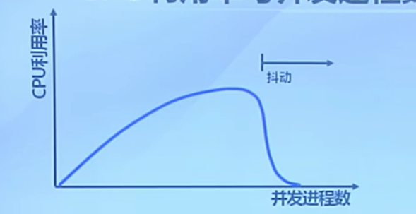
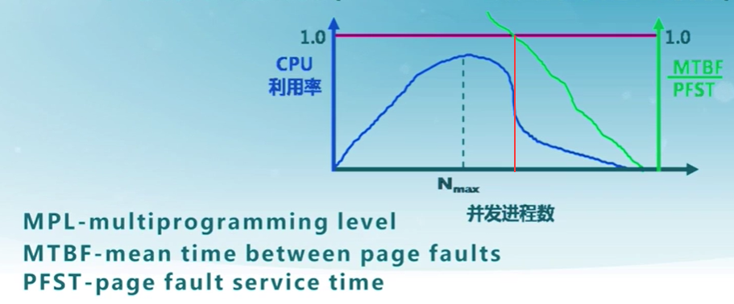
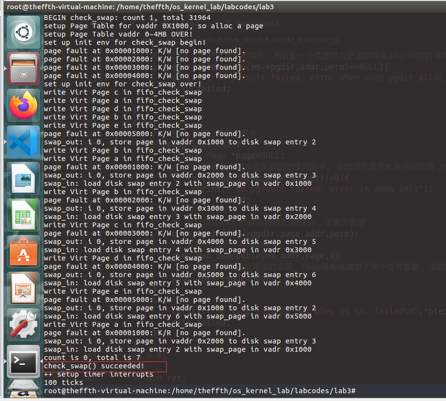

# Lab 3

## 理论部分-虚拟存储概念

### 虚拟存储的需求背景

增长迅速的存储需求：程序规模的增长速度远远大于存储器容量的增长速度

内存空间不够用

- 覆盖（overlay）：应用程序**手动**把需要的指令和数据保存在内存中 ==> 开发难度增大
- 交换（swapping）：操作系统**自动**把暂时不能执行的程序保存到外存中 ==>开销大
- 虚拟存储：在有限容量的内存中，以页为单位**自动**装入**更多更大**的程序

### 覆盖和交换

#### 覆盖技术

目标：在较小的可用内存中运行较大的程序（内存中一个程序就不能执行）

方法：根据程序逻辑结构，将程序划分为若干功能相对独立的模块，将不会同时执行的模块（不存在调用关系）共享同一块内存区域

- 必要部分：常用功能的代码和数据常驻内存
- 可选部分：不常用功能放在其他程序模块中，只在需要用到时装入内存中

实例：Turbo Pascal 的 Overlay 系统单元

不足：

- 增加编程困难
  - 需要程序员划分功能模块并确定模块间的覆盖关系
  - 增加了编程的复杂度
- 增加执行时间
  - 从外存装入覆盖模块
  - 时间换空间

#### 交换技术

目标：增加正在运行或需要运行的程序的内存（出现于多道处理系统，不考虑一个程序内存不够的情况）

实现方法：可将暂时不能运行的程序放到外存中

- 换入换出的基本单位：整个进程的地址空间
- 换出：一个进程的整个地址空间保存到外存
- 换入：将外存中的某进程的地址空间读入到内存

需要考虑的问题：

- 交换时机：何时需要发生交换？
  - 只当内存空间不够或有不够的可能时换出
- 交换区大小：存在所有暂停的用户进程的所有内存映像的拷贝
- 程序换入时的重定位：换出后再换入时需要放在原处吗？
  - 采用动态地址映射的方法（函数调用或跳转指令的执行）

#### 覆盖与交换的比较

覆盖：

- 只能发生在没有调用关系的模块之间
- 程序员需要给出模块间的逻辑覆盖结构（困难）
- 发生在运行程序的内部模块之间

交换：

- 以进程为单位
- 不需要模块间的逻辑覆盖结构
- 发生在内存进程之间

### 局部性原理

虚拟存储技术的目标：

- 只把部分程序放到内存中，从而运行比物理内存大的程序
  - 由操作系统自动完成，无需程序员的干涉
- 实现进程在内存与外存之间的交换，从而获得更多的空闲内存空间
  - 在内存和外存之间只交换进程的部分内容

局部性原理：程序在执行过程中的一个较短时期，所执行的指令地址和指令的操作数地址，分别局限于一定区域

- 时间局部性：一条指令的一次执行和下次执行，一个数据的一次访问和下次访问都集中在一个较短时期内
- 空间局部性：当前指令和邻近的几条指令，当前访问的数据和邻近访问的几个数据都集中在一个较小的区域内
- 分支局部性：一条跳转指令的两次执行，很可能跳到相同的内存位置

==> 是虚拟存储系统的理论基础

### 虚拟存储的概念

思路：将不常用的部分内存块暂存到外存

原理：

- 装载程序时，只将当前指令执行需要的部分页面或段装入内存
- 指令执行中需要的指令或数据不在内存（缺页或缺段）时，处理器通知操作系统将相应的页面或段调入内存
- 操作系统将内存中暂时不用的页面或段保存在外存中

实现方式：

- 虚拟页式存储
- 虚拟段式存储

虚拟存储的基本特征：

- 不连续性：物理内存和虚拟地址空间使用非连续
- 大用户空间：提供给用户的虚拟内存可大于实际的物理内存
- 部分交换：虚拟存储只对部分虚拟地址空间进行调入和调出

支持技术：

- 硬件：页式或段式存储中的地址转换机制
- 操作系统：管理内存和外存间页面或段的换入和换出

### 虚拟页式存储

在页式存储管理的基础上，增加请求调页和页面置换

思路：

- 当用户程序要装载到内存运行时，只装入部分页面，就启动程序运行
- 程序在运行中发现有需要的代码或数据不在内存时，则向系统发出缺页异常请求
- 操作系统在处理缺页异常时，将外存中相应的页面调入内存使得进程能够继续运行

虚拟页式存储中的页表项结构：

- 驻留位：表示该页是否在内存之中
  - 1表示该页在内存中，该页表项有效可以使用
  - 0表示该页当前在外存中，访问该页表项将导致缺页异常
- 修改位：表示在内存中的该页是否被修改过
  - 回收该物理页面时，会据此判断是否要把它的内容写回外存
- 访问位：表示该页面是否被访问过（读或写）
  - 用于页面置换算法
- 保护位：表示该页的允许访问方式
  - 只读、可读写和可执行



P：驻留位   W：可写位（保护位）   A：访问位   D：修改位（一级页表为0）

U：用户态标志，能否由用户态的应用程序进行访问

WT：是否写通，1=Write-through ； 0=Write-back

CD：Cache Disabled 缓存是否有效，实时数据的情况下，必须通过IO端口等直接读外存

AVL：保留位，便于后续升级对页表项的改动

### 缺页异常

缺页异常（缺页中断）的处理流程：

1. 在内存中有空闲物理页面时，分配一个物理页帧f，转至5
2. 依据页面置换算法选择将被替换的物理页帧f，对应逻辑页q
3. 如果q被修改过，则把它写回外存
4. 修改q的页表项中驻留项为0
5. 将需要访问的页p装入物理页面f
6. 修改p的页表项驻留位为1，物理页帧号为f
7. 重新执行产生缺页的指令



虚拟页式存储中的外存管理：

- 能方便地找到在外存中的页面内容
- 交换空间（磁盘或者文件）
  - 采用特殊格式存储未被映射的页面

虚拟页式存储中的外存选择：

- 代码段：可执行二进制文件
- 动态加载的共享库程序段：动态调用的库文件
- 其他段：交换空间

代码段和共享库都是不会被修改的

虚拟页式存储管理的性能：

EAT=访存时间*(1-p)+缺页异常处理时间\*缺页率p

## 理论部分-页面置换算法

### 页面置换算法的概念

场景：出现缺页异常，需调入新页面而内存已满

功能：选择被置换的物理页面

设计目标：

- 尽可能**减少页面的调入调出次数**
- 把未来不再访问或短期内不访问的页面调出

页面锁定（frame locking）：

- 描述必须常驻内存的逻辑页面
- => 操作系统的关键部分
- => 要求响应速度的代码和数据
- 实现：页表中的锁定标志位（lock bit）

评价方法：记录进程访问内存的页面轨迹，模拟页面置换行为，记录产生缺页的次数。更好的缺页代表更好的性能

页面置换算法分类：

- 局部页面置换算法：置换页面的选择范围仅限于当前进程占用的物理页面内（分配给一个进程的物理页面总数不变）
  - 最优算法：算法最优，但需要预测未来，实际上不可行
  - 先进先出算法：最易实现，但性能不佳
  - 最近最久未使用算法：用过去一段时间预测未来趋势（仍然足够复杂 =>）
  - 时钟算法、不常用算法：对最近最久未使用算法的近似
- 全局页面置换算法：置换页面的选择范围是所有可换出的物理页面
  - 工作集算法、缺页率算法

### 最优算法、先进先出算法和最近最久未使用算法

#### 最优页面置换算法

基本思路：置换在未来最长时间不访问的页面

算法实现：缺页时，计算内存中每个逻辑页面的下一次访问时间，未来最长时间不访问的页面就是被置换页面

算法特征：

- 缺页最少，理想情况
- 实际系统中无法实现：无法预知每个页面在下次访问之前的等待时间（通常情况下，程序每次执行时处理的数据也是不同的）
- 作为置换算法的性能评价依据
  - 在模拟器上运行某程序，并记录每一次的页面访问情况
  - 第二遍运行时使用最优算法

#### 先进先出算法

基本思路：选择在内存中驻留时间最长的页面进行置换

算法实现：维护一个记录所有位于内存中的逻辑页面页表，链表元素按驻留内存的时间排序

算法特征：

- 实现简单
- 性能较差，调出的页面可能是经常访问的
- 进程分配物理页面数增加时，缺页不一定减少（Belady现象）
- 很少单独使用

#### 最近最久未使用算法

基本思路：选择最长时间没有被引用的页面进行置换

算法依据：如果某些页面的时间未被访问，则它们在将来还可能会长时间不会访问

算法实现：缺页时计算内存中每个逻辑页面的上一次访问时间，选择上一次使用到当前时间最长的页面

算法特征：是最优置换算法的一种近似

LRU算法可能的实现方法：

页面链表法：

- 系统维护一个按最近一次访问时间排序的页面链表
  - 链表首节点是最近刚刚使用过的页面
  - 链表尾节点是最久未使用的页面
- 访问内存时，找到相应页面并把它移到链表之首
- 缺页时，置换链表尾节点的页面

活动页面栈法：

- 访问页面时，将此页号压入栈顶，并把栈内相同的页号抽出
- 缺页时，置换栈底的页面

特征：开销大

### 时钟置换算法和最不常用算法 

时钟置换算法（Clock）：

基本思路：仅对页面的访问情况进行大致统计

数据结构：

- 在页表项中增加访问位，描述页面过去一段时间内（由指针约定）的访问情况
- 各页面组织成环形链表
- 指针指向最先调入的页面

算法实现：

- 访问页面时，在页表项中记录页面访问情况
- 缺页时，从指针处开始顺序查找未被访问的页面进行置换

算法特征：LRU和FIFO的折中

具体实现：

- 页面装入内存时，访问位初始化为0
- 访问页面（读/写）时，访问位置置为1
- 缺页时，从指针当前位置顺序检查环形链表
  - 访问位为0，则置换该页
  - 访问位为1，则将访问位置0，并把指针指向下一个页面知道找到可置换的页面

改进的Clock算法：

基本思路：减少修改页的缺页处理开销（修改页的缺页处理时间是未修改页的两倍）

算法实现：

- 在页面中增加修改位，并在访问时进行相应的修改
- 缺页时，修改页面标志位，以跳过有修改的页面



最不常用算法（LFU）：

算法思路：缺页时，置换访问次数最少的页面

算法实现：

- 每个页面设置一个访问计数
- 访问页面时，访问计数加1
- 缺页时，置换页面访问次数最少的页面

算法特征：

- 算法开销大
- 开始时频繁使用，但以后不使用的页面很难置换
  - 解决方法：计数定期右移

LFU和LRU的区别：

- LRU关注多久未访问，时间越短越好
- LFU关注访问次数，次数越多越好

### BELADY现象和局部置换算法比较

Belady现象：采用FIFO等算法时，可能出现分配的物理页面数增加，缺页次数反而升高的异常现象

原因：

- FIFO算法的置换特征与进程访问内存的动态特征矛盾
- 被它置换出去的页面并不一定是进程近期不会访问的

LRU页面置换算法没有Belady现象（与栈结构相关的页面置换算法是没有Belady现象的）

LRU、FIFO和Clock算法的比较：

LRU算法和FIFO算法本质上都是先进先出的思路

- LRU依据页面的最近访问时间排序
- LRU需要动态地调整顺序（开销大）
- FIFO依据页面进入内存的时间排序
- FIFO的页面进入时间是固定不变的

LRU可退化成FIFO：页面进入内存之后没有被访问

### 工作集置换算法

局部置换算法没有考虑进程间的访存差异 ==>

全局置换算法：为进程分配可变数目的物理页面

- 进程在不同阶段的内存需求是变化的
- 分配给进程的内存需要在不同阶段有所变化
- 全局置换算法需要确定分配给进程的物理页面数

CPU利用率与并发进程数的关系：



CPU利用率与并发进程数存在相互促进和制约的关系：

- 进程数少时，提高并发进程数，可提高CPU利用率
- 并发进程数导致内存访问增加
- 并发进程数的内存访问会降低访存的局部性特征
- 局部性特征的下降会导致缺页率的上升和CPU利用率的下降

工作集：一个进程当前正在使用的逻辑页面集合，可表示为二元函数W(t,Δ)：

- t 是当前的执行时刻
- Δ 称为工作集窗口，即一个定长的页面访问时间窗口
- W(t,Δ) 是指在当前时刻 t 前的 Δ 时间窗口中的所有访问页面所组成的集合
- |W(t,Δ)|指工作集的大小，即页面数目

工作集的变化：

- 进程开始执行后，随着访问新页面逐步建立较稳定的工作集
- 当内存访问的局部性区域的位置大致稳定时，工作集的大小也大致稳定
- 局部性区域的位置改变时，工作集快速扩张或收缩过渡到下一个稳定值

常驻集：在当前时刻，进程实际驻留在内存当中的页面集合

工作集和常驻集的关系：

- 工作集是进程在运行过程中的固有的性质
- 常驻集取决于系统分配给进程的物理页面的数量和页面置换算法

缺页率与常驻集的关系：

- 常驻集包含工作集时，缺页较少
- 工作集发生剧烈变化(过渡)时，缺页较多
- 进程常驻集大小达到一定数目后，缺页率也不会明显下降

工作集置换算法：

基本思路：换出不在工作集中的页面

窗口大小tao：当前时刻前tao个内存访问的页引用是工作集，tao被称为窗口大小

实现方法：

- 访存链表：维护窗口内访存页面链表
- 访存时，换出不在工作集的页面并更新访存链表
- 缺页时，换入页面；更新访存链表

### 缺页率置换算法

缺页率：缺页次数/内存访问次数 或 缺页平均时间间隔的倒数

影响缺页率的因素：

- 页面置换算法
- 分配给进程的物理页面的数目
- 页面大小
- 程序的编写方法

缺页率置换算法：通过调节常驻集大小，使每个进程的缺页率保持在一个**合理的范围**内

- 若进程缺页率过高，则增加常驻集以分配更多的页面
- 若进程缺页率过低，则减少常驻集以减少它的物理页面数

算法实现：

- 访存时，设置引用位标志
- 缺页时，计算从上次缺页时间t<sub>last</sub>到现在t<sub>current</sub>的时间间隔
  - 如果t<sub>current</sub>-t<sub>last</sub>＞T，则置换所有在[t<sub>last</sub>，t<sub>current</sub>]时间内没有被引用的页（缺页率比较低，减少常驻集）
  - 如果t<sub>current</sub>-t<sub>last</sub> ≤ T，则增加缺失页到常驻集中（缺页率高，增加常驻集以分配更多的页面）

### 抖动和负载控制

抖动：

- 进程物理页面太少，不能包含工作集
- 大量缺页，频繁置换
- 进程运行速度变慢

产生抖动的原因：驻留内存的进程数目增加，分配给每个进程的物理页面数减少，缺页率上升

操作系统需要在并发水平和缺页率之间达到平衡：

- 适当的进程数目
- 分配给进程适当的物理页面数

负载控制：

通过调节并发进程数进行系统负载控制



### 课后错题

物理页帧数量为3，虚拟页访问序列为 0,1,2,0,1,3,0,3,1,0,3，请问采用最优置换算法的缺页次数为（）

A.1

B.2

C.3

**D.4**

## 实验部分

### 练习1

实验内容：完成do_pgfault（mm/vmm.c）函数，给未被映射的地址映射上物理页。设置访问权限的时候需要参考页面所在 VMA 的权限，同时需要注意映射物理页时需要操作内存控制结构所指定的页表，而不是内核的页表。 

需要先理解两个数据结构：

vma_struct => 用来描述对应用程序“合法”的虚拟内存页

mm_struct => 用来描述所有的虚拟内存页的共同属性

具体代码实现：

```C
/* do_pgfault - interrupt handler to process the page fault execption
 * @mm         : the control struct for a set of vma using the same PDT
 * @error_code : the error code recorded in trapframe->tf_err which is setted by x86 hardware
 * @addr       : the addr which causes a memory access exception, (the contents of the CR2 register)
 *
 * CALL GRAPH: trap--> trap_dispatch-->pgfault_handler-->do_pgfault
 * The processor provides ucore's do_pgfault function with two items of information to aid in diagnosing
 * the exception and recovering from it.
 *   (1) The contents of the CR2 register. The processor loads the CR2 register with the
 *       32-bit linear address that generated the exception. The do_pgfault fun can
 *       use this address to locate the corresponding page directory and page-table
 *       entries.
 *   (2) An error code on the kernel stack. The error code for a page fault has a format different from
 *       that for other exceptions. The error code tells the exception handler three things:
 *         -- The P flag   (bit 0) indicates whether the exception was due to a not-present page (0)
 *            or to either an access rights violation or the use of a reserved bit (1).
 *         -- The W/R flag (bit 1) indicates whether the memory access that caused the exception
 *            was a read (0) or write (1).
 *         -- The U/S flag (bit 2) indicates whether the processor was executing at user mode (1)
 *            or supervisor mode (0) at the time of the exception.
 */
int
do_pgfault(struct mm_struct *mm, uint32_t error_code, uintptr_t addr) {
    int ret = -E_INVAL;
    //try to find a vma which include addr
    //虚拟地址对应的数据结构vma
    struct vma_struct *vma = find_vma(mm, addr);

    pgfault_num++;
    //If the addr is in the range of a mm's vma?
    //虚拟地址addr不在应用程序需求的虚拟页中，即非法地址
    if (vma == NULL || vma->vm_start > addr) {
        cprintf("not valid addr %x, and  can not find it in vma\n", addr);
        goto failed;
    }
    //check the error_code
    //检查错误代码
    switch (error_code & 3) {
    default:
            /* error code flag : default is 3 ( W/R=1, P=1): write, present */
            // 写操作，内存中存在对应的物理页面 -> 那么错误原因一定是对应页面的权限不可写 进入case2
    case 2: /* error code flag : (W/R=1, P=0): write, not present */
            // 写操作，内存中不存在对应的物理页面 -> 首先检查vma管理的虚拟页是否有写权限
        if (!(vma->vm_flags & VM_WRITE)) {
            cprintf("do_pgfault failed: error code flag = write AND not present, but the addr's vma cannot write\n");
            goto failed;
        }
        break;
    case 1: /* error code flag : (W/R=0, P=1): read, present */
            // 读操作，内存中存在对应的物理页面 -> 正常情况下不会产生缺页异常，直接报错
        cprintf("do_pgfault failed: error code flag = read AND present\n");
        goto failed;
    case 0: /* error code flag : (W/R=0, P=0): read, not present */
            // 读操作，内存中不存在对应的物理页面 -> 首先检查vma管理的虚拟页是否有可读或者可执行权限
        if (!(vma->vm_flags & (VM_READ | VM_EXEC))) {
            cprintf("do_pgfault failed: error code flag = read AND not present, but the addr's vma cannot read or exec\n");
            goto failed;
        }
    }
    /* IF (write an existed addr ) OR  //？？？
     *    (write an non_existed addr && addr is writable) OR
     *    (read  an non_existed addr && addr is readable)
     * THEN
     *    continue process
     */
    uint32_t perm = PTE_U;
    if (vma->vm_flags & VM_WRITE) {
        perm |= PTE_W;
    }
    addr = ROUNDDOWN(addr, PGSIZE);

    ret = -E_NO_MEM;

    pte_t *ptep=NULL;
    /*LAB3 EXERCISE 1: YOUR CODE
    * Maybe you want help comment, BELOW comments can help you finish the code
    *
    * Some Useful MACROs and DEFINEs, you can use them in below implementation.
    * MACROs or Functions:
    *   get_pte : get an pte and return the kernel virtual address of this pte for la
    *             if the PT contians this pte didn't exist, alloc a page for PT (notice the 3th parameter '1')
    *   pgdir_alloc_page : call alloc_page & page_insert functions to allocate a page size memory & setup
    *             an addr map pa<--->la with linear address la and the PDT pgdir
    * DEFINES:
    *   VM_WRITE  : If vma->vm_flags & VM_WRITE == 1/0, then the vma is writable/non writable
    *   PTE_W           0x002                   // page table/directory entry flags bit : Writeable
    *   PTE_U           0x004                   // page table/directory entry flags bit : User can access
    * VARIABLES:
    *   mm->pgdir : the PDT of these vma
    *
    */
    //查找虚拟地址addr对应的二级页表项pte，若不存在则尝试分配一个
    ptep=get_pte(mm->pgdir,addr,1);
    if(*ptep==0){
        // 如果对应的物理地址不存在，则分配一个页面并且把虚拟地址addr映射到该物理页面地址
        if(pgdir_alloc_page(mm->pgdir,addr,perm)==NULL){
            cprintf("do_pgfault failed: error when exec pgdir_alloc_page");
            goto failed;
        }
    }
    else{
        // 对应的物理页面在硬盘中
        if(swap_init_ok) {
            struct Page *page=NULL;
            // 把磁盘扇区中的内容加载到物理页面中, 该物理页面可能是空闲页面，也可能是已分配的页面
            if((ret=swap_in(mm,addr,&page))!=0){
                cprintf("do_pgfault failed: error in swap_in()");
                goto failed;
            }
            // 虚拟地址addr映射到物理页面page，设置页表项
            page_insert(mm->pgdir,page,addr,perm);
            // 设置page为swappable
            swap_map_swappable(mm,addr,page,0);
            // 为了满足页面置换算法的实现，Page结构体增加了两个成员变量，这里需要对其中的pra_addr正确赋值，表示物理页面对应的虚拟地址
            page->pra_vaddr=addr;
        }
        else {
            cprintf("no swap_init_ok but ptep is %x, failed\n",*ptep);
            goto failed;
        }
    }
   ret = 0;
failed:
    return ret;
}
```

问题1：请描述页目录项（Page Directory Entry）和页表项（Page Table Entry）中组成部分对ucore实现页替换算法的潜在用处。 

页表项中驻留位表示该页是否在内存中，在此基础上才能进行缺页异常处理；修改位表示内存中的该页是否被修改过，若已修改则替换该页面时需要先该页写入到硬盘中，页面替换时间是原先的二倍；访问位表示该页面是否被访问过，对例如Clock算法等页面置换算法有影响。

问题2：如果ucore的缺页服务例程在执行过程中访问内存，出现了页访问异常，请问硬件要做哪些事情？  

把引起页访问异常的线性地址装到寄存器CR2中，并给出了出错码errorCode（说明页访问异常的类型）

在当前内核栈保存当前被打断的程序现场：

1. 压入当前被打断程序使用的EFLAGS，CS，EIP，errorCode；
2. 把异常中断号0xE对应的中断服务例程的地址（vectors.S中的标号vector14处）加载到CS和EIP寄存器中，开始执行中断服务例程。

### 练习2

补充完成基于FIFO的页面替换算法（需要编程） 

完成vmm.c中的do_pgfault函数，并且在实现FIFO算法的swap_fifo.c中完成map_swappable和swap_out_victim函数。通过对swap的测试。 

具体代码实现如下：

```C
/*
 * (3)_fifo_map_swappable: According FIFO PRA, we should link the most recent arrival page at the back of pra_list_head queue
 */
static int
_fifo_map_swappable(struct mm_struct *mm, uintptr_t addr, struct Page *page, int swap_in)
{
    list_entry_t *head=(list_entry_t*) mm->sm_priv;
    list_entry_t *entry=&(page->pra_page_link);
 
    assert(entry != NULL && head != NULL);
    //record the page access situlation
    /*LAB3 EXERCISE 2: YOUR CODE*/ 
    //(1)link the most recent arrival page at the back of the pra_list_head queue.
    list_add(head,entry);
    // 新换入的页面加在head的后面，即链表头部位置
    return 0;
}
/*
 *  (4)_fifo_swap_out_victim: According FIFO PRA, we should unlink the earliest arrival page in front of pra_list_head queue,
 *                            then assign the value of *ptr_page to the addr of this page.
 */
static int
_fifo_swap_out_victim(struct mm_struct *mm, struct Page ** ptr_page, int in_tick)
{
    list_entry_t *head=(list_entry_t*) mm->sm_priv;
        assert(head != NULL);
    assert(in_tick==0);
     /* Select the victim */
     /*LAB3 EXERCISE 2: YOUR CODE*/ 
     //(1)  unlink the  earliest arrival page in front of pra_list_head qeueue
     //(2)  assign the value of *ptr_page to the addr of this page
    // 换出链表尾的页面，即最先进入的页面
    list_entry_t* victim=head->prev;
    // 根据链表节点找到对应的页面的物理地址，并赋值给*ptr_page
    struct Page* page=le2page(victim,pra_page_link);
    *ptr_page=page;
    list_del(victim);
    return 0;
}
```

运行结果：



问题：如果要在ucore上实现"extended clock页替换算法"，请给你的设计方案，现有的swap_manager框架是否足以支持在ucore中实现此算法？如果是，请给你的设计方案。 如果不是，请给出你的新的扩展和基此扩展的设计方案。并需要回答如下问题：需要被换出的页的特征是什么？ 在ucore中如何判断具有这样特征的页？ 何时进行换入和换出操作？ 

现有的swap_manager框架足以支持ucore实现此算法。

需要被换出的页的特征：首先考虑无访问和无修改的页面，其次考虑有访问无修改的页面，最后考虑有访问有修改的页面

在ucore中如何判断具有这种特征的页面：根据页表项中的标志位PTE_A表示是否访问过，PTE_D是否修改过

何时进行换入和换出的操作：当访问的页面内存中不存在时进行换入操作，当内存物理页帧已满时进行换出操作