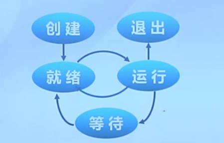
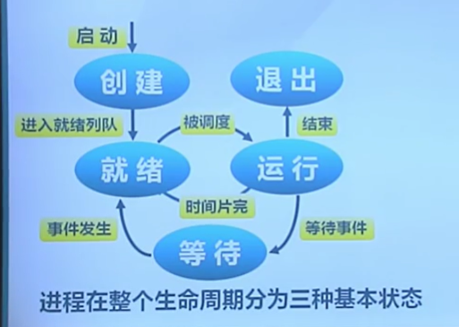
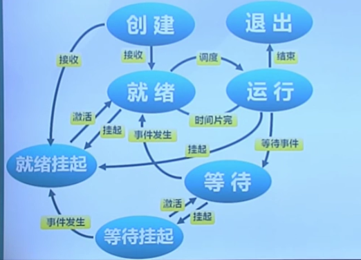
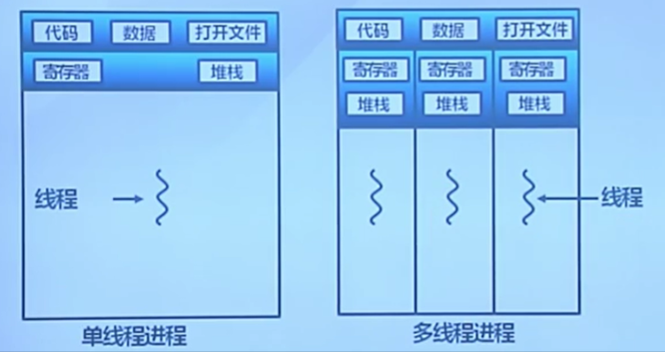
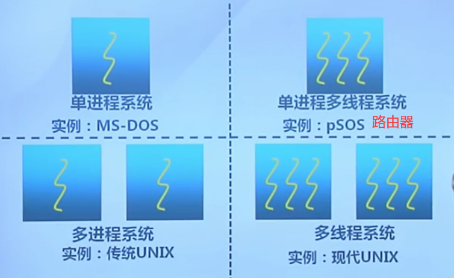

# Lab 4 & Lab 5

## 理论部分

### 进程和线程

#### 进程的概念

进程的定义：进程是指一个具有一定**独立功能**的程序在一个**数据集合**上的一次**动态执行**过程

进程的组成：进程包含了正在运行的一个程序的所有状态信息

- 代码
- 数据
- 状态寄存器：CPU状态CR0，指令指针IP
- 通用寄存器：AX，BX，CX
- 进程占用系统资源：打开文件、已分配内存

进程的特点：

- 动态性
- 并发性：进程可以被独立调度并占用处理机运行
- 独立性：不同进程的工作不互相影响
- 制约性：因访问共享数据/资源或进程间同步而产生制约

进程和程序的联系：

- 进程是操作系统处于执行状态程序的抽象 程序=静态的可执行文件 进程=程序+执行状态
- 同一个程序的多次执行过程对应为不同进程
- 进程执行除了程序之外还需要其他资源：内存（保存代码和数据） CPU（执行指令）

进程与程序的区别：

- 进程是动态的，程序是静态的
  - 程序是有序代码的集合
  - 进程是程序的执行，进程有内核态和用户态的切换
- 进程是暂时的，程序是永久的
  - 进程是一个状态变化的过程
  - 程序可永久保存
- 进程和程序的组成不同
  - 进程的组成包括程序、数据和进程控制块

#### 进程控制块

进程控制块：操作系统管理控制进程运行所用的信息集合

- 操作系统用PCB来描述进程的**基本情况**以及**运行变化的过程**
- PCB是进程存在的唯一标志
  - 每一个进程都在操作系统中有一个对应的PCB

进程控制块的使用：

- 进程创建：生成该进程的PCB
- 进程终止：回收他得PCB
- 进程的组织管理：通过对PCB的组织管理来实现

进程控制块的组成：

- 进程标识信息
- 处理机现场保存
- 进程控制信息
  - 调度和状态信息：调度进程和处理机使用情况
  - 进程间的通信信息：进程间通信相关的各种标识
  - 存储管理信息：指向进程映像存储空间的数据结构
  - 进程所用资源：进程使用的系统资源，如打开文件等
  - 有关数据结构连接信息：与PCB相关的进程的队列

进程控制块的组织：

- 链表：同一状态的进程其PCB成一链表，多个状态对应多个不同的链表
  - 各状态的进程形成不同的链表：就绪链表、阻塞链表
- 索引表：同一状态的进程归入一个索引表（由索引指向PCB），多个状态对应多个不同的索引表
  - 各状态的进行形成不同的索引表：就绪索引表、阻塞索引表

#### 进程状态

- 进程创建
- 进程执行
- 进程等待
- 进程抢占
- 进程唤醒
- 进程结束



进程创建：创建 -> 就绪

引起进程创建的情况： 

- 系统初始化时
- 用户请求创建一个新进程
- 正在运行的进程执行了创建进程的系统调用

进程执行：内核选择一个就绪的进程，让它占用处理机并执行

进程等待：

进程进入等待（阻塞）的情况：

- 请求并等待系统服务，无法马上完成
- 启动某种操作，无法马上完成
- 需要的数据没有到达

进程进入等待状态一定是由于进程的内部原因，只有进程自身才能知道何时需要等待某种事件的发生

进程抢占：

进程会被抢占的情况：

- 高优先级进程就绪
- 进程执行当前时间用完

进程唤醒：

唤醒进程的情况:

- 被阻塞的进程需要的资源可被满足
- 被阻塞进程等待的时间到达

进程只能被别的进程或操作系统唤醒

进程结束：

进程结束的情况：

- 正常退出
- 错误退出
- 致命错误
- 被其他进程所杀（强制性的）

操作系统管理不同进程之间的切换过程

#### 三状态进程模型



运行状态：进程正在处理机上**运行**

就绪状态：进程获取除了处理机之外的所需资源，**得到处理机即可运行**

等待状态/阻塞状态：进程正在**等待某一事件**的出现而暂停运行

#### 挂起进程模型

进程挂起：处于挂起状态的进程映像在磁盘上，目的是减少进程占用内存

增加了两个状态：等待挂起、就绪挂起



等待挂起状态：进程在外存并等待某事件的出现

就绪挂起状态：进程在外存，但只要进入内存即可运行

状态变迁：

- 挂起：把一个进程从内存转到外存
  - 等待到等待挂起：没有进程处于就绪状态或就绪进程要求更多的内存资源
  - 就绪到就绪挂起：由高优先级等待进程（系统认为会很快就绪）和低优先级就绪进程
  - 运行到就绪挂起：对抢先式分时系统中，当有高优先级等待挂起进程因事件出现而进入就绪挂起
- 在外存时的状态转换：
  - 等待挂起 -> 就绪挂起：等待挂起进程因相关事件出现
- 激活：把一个进程从外存转到内存
  - 就绪挂起到就绪：没有就绪进程或挂起就绪进程优先级高于就绪进程
  - 等待挂起到等待：当一个进程释放足够内存，并有高优先级等待挂起进程

状态队列：

- 由操作系统来维护一组队列，表示系统中所有进程的当前状态
- 不同队列表示不同状态：就绪队列、各种等待队列
- 根据进程状态的不同，进程PCB加入相应队列，进程状态变化时，它所在的PCB会从一个队列换到另一个

#### 线程的概念

线程是进程的一部分，描述指令流执行状态。它是进程中的**指令执行流**的最小单位，是**CPU调度**的基本单位。

- 进程的资源分配角色：进程由一组相关的资源构成，包括地址空间（代码段、数据段）、打开文件等各种资源
- 线程的处理机调度角色：线程描述在进程资源环境中的指令流执行状态

进程和线程的关系：



- 线程=进程-共享资源

线程的优点：

- 一个进程中可以同时存在多个线程
- 各个线程之间可以并发执行
- 各个线程之间可以共享地址空间和文件等资源

线程的缺点：一个线程崩溃，会导致其所属进程的所有线程崩溃

不同操作系统对线程的支持：



线程和进程的比较：

- 进程是资源分配的单位，线程是CPU调度的单位
- 进程拥有一个完整的资源平台，而线程只独享指令流执行的必要资源，如寄存器和栈
- 线程具有就绪、等待和运行三种基本状态和状态间的转换关系
- 线程能减少并发执行的时间和空间开销
  - 线程的创建时间比进程短
  - 线程的终止时间比进程短
  - 同一进程内部的线程切换时间比进程短
  - 由于同一进程的各线程间共享内存和文件资源，可不通过内核直接通信

#### 用户线程

线程的三种实现方式：

- 用户线程：在用户空间实现
  - POSIX Pthreads，Mach C-threads，Solaris threads
- 内核线程：在内核中实现
  - Windows，Solaris，Linux 
- 轻量级进程：在内核中实现，支持用户线程
  - Solaris

用户线程：由一组用户级的线程库函数来完成线程的管理，包括线程的创建、终止、同步和调度等

特征：

- 不依赖于操作系统的内核：内核不了解用户线程的存在、可用于不支持线程的多进程操作系统
- 在用户空间实现的线程机制：每个进程有私有的线程控制块列表、TCB由线程库函数维护
- 同一进程内的用户线程切换速度快：无需用户态/核心态的切换
- 允许每个进程拥有自己的线程调度算法

不足：

- 线程发起系统调用而阻塞时，整个进程进入等待
- 不支持基于线程的处理机抢占，除非当前运行线程主动放弃，它所在进程的其他线程无法抢占CPU
- 只能按进程分配CPU时间：多个线程进程中，每个线程的时间片较少

#### 内核线程

由内核通过系统调用实现的线程机制，由内核完成线程的创建、终止和管理

特征：

- 由内核维护PCB和TCB
- 线程执行系统调用而被阻塞不会影响其他线程
- 线程的创建、终止和切换相对较大：通过系统调用/内核函数，在内核实现
- 以线程为单位进行CPU时间分配：多线程的进程可获得更多的CPU时间

轻权进程：内核支持的用户线程，一个进程可有一个或多个轻量级进程，每个轻权进程由一个单独的内核线程来支持（Solaris/Linux） => 实际上实现不理想

### 进程控制

#### 进程切换

进程切换（上下文切换）：

- 暂停当前运行进程，从运行状态变成其他状态
- 调度另一个进程从就绪状态变成运行状态

进程切换的要求：

- 切换前，保存进程的上下文
- 切换后，恢复进程上下文
- 快速切换 （进程切换的频率非常快，通常由汇编实现）

进程生命周期的信息：

- 寄存器（PC，SP，...）
- CPU状态
- 内存地址空间

#### 进程创建

创建新进程：

- Windows进程创建API：CreateProcess(filename)
- Unix进程创建系统调用：fork/exec
  - fork()把一个进程复制成两个进程：parent(old PID)，child（new PID）
  - exec()用新程序来重写当前进程：PID没有改变

fork()创建一个继承的子进程:

- 复制父进程的所有变量和内存
- 复制父进程的所有CPU寄存器(除一个寄存器外)

fork()的返回值:

- 子进程的fork()返回0
- 父进程的frok()返回子进程标识符
- fork()返回值可以方便后续使用，子进程可使用getpid()获取PID

空闲进程的创建：当CPU处理完用户的所有指令之后，会继续执行对于空闲进程处理的指令

创建第一个内核线程

fork()的开销：

- 对子进程分配内存
- 复制父进程的内存和CPU寄存器到子进程里
- = = > 开销昂贵

在99%的情况下，调用fork()之后会调用exec()函数

- 在fork()操作中内存复制是没有作用的
- 子进程将可能关闭打开的文件和连接

vfork()（早期）：

- 创建进程时，不再创建一个同样的内存映像
- 子进程应该几乎立即调用exec()
- => 轻量级fork()

现在使用Copy on Write（COW）技术

#### 进程加载

程序加载和执行系统调用exec()：

- 允许进程"加载"一个完全不同的程序，并从main开始执行（即_start）
- 允许进程加载时指定启动参数（argc,argv）
- exec调用成功时
  - 是相同的进程，运行了不同的程序
- 代码段、堆栈和堆等完全重写

#### 进程等待与退出

父进程等待子进程：

- wait()系统调用用于父进程等待子进程的结束
  - 子进程结束时通过exit()向父进程返回一个值
  - 父进程通过wait()接受并处理返回值

wait()系统调用的功能：

- 有子进程存活时，父进程进入等待状态，等待子进程的返回结果
  - 当某子进程调用exit()时，唤醒父进程，将exit()返回值作为父进程中wait的返回值
- 有僵尸子进程等待时，wait()立即返回其中一个值
- 无子进程存活时，wait()立刻返回

进程的有序终止exit()：

- 进程结束执行调用exit()，完成进程资源回收
- exit()系统调用的功能：
  - 将调用参数作为父进程的结果
  - 关闭所有打开的文件等占用资源
  - 释放内存
  - 释放大部分进程相关的内核数据结构
  - 检查父进程是否是存活着的
    - 如果父进程存活，保留结果的值直到父进程需要它，进入僵尸状态
    - 如果没有，释放所有的数据结构和进程结果
  - 清理所有等待的僵尸进程
- 进程终止是最终的垃圾收集（资源回收）

其他进程控制系统调用：

- 优先级控制
  - nice()指定进程的初始优先级
  - Unix系统中进程优先级会随执行时间而衰减（动态的优先级）
- 进程调试支持
  - ptrace()允许一个进程控制另一个进程的执行
  - 设置断点和查看寄存器
- 定时
  - sleep()可以让进程在定时器的等待队列中等待指定

## 实验部分-Lab 4

### 练习1

分配并初始化一个进程控制块（需要编码） 

alloc_proc函数（位于kern/process/proc.c中）负责分配并返回一个新的struct proc_struct结 构，用于存储新建立的内核线程的管理信息。ucore需要对这个结构进行最基本的初始化，需要我们完成这个初始化过程。

在alloc_proc函数的实现中，需要初始化的 proc_struct结构中的成员变量至少包括：state/pid/runs/kstack/need_resched/parent/mm/context/tf/cr3/flags/name。 

具体代码如下：

```C
static struct proc_struct *alloc_proc(void) {
    struct proc_struct *proc = kmalloc(sizeof(struct proc_struct));
    if (proc != NULL) {
        proc->state = PROC_UNINIT; // 进程状态
        proc->pid = -1; // 进程ID
        proc->runs = 0; // 进程时间片
        proc->kstack = 0; // 进程所使用的内存栈地址
        proc->need_resched = NULL; // 进程是否能被调度
        proc->parent = NULL; // 父进程
        proc->mm = NULL; // 进程所用的虚拟内存
        memset(&(proc->context), 0, sizeof(struct context)); // 进程的上下文
        proc->tf = NULL; // 中断帧指针
        proc->cr3 = boot_cr3; // 内核页目录表基址
        proc->flags = 0; // 标志位
        memset(&(proc->name), 0, PROC_NAME_LEN); // 进程名
    }
    return proc;
}
```

问题：请说明proc_struct中 `struct context context` 和 `struct trapframe *tf` 成员变量含义和在本实验中的作用是啥？（提示通过看代码和编程调试可以判断出来） 

`struct context context` 中保存着各种寄存器的内容，用来保存进程上下文进而为进程调度做准备

`struct trapframe *tf` 保存着用于特权级转换的栈和寄存器等数据

### 练习2

为新创建的内核线程分配资源（需要编码）  

创建一个内核线程需要分配和设置好很多资源。kernel_thread函数通过调用do_fork函数完成 具体内核线程的创建工作。do_kernel函数会调用alloc_proc函数来分配并初始化一个进程控 制块，但alloc_proc只是找到了一小块内存用以记录进程的必要信息，并没有实际分配这些资 源。ucore一般通过do_fork实际创建新的内核线程。do_fork的作用是，创建当前内核线程的 一个副本，它们的执行上下文、代码、数据都一样，但是存储位置不同。在这个过程中，需 要给新内核线程分配资源，并且复制原进程的状态。需要完成在kern/process/proc.c中的 do_fork函数中的处理过程。它的大致执行步骤包括： 

- 调用alloc_proc，首先获得一块用户信息块
- 为进程分配一个内核栈
- 复制原进程的内存管理信息到新进程（但内核线程不必做此事）
- 复制原进程上下文到新进程 
- 将新进程添加到进程列表 
- 唤醒新进程 
- 返回新进程号 

具体代码如下：

```C
int do_fork(uint32_t clone_flags, uintptr_t stack, struct trapframe *tf) {
    if ((proc = alloc_proc()) == NULL) {
        goto fork_out;
    }
    proc->parent = current;
    if (setup_kstack(proc) != 0) {
        goto bad_fork_cleanup_proc;
    }
    if (copy_mm(clone_flags, proc) != 0) {
        goto bad_fork_cleanup_kstack;
    }
    copy_thread(proc, stack, tf);
    bool intr_flag;
    local_intr_save(intr_flag);
    {
        proc->pid = get_pid();
        hash_proc(proc);
        nr_process++;
        list_add(&proc_list, &(proc->list_link));
    }
    local_intr_restore(intr_flag);

    wakeup_proc(proc);
    ret = proc->pid;
}
```

问题： 请说明ucore是否做到给每个新fork的线程一个唯一的id？请说明你的分析和理由。 

ucore通过get_pid()函数从进程控制块链表中找到合适的ID分配给新fork()的线程

### 练习3

阅读代码，理解 proc_run函数和它调用的函数如何完成进程切换的。

```C
void proc_run(struct proc_struct *proc) {
    if (proc != current) {
        bool intr_flag;
        struct proc_struct *prev = current, *next = proc;
        local_intr_save(intr_flag); // 关闭中断
        {
            current = proc; // 将当前进程换为要切换到的进程
            // 设置任务状态段tss中的特权级0下的esp0指针为next内核线程的内核栈的栈顶
            load_esp0(next->kstack + KSTACKSIZE);
            // 重新加载cr3寄存器(页目录表基址) 进行进程间的页表切换
            lcr3(next->cr3); 
            // 调用switch_to进行上下文的保存与切换
            switch_to(&(prev->context), &(next->context)); 
        }
        local_intr_restore(intr_flag);
    }
}
```

问题：在本实验的执行过程中，创建且运行了几个内核线程？

创建了两个内核线程，一个是idle_proc，来完成内核中的初始化，另一个为init_proc。

问题：语句`local_intr_save(intr_flag);....local_intr_restore(intr_flag); `在这里有何作用？

该语句用来关闭中断，以避免进程切换的中途再被中断或者其他进程再进行调度.

## 实验部分-Lab 5

### 练习0

填写已有代码

本实验依赖实验1/2/3/4。请把你做的实验1/2/3/4的代码填入本实验中代码中 有“LAB1”/“LAB2”/“LAB3”/“LAB4”的注释相应部分。注意：为了能够正确执行lab5的测试应用 程序，可能需对已完成的实验1/2/3/4的代码进行进一步改进。 

改进部分如下：

```C
//proc.c: 
static struct proc_struct * alloc_proc(void) {
    proc->state = PROC_UNINIT;
    proc->pid = -1;
    proc->runs = 0;
    proc->kstack = 0;
    proc->need_resched = NULL;
    proc->parent = NULL;
    proc->mm = NULL;
    memset(&(proc->context), 0, sizeof(struct context));
    proc->tf = NULL;
    proc->cr3 = boot_cr3;
    proc->flags = 0;
    memset(&(proc->name), 0, PROC_NAME_LEN);
    
    // 新添加: 初始化进程等待状态和进程相关指针
    proc->wait_state = 0; 
    proc->cptr = proc->yptr = proc-> optr = NULL;
    |   cptr: proc is parent          |
    |   yptr: proc is younger sibling |
    |   optr: proc is older sibling   |
}

int do_fork(uint32_t clone_flags, uintptr_t stack, struct trapframe *tf) {
    if ((proc = alloc_proc()) == NULL) {
        goto fork_out;
    }
    proc->parent = current;

    // 新添加：确保当前进程正在等待    
    assert(current->wait_state == 0);

    if (setup_kstack(proc) != 0) {
        goto bad_fork_cleanup_proc;
    }
    if (copy_mm(clone_flags, proc) != 0) {
        goto bad_fork_cleanup_kstack;
    }
    copy_thread(proc, stack, tf);
    bool intr_flag;
    local_intr_save(intr_flag);
    {
        proc->pid = get_pid();
        hash_proc(proc);

        // 删除这行：将原来的简单计数改成设置进程的相关链接
        set_links(proc);
    }
    local_intr_restore(intr_flag);

    wakeup_proc(proc);
    ret = proc->pid;
}
```

```C
//trap.c:
static void trap_dispatch(struct trapframe *tf) {
    // 时间片用完，设置进程变成需要被调度
    if (++ticks % TICK_NUM == 0) {
        assert(current != NULL);
        current->need_resched = 1;
    }
}
void idt_init(void) {
    int i;
    for (i = 0; i < sizeof(idt) / sizeof(struct gatedesc); i++) {
        SETGATE(idt[i], 0, GD_KTEXT, __vectors[i], DPL_KERNEL);
    }
    // 新添加：设置C给用户态用的中断门，让用户态能够进行系统调用
    SETGATE(idt[T_SYSCALL], 1, GD_KTEXT, __vectors[T_SYSCALL], DPL_USER);

    lidt(&idt_pd);
}
```

### 练习1

加载应用程序并执行（需要编码） 

do_execv函数调用load_icode（位于kern/process/proc.c中）来加载并解析一个处于内存中的ELF执行文件格式的应用程序，建立相应的用户内存空间来放置应用程序的代码段、数据段等，且要设置好proc_struct结构中的成员变量trapframe中的内容，确保在执行此进程后，能够从应用程序设定的起始执行地址开始执行。需设置正确的trapframe内容。 

具体代码如下：

```C
//(6) setup trapframe for user environment
struct trapframe *tf = current->tf;
memset(tf, 0, sizeof(struct trapframe));
/* LAB5:EXERCISE1 YOUR CODE
 * should set tf_cs,tf_ds,tf_es,tf_ss,tf_esp,tf_eip,tf_eflags
 * NOTICE: If we set trapframe correctly, then the user level process can return to USER MODE from kernel. So
 *          tf_cs should be USER_CS segment (see memlayout.h)
 *          tf_ds=tf_es=tf_ss should be USER_DS segment
 *          tf_esp should be the top addr of user stack (USTACKTOP)
 *          tf_eip should be the entry point of this binary program (elf->e_entry)
 *          tf_eflags should be set to enable computer to produce Interrupt
 */
tf->tf_cs = USER_CS;
tf->tf_ds = tf->tf_es = tf->tf_ss = USER_DS;
tf->tf_esp = USTACKTOP;
tf->tf_eip = elf->e_entry;
tf->tf_eflags = FL_IF;
ret = 0;
```

问题： 描述当创建一个用户态进程并加载了应用程序后，CPU是如何让这个应用程序最终在用户态执行起来的。即这个用户态进程被ucore选择占用CPU执行（RUNNING态）到具体执行应用程序第一条指令的整个经过。 

创建一个用户态进程并加载了应用程序之后调度器schedule调用proc_run，设置指针 current 为当前执行PCB并加载该进程的内核栈和页目录表调用 switch_to 。因为当前进程的 context 其中的 eip 被设置成forkret， switch_to ret 后会跳转到 forkret 处 forkret 又会将栈设置为当前进程的trapframe，然后跳到 \__trapret，此时 __trapret会根据当前进程的trapframe恢复上下文，最后退出中断 iret ，从系统调用的函数调用路径返回切换到用户进程 hello 第一句语句 _start 处开始执行。

### 练习2

父进程复制自己的内存空间给子进程（需要编码） 

创建子进程的函数do_fork在执行中将拷贝当前进程（即父进程）的用户内存地址空间中的合法内容到新进程中（子进程），完成内存资源的复制。具体是通过copy_range函数（位于 kern/mm/pmm.c中）实现的，请补充copy_range的实现，确保能够正确执行。

具体代码如下：

```C
/* copy_range - copy content of memory (start, end) of one process A to another process B
 * @to:    the addr of process B's Page Directory
 * @from:  the addr of process A's Page Directory
 * @share: flags to indicate to dup OR share. We just use dup method, so it didn't be used.
 *
 * CALL GRAPH: copy_mm-->dup_mmap-->copy_range
 */
int
copy_range(pde_t *to, pde_t *from, uintptr_t start, uintptr_t end, bool share) {
    assert(start % PGSIZE == 0 && end % PGSIZE == 0);
    assert(USER_ACCESS(start, end));
    // copy content by page unit.
    do {
        //call get_pte to find process A's pte according to the addr start
        pte_t *ptep = get_pte(from, start, 0), *nptep;
        if (ptep == NULL) {
            start = ROUNDDOWN(start + PTSIZE, PTSIZE);
            continue ;
        }
        //call get_pte to find process B's pte according to the addr start. If pte is NULL, just alloc a PT
        if (*ptep & PTE_P) {
            if ((nptep = get_pte(to, start, 1)) == NULL) {
                return -E_NO_MEM;
            }
        uint32_t perm = (*ptep & PTE_USER);
        //get page from ptep
        struct Page *page = pte2page(*ptep);
        // alloc a page for process B
        struct Page *npage=alloc_page();
        assert(page!=NULL);
        assert(npage!=NULL);
        int ret=0;
        /* LAB5:EXERCISE2 YOUR CODE
         * replicate content of page to npage, build the map of phy addr of nage with the linear addr start
         */
        void * kva_src = page2kva(page);
        void * kva_dst = page2kva(npage);
        memcpy(kva_dst, kva_src, PGSIZE);
        ret = page_insert(to, npage, start, perm);

        assert(ret == 0);
        }
        start += PGSIZE;
    } while (start != 0 && start < end);
    return 0;
}
```

### 练习3

阅读分析源代码，理解进程执行 fork/exec/wait/exit 的实现，以及系统调用的实现（不需要编码） 

问题：请分析fork/exec/wait/exit在实现中是如何影响进程的执行状态的？ 

fork：创建新的 PCB 进程状态为 UNINIT。

exec：将当前进程的内存布局清除再调用 load_icode 读出ELF映像中的内存布局，进程状态不改变。

wait：当前进程若无子进程则返回错误，若有子进程则判定是否为 ZOMBIE子进程，有则释放子进程的资源，并返回子进程的返回状态码，若无ZOMBIE状态子进程，则进入 SLEEPING 状态，等子进程唤醒。

exit：清除当前进程几乎所有资源(PCB和内核栈不清除)， 将所有子进程设置为 init 进程，将当前进程状态设置为 ZOMBIE若有父进程在等待当前进程exit，则唤醒父进程。

问题：请给出ucore中一个用户态进程的执行状态生命周期图（包括执行状态，执行状态之间的变换关系，以及产生变换的事件或函数调用）

见理论部分三状态进程模型


