# Ucore LAB（一）

本实验主要是根据清华大学的ucore课程设计学习操作系统的内容。

## Lab 0

### 准备知识

#### Intel 80386运行模式

80386有四种运行模式，实模式、保护模式、SMM模式和虚拟8086模式

80386加电启动后处于实模式运行状态，实模式的存在是为了intel x86的向下兼容需求。实模式把整个物理内存看作是分段的区域，程序代码和数据位于不同的区域，操作系统和用户程序没有区别对待。

80386工作在保护模式时，32根地址线都可供寻址，物理寻址空间高达4GB。保护模式支持内存分页机制，提供对虚拟内存的良好支持。支持多任务、优先级机制，不同的程序可以运行在不同的特权级上。

#### Intel 80386内存架构

内存处理机制：

- 段机制：对内存单元的安全保护和隔离
- 页机制：有效支持大量应用程序分散使用大内存

三个地址空间：

- 物理地址空间：处理器提交到总线上、用于访问计算机系统中内存和外设的最终地址
- 线性地址空间：80386处理器通过段机制控制下形成的地址空间，实现多个运行的应用程序之间相互隔离、保护地址空间
  - 在操作系统的管理下，每个运行的应用程序有相对独立的一个或多个内存空间段
  - 每个段有各自的起始地址和长度属性，大小不固定
- 逻辑地址空间：面向程序员的地址（虚拟地址）

三者关系：

- 分段机制启动、分页机制未启动：逻辑地址--->**段机制处理**--->线性地址=物理地址
- 分段机制和分页机制都启动：逻辑地址--->**段机制处理**--->线性地址--->**页机制处理**--->物理地址

### 具体操作

本实验我选择的环境是在Win上通过VMware虚拟机使用Linux Ubuntu 16.04实验环境，首先下载相应的lab：

```
git clone https://github.com/kiukotsu/ucore
```

随后安装qemu：

```
sudo apt-get install qemu-system
```

## Lab 1

### 实验目的

完成一个能够切换到X86保护模式并显示字符的bootloader，为启动操作系统ucore做准备。

lab1中包含一个bootloader和一个OS，其中bootloader：切换到X86保护模式、读磁盘并加载ELF执行文件格式、显示字符；OS：处理时钟中断、显示字符

### 练习1

问题：

 操作系统镜像文件ucore.img是如何一步一步生成的？  (需要比较详细地解释Makefile中每一条相关命令和命令参数的含义，以及说明命令导致的结果) 

首先在lab1_result目录下执行如下命令，通过make命令生成可执行文件：

```
make V= >> make_result.txt
```

首先把当前文件夹各目录下的.c文件和.s文件编译生成相应的.o文件，具体文件有：

```
kern/init/init.c
kern/libs/stdio.c
kern/libs/readline.c
kern/debug/panic.c
kern/debug/kdebug.c
kern/debug/kmonitor.c
kern/driver/clock.c
kern/driver/console.c
kern/driver/picirq.c
kern/driver/intr.c
kern/trap/trap.c
kern/trap/vectors.S
kern/trap/trapentry.S
kern/mm/pmm.c
libs/string.c
libs/printfmt.c
```

执行的命令例如：

```makefile
+ cc kern/init/init.c
gcc -Ikern/init/ -fno-builtin -Wall -ggdb -m32 -gstabs -nostdinc  -fno-stack-protector -Ilibs/ -Ikern/debug/ -Ikern/driver/ -Ikern/trap/ -Ikern/mm/ -c kern/init/init.c -o obj/kern/init/init.o
```

以及：

```
+ cc kern/trap/vectors.S
gcc -Ikern/trap/ -fno-builtin -Wall -ggdb -m32 -gstabs -nostdinc  -fno-stack-protector -Ilibs/ -Ikern/debug/ -Ikern/driver/ -Ikern/trap/ -Ikern/mm/ -c kern/trap/vectors.S -o obj/kern/trap/vectors.o
```

相关参数：

-Idir：使用-I 指定目录，在`#include "file"`的时候会先在dir目录下查找file，如果查找不到则到系统缺省的头文件目录查找

-fno-builtin：无法识别不以`__builtin_`作为前缀的内置函数，防止内核代码函数名与内置函数名冲突

-Wall：显示所有的编译警告

-ggdb：令gcc为gdb生成专用的更为丰富的调试信息

-m32：生成32位

-gstabs：以stabs格式声称调试信息，但是不包括gdb调试信息

-nostdinc：使编译器不在系统缺省的头文件目录中找头文件，与-Idir选项一起使用，明确限定了头文件的位置

-fno-stack-protector：禁用栈保护措施

-c：只做预处理、编译和汇编，只生成obj目标文件

-o：指定生成的输出文件

随后，指定`tools/kernel.ld`脚本文件链接上面生成的所有目标文件，生成 bin/kernel 内核文件

```
+ ld bin/kernel
ld -m    elf_i386 -nostdlib -T tools/kernel.ld -o bin/kernel  obj/kern/init/init.o obj/kern/libs/stdio.o obj/kern/libs/readline.o obj/kern/debug/panic.o obj/kern/debug/kdebug.o obj/kern/debug/kmonitor.o obj/kern/driver/clock.o obj/kern/driver/console.o obj/kern/driver/picirq.o obj/kern/driver/intr.o obj/kern/trap/trap.o obj/kern/trap/vectors.o obj/kern/trap/trapentry.o obj/kern/mm/pmm.o  obj/libs/string.o obj/libs/printfmt.o
```

相关参数：

-m：模拟指定的链接器

-nostdlib：不链接系统标准启动文件和标准库文件，只把指定的文件传递给链接器

-T：从指定的命令文件读取命令

-o：指定输出文件的名称

接着使用gcc命令将bootasm.S、bootmain.c、sign.c文件生成相应的目标文件，将生成的sign.o文件生成可执行文件bin/sign，随后将bootasm.o文件和bootmain.o文件链接生成bootblock.o文件

```
+ cc boot/bootasm.S
gcc -Iboot/ -fno-builtin -Wall -ggdb -m32 -gstabs -nostdinc  -fno-stack-protector -Ilibs/ -Os -nostdinc -c boot/bootasm.S -o obj/boot/bootasm.o
+ cc boot/bootmain.c
gcc -Iboot/ -fno-builtin -Wall -ggdb -m32 -gstabs -nostdinc  -fno-stack-protector -Ilibs/ -Os -nostdinc -c boot/bootmain.c -o obj/boot/bootmain.o
+ cc tools/sign.c
gcc -Itools/ -g -Wall -O2 -c tools/sign.c -o obj/sign/tools/sign.o
gcc -g -Wall -O2 obj/sign/tools/sign.o -o bin/sign
+ ld bin/bootblock
ld -m    elf_i386 -nostdlib -N -e start -Ttext 0x7C00 obj/boot/bootasm.o obj/boot/bootmain.o -o obj/bootblock.o
'obj/bootblock.out' size: 500 bytes
build 512 bytes boot sector: 'bin/bootblock' success!
```

补充ld命令的相关参数：

-N：指定读取/写入文本和数据段  

-e： 使用指定的符号作为程序的初始执行点  ，这里是start

-Ttext：使用指定的地址作为text段（代码段）的起始点，这里是0x7C00

最后，使用dd命令生成最终的ucore.img镜像文件：

```
dd if=/dev/zero of=bin/ucore.img count=10000
dd if=bin/bootblock of=bin/ucore.img conv=notrunc
dd if=bin/kernel of=bin/ucore.img seek=1 conv=notrunc
```

相关参数说明：

if=file：输入文件名， 从file读取。/dev/zero设备无穷尽地提供0。
of=file：输出文件名， 向file写出，可以写文件，可以写裸设备。
seek=blocks ：从输出文件开头跳过 blocks 个块后再开始复制。
count=blocks ：仅拷贝 blocks 个块
conv=conversion：用指定的参数转换文件

所以，这三条dd命令是先用10000个块的空字符填充ucore.img，每个块的大小为512字节，所以共5120000B。随后把bootblock文件复制到ucore.img的文件头处，共512B大小。最后把kernel文件复制到第一个块后的文件位置处，也就是512B之后，notrunc模式表示不会缩减输出文件，只复制指定字节并保留输出文件的剩余部分。

问题：

一个被系统认为是符合规范的硬盘主引导扇区的特征是什么？

sign程序将bootblock.o文件添加主引导扇区标志：

```C
#include <stdio.h>
#include <errno.h>
#include <string.h>
#include <sys/stat.h>

int
main(int argc, char *argv[]) {
    struct stat st;
    if (argc != 3) {
        fprintf(stderr, "Usage: <input filename> <output filename>\n");
        return -1;
    }
    if (stat(argv[1], &st) != 0) {
        fprintf(stderr, "Error opening file '%s': %s\n", argv[1], strerror(errno));
        return -1;
    }
    printf("'%s' size: %lld bytes\n", argv[1], (long long)st.st_size);
    if (st.st_size > 510) {
        fprintf(stderr, "%lld >> 510!!\n", (long long)st.st_size);
        return -1;
    }
    char buf[512];
    memset(buf, 0, sizeof(buf));
    FILE *ifp = fopen(argv[1], "rb");
    int size = fread(buf, 1, st.st_size, ifp);
    if (size != st.st_size) {
        fprintf(stderr, "read '%s' error, size is %d.\n", argv[1], size);
        return -1;
    }
    fclose(ifp);
    buf[510] = 0x55;
    buf[511] = 0xAA;
    FILE *ofp = fopen(argv[2], "wb+");
    size = fwrite(buf, 1, 512, ofp);
    if (size != 512) {
        fprintf(stderr, "write '%s' error, size is %d.\n", argv[2], size);
        return -1;
    }
    fclose(ofp);
    printf("build 512 bytes boot sector: '%s' success!\n", argv[2]);
    return 0;
}
```

可以看到读取输入文件（小于等于510字节），随后将第511和512字节设置为0x55AA。

### 练习2

问题：                                                                                                                          

1. 从CPU加电后执行的第一条指令开始，单步跟踪BIOS的执行。
2. 在初始化位置0x7c00设置实地址断点,测试断点正常。
3. 从0x7c00开始跟踪代码运行,将单步跟踪反汇编得到的代码与bootasm.S和 bootblock.asm进行比较。

根据实验提示，需要我们尝试执行：

```
make lab1-mon
```

我们先使用：

```
less Makefile
```

命令查看lab1-mon执行的是什么命令，可以看到：

```makefile
$(UCOREIMG)
$(V)$(TERMINAL) -e "$(QEMU) -S -s -d in_asm -D $(BINDIR)/q.log -monitor stdio -hda $< -serial null"
$(V)sleep 2
$(V)$(TERMINAL) -e "gdb -q -x tools/lab1init"
```

lab1init的内容如下：

```
file bin/kernel
target remote :1234
set architecture i8086
b *0x7c00
continue
x /2i $pc
```

但是，我尝试执行`make lab1-mon`会报错，原因应该是gnome-terminal出现问题，所以手动输入命令调试，首先从CPU加电后执行的第一条指令开始，单步跟踪BIOS的执行：

可以看到第一条是跳转指令：

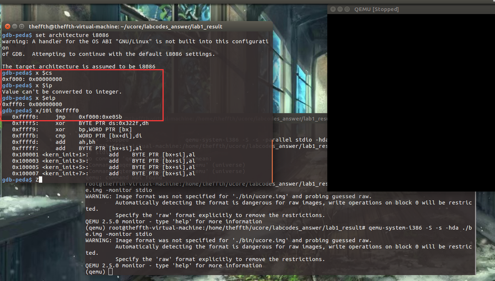

接着执行BIOS代码，将加载程序从磁盘的引导扇区加载到0x7c00，在初始化位置0x7c00设置实地址断点,测试断点正常：

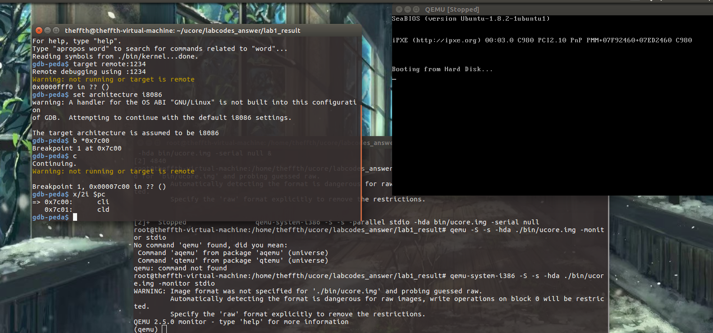

从0x7c00开始跟踪代码运行，将单步跟踪反汇编得到的代码与bootasm.S和 bootblock.asm进行比较：

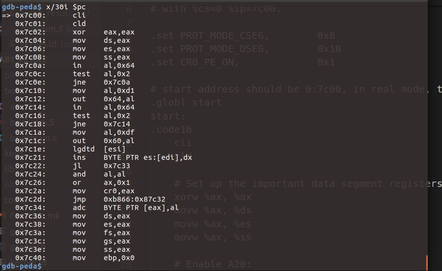

可以看到从0x7c00开始执行的代码与bootasm.S和bootblock.asm中的汇编代码相同：

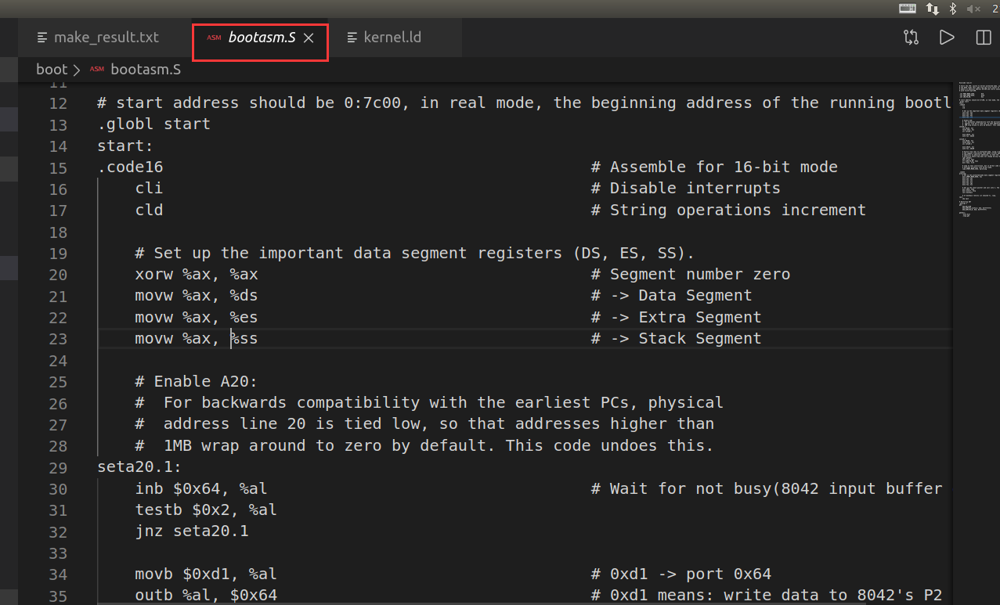

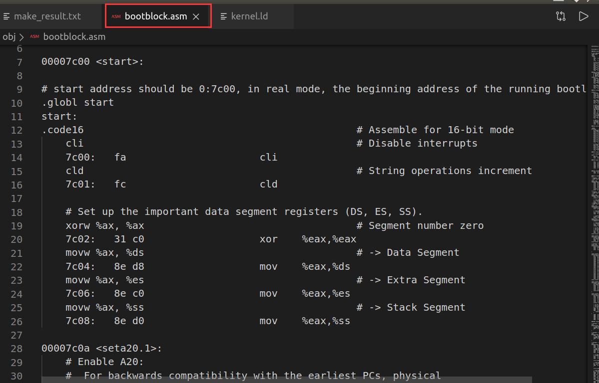

### 练习3

实验内容：分析bootloader进入保护模式的过程

背景知识：参考资料“保护模式和分段机制”一节

此练习需要我们重点分析bootasm.S文件中16-56行代码：

bootloader从start汇编代码段开始执行，首先关闭中断，初始化DS、ES、SS寄存器的内容为0：

```assembly
.globl start
start:
.code16                                             # Assemble for 16-bit mode
    cli                                             # 关闭中断
    cld                                             # 字串操作由前往后递增处理

    # 设置重要的数据段寄存器（DS，ES，SS）内容为0
    xorw %ax, %ax                                   # eax寄存器内容为0
    movw %ax, %ds                                   # -> Data Segment
    movw %ax, %es                                   # -> Extra Segment
    movw %ax, %ss                                   # -> Stack Segment
```

为何开启A20，以及如何开启A20？

背景知识：参考附录“关于A20 Gate”

在保护模式下，由于使用32位地址线，如果A20恒等于0，那么系统只能访问奇数兆的内存，即只能访问0--1M、2-3M、4-5M......为了避免这种情况的发生，必须开启A20。

开启A20的步骤是：

- 等待8042 Input buffer为空；    


- 发送Write 8042 Output Port （P2）命令到8042 Input buffer；


- 等待8042 Input buffer为空；
- 将8042 Output Port（P2）得到字节的第2位置1，然后写入8042 Input buffer

具体代码如下：

```assembly
    # 开启A20，取消回卷操作
seta20.1:
    inb $0x64, %al                            #读Status Register到al寄存器
    testb $0x2, %al                           #判断input buffer是否为空
    jnz seta20.1

    movb $0xd1, %al                           # 0xd1 -> port 0x64
    outb %al, $0x64                           # 0xd1 means: write data to 8042's P2 port

seta20.2:
    inb $0x64, %al                          # Wait for not busy(8042 input buffer empty).
    testb $0x2, %al
    jnz seta20.2

    movb $0xdf, %al             # 0xdf -> port 0x60
    outb %al, $0x60             # 0xdf = 11011111, means set P2's A20 bit(the 1 bit) to 1
```

如何初始化GDT表？

asm.h文件中关于段描述符的初始化：

```c
#define SEG_NULLASM                                             \
    .word 0, 0;                                                 \
    .byte 0, 0, 0, 0

#define SEG_ASM(type,base,lim)                                  \
    .word (((lim) >> 12) & 0xffff), ((base) & 0xffff);          \
    .byte (((base) >> 16) & 0xff), (0x90 | (type)),             \
        (0xC0 | (((lim) >> 28) & 0xf)), (((base) >> 24) & 0xff)

/* Application segment type bits */
#define STA_X       0x8     // Executable segment
#define STA_E       0x4     // Expand down (non-executable segments)
#define STA_C       0x4     // Conforming code segment (executable only)
#define STA_W       0x2     // Writeable (non-executable segments)
#define STA_R       0x2     // Readable (executable segments)
#define STA_A       0x1     // Accessed
```

```assembly
# Bootstrap GDT
.p2align 2                                          # 强制4字节对齐
gdt:
    SEG_NULLASM                                     # 空段
    SEG_ASM(STA_X|STA_R, 0x0, 0xffffffff)           # code seg for bootloader and kernel
    SEG_ASM(STA_W, 0x0, 0xffffffff)                 # data seg for bootloader and kernel

gdtdesc:
    .word 0x17                                      # sizeof(gdt) - 1
    .long gdt                                       # address gdt
```

```assembly
lgdt gdtdesc                                        #加载全局描述符
```

如何使能和进入保护模式？

使能：

CR0寄存器是系统内的控制寄存器之一。0位是保护使能位PE(Protedted Enable)，用于启动保护模式，如果PE位置1，则保护模式启动，如果PE=0，则在实模式下运行。 

```assembly
    movl %cr0, %eax
    orl $CR0_PE_ON, %eax
    movl %eax, %cr0
```

进入保护模式：

```assembly
    # Jump to next instruction, but in 32-bit code segment.
    # Switches processor into 32-bit mode.
    ljmp $PROT_MODE_CSEG, $protcseg
```

```assembly
.set PROT_MODE_CSEG,        0x8                     # kernel code segment selector
.set PROT_MODE_DSEG,        0x10                    # kernel data segment selector
.set CR0_PE_ON,             0x1                     # protected mode enable flag
```

```assembly
.code32                                             # Assemble for 32-bit mode
protcseg:
    # Set up the protected-mode data segment registers
    movw $PROT_MODE_DSEG, %ax                       # Our data segment selector
    movw %ax, %ds                                   # -> DS: Data Segment
    movw %ax, %es                                   # -> ES: Extra Segment
    movw %ax, %fs                                   # -> FS
    movw %ax, %gs                                   # -> GS
    movw %ax, %ss                                   # -> SS: Stack Segment

    # Set up the stack pointer and call into C. The stack region is from 0--start(0x7c00)
    movl $0x0, %ebp
    movl $start, %esp
    call bootmain

    # If bootmain returns (it shouldn't), loop.
spin:
    jmp spin
```

### 练习4

分析bootloader加载ELF格式的OS的过程

问题： bootloader如何读取硬盘扇区的？ 

参考资料：“硬盘访问概述”一节

读一个扇区的流程（可参看boot/bootmain.c中的readsect函数实现）大致如下：

1. 等待磁盘准备好
2. 发出读取扇区的命令
3. 等待磁盘准备好
4. 把磁盘扇区数据读到指定内存

具体代码如下：

```C
/* waitdisk - wait for disk ready */
static void
waitdisk(void) {
    while ((inb(0x1F7) & 0xC0) != 0x40)
        /* do nothing */;
}

/* readsect - read a single sector at @secno into @dst */
static void
readsect(void *dst, uint32_t secno) {
    // wait for disk to be ready
    waitdisk();

    outb(0x1F2, 1);                            // 读取一个扇区
    outb(0x1F3, secno & 0xFF);                 // 设置LBA模式的参数
    outb(0x1F4, (secno >> 8) & 0xFF);
    outb(0x1F5, (secno >> 16) & 0xFF);
    outb(0x1F6, ((secno >> 24) & 0xF) | 0xE0); // 选择主盘
    outb(0x1F7, 0x20);                         // cmd 0x20 - read sectors

    // wait for disk to be ready
    waitdisk();

    // read a sector
    /* static inline void insl(uint32_t port, void *addr, int cnt)
     * __attribute__((always_inline));
     */
    insl(0x1F0, dst, SECTSIZE / 4);
}
```

问题： bootloader是如何加载ELF格式的OS？ 

kernel文件格式信息如下：

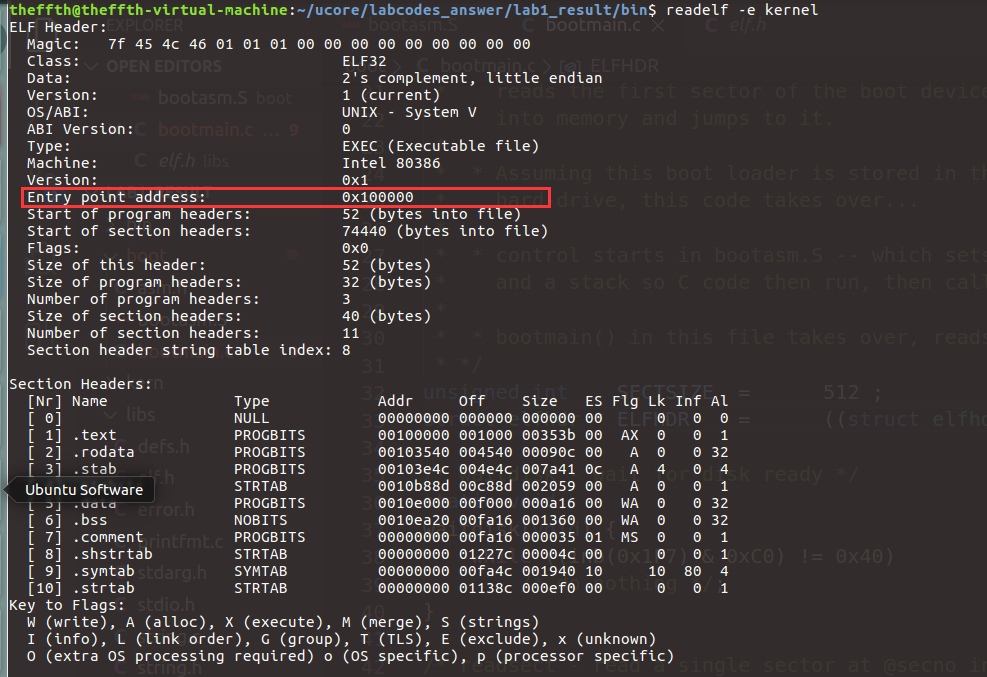

程序头信息如下:

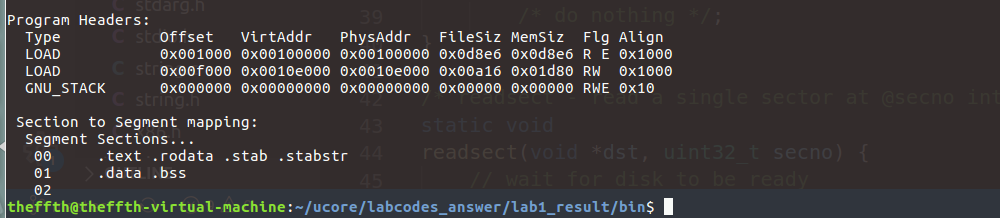

具体代码如下：

```C
/* bootmain - the entry of bootloader */
void
bootmain(void) {
    // 从硬盘0开始读取4KB（一页）到虚拟地址0x10000地址处
    readseg((uintptr_t)ELFHDR, SECTSIZE * 8, 0);

    // 检查ELF文件头的魔数，判断是否是合法的ELF文件
    if (ELFHDR->e_magic != ELF_MAGIC) {
        goto bad;
    }

    struct proghdr *ph, *eph;

    // load each program segment (ignores ph flags)
    ph = (struct proghdr *)((uintptr_t)ELFHDR + ELFHDR->e_phoff);//找到程序头表指针
    eph = ph + ELFHDR->e_phnum;  //找到程序头表尾指针
    for (; ph < eph; ph ++) {
        //把每一个段都加载到内存中
        readseg(ph->p_va & 0xFFFFFF, ph->p_memsz, ph->p_offset);
    }

    // 跳转到程序入口地址处开始执行,没有返回值
    ((void (*)(void))(ELFHDR->e_entry & 0xFFFFFF))();

bad:
    outw(0x8A00, 0x8A00);
    outw(0x8A00, 0x8E00);
    /* do nothing */
    while (1);
}
```

### 练习5

实现函数调用堆栈跟踪函数

参考资料：“函数堆栈”一节

具体实现代码如下：

```C
void
print_stackframe(void) {
     /* LAB1 YOUR CODE : STEP 1 */
     /* (1) call read_ebp() to get the value of ebp. the type is (uint32_t);
      * (2) call read_eip() to get the value of eip. the type is (uint32_t);
      * (3) from 0 .. STACKFRAME_DEPTH
      *    (3.1) printf value of ebp, eip
      *    (3.2) (uint32_t)calling arguments [0..4] = the contents in address (unit32_t)ebp +2 [0..4]
      *    (3.3) cprintf("\n");
      *    (3.4) call print_debuginfo(eip-1) to print the C calling function name and line number, etc.
      *    (3.5) popup a calling stackframe
      *           NOTICE: the calling funciton's return addr eip  = ss:[ebp+4]
      *                   the calling funciton's ebp = ss:[ebp]
      */
    uint32_t ebp=read_ebp();
    uint32_t eip=read_eip();
    for(int i=0;i<STACKFRAME_DEPTH&&ebp!=0;i++){
        cprintf("ebp:0x%08x eip:0x%08x",ebp,eip);
        cprintf(" arg:0x%08x 0x%08x 0x%08x 0x%08x",((uint32_t*)ebp)[2],((uint32_t*)ebp)[3],((uint32_t*)ebp)[4]);
        cprintf("\n");
        print_debuginfo(eip-1);
        eip=((uint32_t*)ebp)[1];
        ebp=((uint32_t*)ebp)[0];
	}
}
```

运行结果：

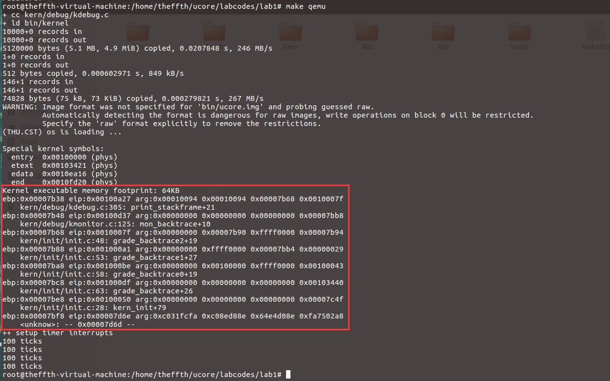

最后一行数值的含义：

由于BIOS加载bootloader代码到0x7c00地址处，所以0x7c00-开始为代码段，0x7c00-0为栈空间，一开始执行0x7c00处代码，没有参数，所以追踪到最后一个看到ebp的地址为0x7bf8（=0x7c00-8），参数为0x7c00地址开始的代码段的内容，也即0xc031fcfa...：

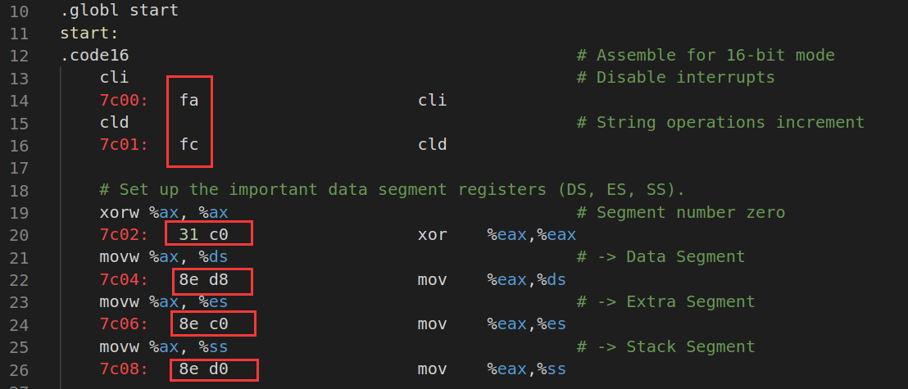

### 练习6

完善中断初始化和处理 （需要编程） 

参考资料：“中断与异常”一节

问题：中断描述符表（也可简称为保护模式下的中断向量表）中一个表项占多少字节？其中哪几位代表中断处理代码的入口？  

中断描述符结构如下：

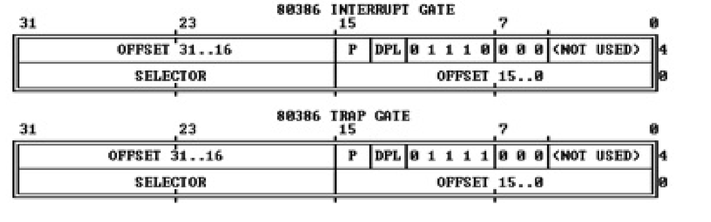

中断描述符表中一个表项占8字节，其中SELECTOR作为段选择子，段选择子从GDT中取得相应的段描述符，段描述符里保存了中断服务例程的段基址和属性信息，将段基址与中断描述符中的OFFSET偏移量相加即得到中断处理代码的入口地址。 

具体代码如下：

```C
// /kern/mm/mmu.h
/* Gate descriptors for interrupts and traps */
struct gatedesc {
    unsigned gd_off_15_0 : 16;        // low 16 bits of offset in segment
    unsigned gd_ss : 16;            // segment selector
    unsigned gd_args : 5;            // # args, 0 for interrupt/trap gates
    unsigned gd_rsv1 : 3;            // reserved(should be zero I guess)
    unsigned gd_type : 4;            // type(STS_{TG,IG32,TG32})
    unsigned gd_s : 1;                // must be 0 (system)
    unsigned gd_dpl : 2;            // descriptor(meaning new) privilege level
    unsigned gd_p : 1;                // Present
    unsigned gd_off_31_16 : 16;        // high bits of offset in segment
};
```

问题：编程完善kern/trap/trap.c中对中断向量表进行初始化的函数idt_init。在idt_init函数中， 依次对所有中断入口进行初始化。使用mmu.h中的SETGATE宏，填充idt数组内容。每个中断的入口由tools/vectors.c生成，使用trap.c中声明的vectors数组即可。

 具体实现如下：

```C
/* idt_init - initialize IDT to each of the entry points in kern/trap/vectors.S */
void
idt_init(void) {
     /* LAB1 YOUR CODE : STEP 2 */
     /* (1) Where are the entry addrs of each Interrupt Service Routine (ISR)?
      *     All ISR's entry addrs are stored in __vectors. where is uintptr_t __vectors[] ?
      *     __vectors[] is in kern/trap/vector.S which is produced by tools/vector.c
      *     (try "make" command in lab1, then you will find vector.S in kern/trap DIR)
      *     You can use  "extern uintptr_t __vectors[];" to define this extern variable which will be used later.
      * (2) Now you should setup the entries of ISR in Interrupt Description Table (IDT).
      *     Can you see idt[256] in this file? Yes, it's IDT! you can use SETGATE macro to setup each item of IDT
      * (3) After setup the contents of IDT, you will let CPU know where is the IDT by using 'lidt' instruction.
      *     You don't know the meaning of this instruction? just google it! and check the libs/x86.h to know more.
      *     Notice: the argument of lidt is idt_pd. try to find it!
      */
    extern uintptr_t __vectors[];
    //define SETGATE(gate, istrap, sel, off, dpl)
    //先全部初始化为interrupt-gate descriptor
    for(int i=0;i<256;i++)
    {
        SETGATE(idt[i],0,GD_KTEXT,__vectors[i],DPL_KERNEL);
    }
    //初始化从用户态到内核态的trap-gate descriptor
    //istrap==0 ?
    SETGATE(idt[T_SWITCH_TOK], 0 ,GD_KTEXT,__vectors[T_SWITCH_TOK],DPL_USER);
    lidt(&idt_pd);
}
```

首先声明__vectors数组，其数值由tools/vectors.c工具生成，具体在vector.S文件中：

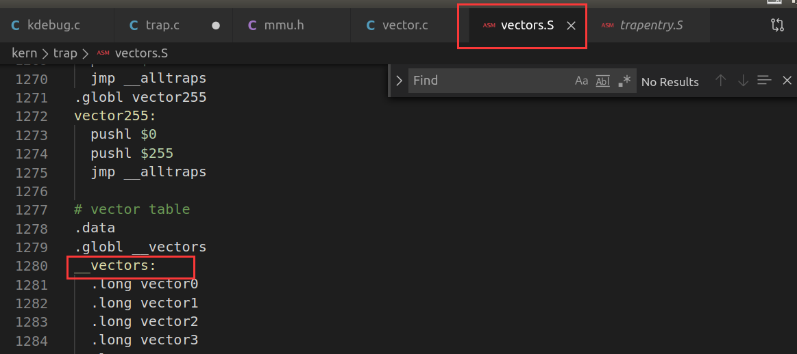

数组存储了中断入口地址中的偏移量部分，随后利用mmu.h文件中SETGATE函数来初始化idt表中的每一项，首先全部初始化为interrupt-gate描述符，则idt目标项地址为idt[i]，istrap=0，处理例程在内核态，代码段选择子为内核代码段，dpl为0；随后再设置trap-gate，最后使用lidt指令把idt的起始地址加载到IDTR寄存器中。

问题：编程完善trap.c中的中断处理函数trap，在对时钟中断进行处理的部分填写trap函数中处理时钟中断的部分，使操作系统每遇到100次时钟中断后，调用print_ticks子程序，向屏幕上打印一行文字”100 ticks”。

具体实现如下：

```C
    switch (tf->tf_trapno) {
    case IRQ_OFFSET + IRQ_TIMER:
        /* LAB1 YOUR CODE : STEP 3 */
        /* handle the timer interrupt */
        /* (1) After a timer interrupt, you should record this event using a global variable (increase it), such as ticks in kern/driver/clock.c
         * (2) Every TICK_NUM cycle, you can print some info using a funciton, such as print_ticks().
         * (3) Too Simple? Yes, I think so!
         */
        ticks++;
        if(ticks%TICK_NUM==0) print_ticks();
        break;
     //......
```

### 扩展练习

### 总结

通过lab1，我主要学习到了ucore项目的文件组成，镜像的生成过程。CPU加电后，到固定地址0xffff0处执行BIOS代码，BIOS加载bootloader代码到0x7c00地址处，bootloader加载程序首先进入保护模式，随后加载ELF格式的OS代码，也就是/bin/kernel文件。

## Lab 2

### 实验内容 

- 发现系统中的物理内存
- 建立对物理内存的初步管理（连续物理内存管理）
- 页表相关的操作，即建立页表来实现虚拟内存到物理内存之间的映射

### 准备知识

#### x86特权级

ucore和Linux只使用 ring 0 和 ring 3，其中ring 0是内核态特权级，ring 2是用户态特权级

CPU检查特权级的情况：

- 访问数据段
- 访问页表
- 进入中断服务例程

检查过程：

段选择子（位于段寄存器中）：


段描述符：

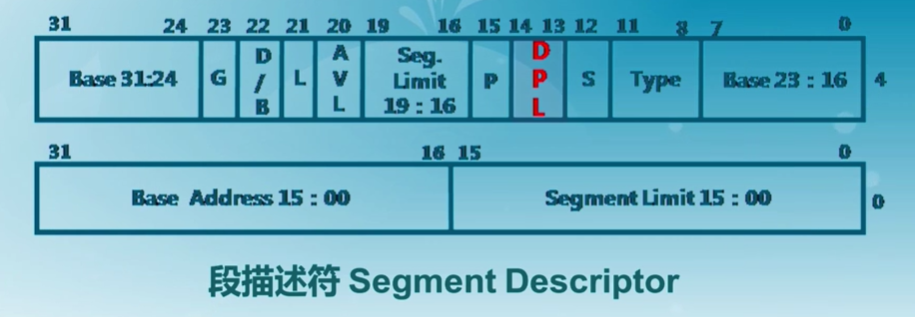

其中，

RPL：处于数据段，段寄存器DS，ES，FS，GS

CPL：处于代码段，段寄存器CS，SS

DPL：段/门描述符

执行一条指令，需要访问数据段时，当前特权级是CPL，需要访问的数据段的特权级是RPL

访问门（中断/陷入/异常）时：检查CPL ≤ DPL[门] & CPL ≥ DPL[段]

访问段时：MAX（CPL，RPL） ≤ DPL[段]

#### 通过中断切换特权级

从内核态转换到用户态：通过构造特殊的栈结合IRET指令

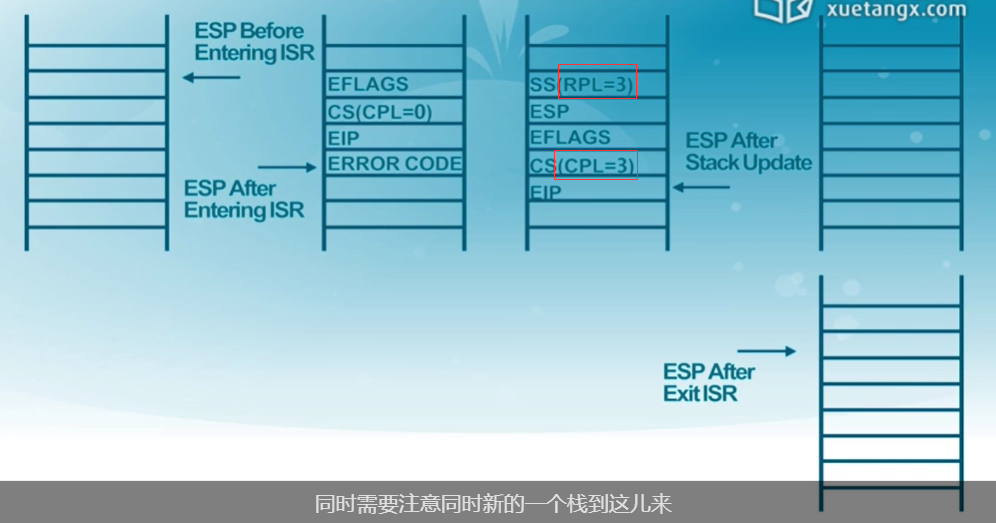

从用户态转换到内核态：通过修改内核态的栈，使IRET指令执行后仍然在内核态

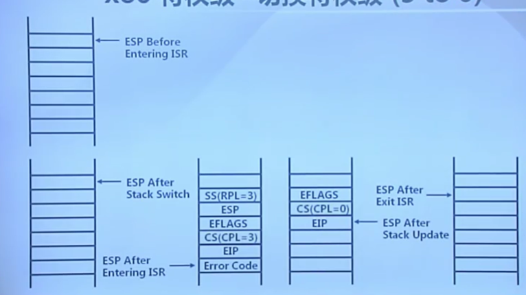

特权级转换时，不同特权级的堆栈信息保存在TSS段中：

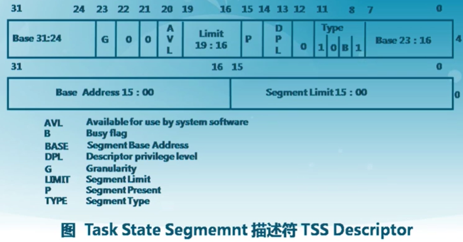

TSS段保存在内存中，通过Task Register特殊寄存器和全局描述符表GDT访问得到：

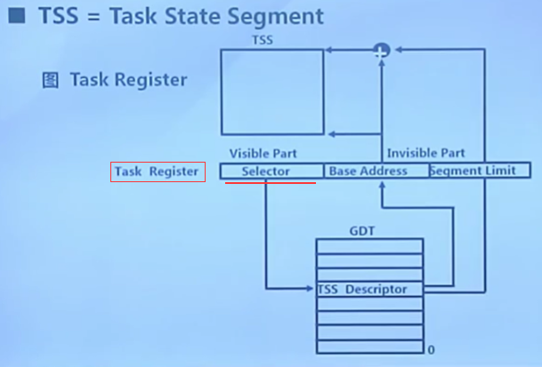

#### 段/页表

段机制概述：首先根据段寄存器中的段选择子部分到GDT中寻找对应的段描述符，最后对应到线性地址（物理地址，没有页机制时）

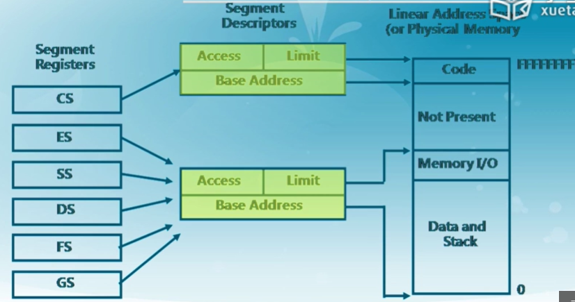

GDT表存放在内存中，访问效率低，因此，段选择子的隐藏部分中存放了Base Address部分，隐藏部分是由硬件控制的：


基址一直被存放在隐藏部分，直到选择子发生变化，才会更新基址内容。

#### Ucore建立段/页表

二级页表机制，首先建立页目录表、页表，页目录表的起始地址存放在CR3寄存器中：

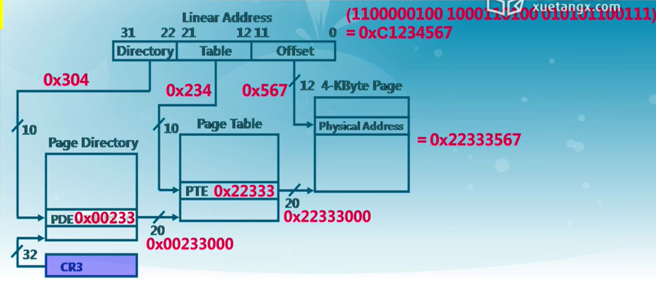

页目录表项：

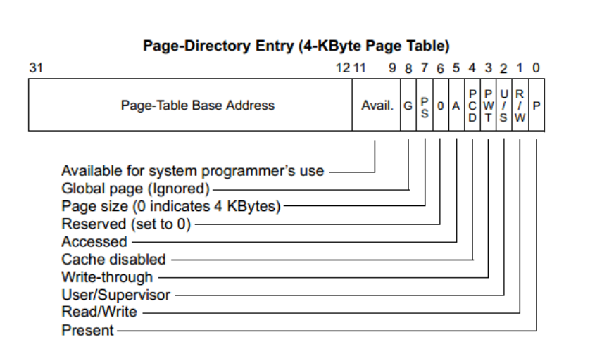

页表项：

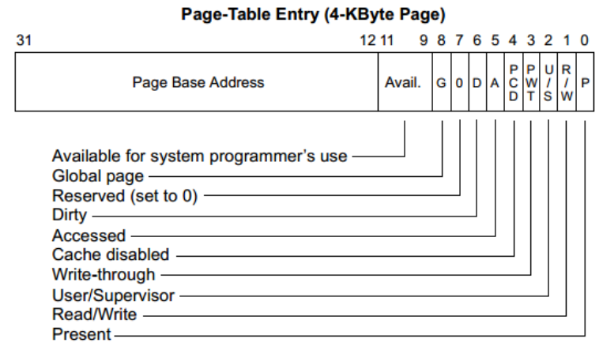

使能页机制：OS需要把CR0寄存器中的bit 31(PG)置为1

合并段机制和页机制：


### 练习1

实现 first-fit 连续物理内存分配算法（需要编程） 

实验要求：在实现first fit 内存分配算法的回收函数时，要考虑地址连续的空闲块之间的合并操作。提示：在建立空闲页块链表时，需要**按照空闲页块起始地址来排序**，形成一个有序的链表。**可能会修改default_pmm.c中的default_init，default_init_memmap，default_alloc_pages，default_free_pages等相关函数。**请仔细查看和理解default_pmm.c中的注释。 

first-fit连续物理内存分配算法以Page结构体为单位，其中空闲块链表按照起始地址排序，分配内存时，依次遍历空闲块，如果当前空闲块的大小大于等于所需大小，则分配该块内存，若有剩余内存部分，则插入原位置；释放内存时，依次遍历空闲块，若存在物理相邻的内存块，则合并，否则按照起始地址顺序插入适当的位置。

具体代码如下：

default_init()函数：（无改动）

初始化free_area结构体，free_list是链接Page中page_link部分的双向循环链表，nr_free是空闲内存块的总数。

```C
/*
 * (2) default_init: you can reuse the  demo default_init fun to init the free_list and set nr_free to 0.
 *              free_list is used to record the free mem blocks. nr_free is the total number for free mem blocks.
 */
static void
default_init(void) {
    list_init(&free_list);
    nr_free = 0;
}
```

default_init_memmap()函数：（无改动）

用具体的空闲页块的起始地址和空闲页块数初始化空闲块，首先需要初始化所有的空闲页块，也就是Page结构体的内容：

```C
/* *
 * struct Page - Page descriptor structures. Each Page describes one
 * physical page. In kern/mm/pmm.h, you can find lots of useful functions
 * that convert Page to other data types, such as phyical address.
 * */
struct Page {
    int ref;                        // page frame's reference counter
    uint32_t flags;                 // array of flags that describe the status of the page frame
    unsigned int property;          // the num of free block, used in first fit pm manager
    list_entry_t page_link;         // free list link
};
```

包括引用计数ref，页帧状态flags，只有连续页块中第一页的Page结构体中的property被设置为空闲页块数，之后页结构体中的property设置为0，page_link是Page结构中作为链表节点的部分。随后设置free_area结构体的内容，把当前空闲连续内存插入链表：

```C
/*
 * (3) default_init_memmap:   
 *              This fun is used to init a free block (with parameter: addr_base, page_number).
 *              First you should init each page (in memlayout.h) in this free block, include:
 *                  p->flags should be set bit PG_property (means this page is valid. In pmm_init fun (in pmm.c),
 *                  the bit PG_reserved is setted in p->flags)
 *                  if this page  is free and is not the first page of free block, p->property should be set to 0.
 *                  if this page  is free and is the first page of free block, p->property should be set to total num of block.
 *                  p->ref should be 0, because now p is free and no reference.
 *                  We can use p->page_link to link this page to free_list, (such as: list_add_before(&free_list, &(p->page_link)); )
 *              Finally, we should sum the number of free mem block: nr_free+=n
 */
static void
default_init_memmap(struct Page *base, size_t n) {
    assert(n > 0);
    struct Page *p = base;
    for (; p != base + n; p ++) {
        assert(PageReserved(p));
        p->flags = p->property = 0;
        set_page_ref(p, 0);
    }
    base->property = n;
    SetPageProperty(base);
    nr_free += n;
    list_add(&free_list, &(base->page_link));
}
```

default_alloc_pages()函数：（修改了//处内容）

分配连续空闲内存，遍历空闲块链表找到一块内存大小≥所需内存，若大小相同，则直接分配；若空闲块的内存大小大于所需内存，则先插入分配后剩余的续内存块，再把原先分配的内存块从空闲块链表中删除：

```C
/*
 * (4) default_alloc_pages: search find a first free block (block size >=n) in free list and resize the free block, return the addr
 *              of malloced block.
 *              (4.1) So you should search freelist like this:
 *                       list_entry_t le = &free_list;
 *                       while((le=list_next(le)) != &free_list) {
 *                       ....
 *                 (4.1.1) In while loop, get the struct page and check the p->property (record the num of free block) >=n?
 *                       struct Page *p = le2page(le, page_link);
 *                       if(p->property >= n){ ...
 *                 (4.1.2) If we find this p, then it' means we find a free block(block size >=n), and the first n pages can be malloced.
 *                     Some flag bits of this page should be setted: PG_reserved =1, PG_property =0
 *                     unlink the pages from free_list
 *                     (4.1.2.1) If (p->property >n), we should re-caluclate number of the the rest of this free block,
 *                           (such as: le2page(le,page_link))->property = p->property - n;)
 *                 (4.1.3)  re-caluclate nr_free (number of the the rest of all free block)
 *                 (4.1.4)  return p
 *               (4.2) If we can not find a free block (block size >=n), then return NULL
 */
static struct Page *
default_alloc_pages(size_t n) {
    assert(n > 0);
    if (n > nr_free) {
        return NULL;
    }
    struct Page *page = NULL;
    list_entry_t *le = &free_list;
    while ((le = list_next(le)) != &free_list) {
        struct Page *p = le2page(le, page_link);
        if (p->property >= n) {
            page = p;
            break;
        }
    }
    if (page != NULL) {
        if (page->property > n) {
            struct Page *p = page + n;
            p->property = page->property - n;
            //modified
            list_add_after(&(page->page_link), &(p->page_link));
    }
        //modified
        list_del(&(page->page_link));
        nr_free -= n;
        ClearPageProperty(page);
    }
    return page;
}
```

default_free_pages()函数：（修改了//处内容）

把已释放的内存块按起始地址的大小顺序插入空闲块链表，首先设置内存块为已释放的空闲状态，随后遍历空闲块链表，直到找到物理相邻的连续空闲内存并合并或者找到比当前连续空闲内存块尾指针大的连续空闲块并插入：

```C
/*
 * (5) default_free_pages: relink the pages into                                                                                                                                                                 free list, maybe merge small free blocks into big free blocks.
 *               (5.1) according the base addr of withdrawed blocks, search free list, find the correct position
 *                     (from low to high addr), and insert the pages. (may use list_next, le2page, list_add_before)
 *               (5.2) reset the fields of pages, such as p->ref, p->flags (PageProperty)
 *               (5.3) try to merge low addr or high addr blocks. Notice: should change some pages's p->property correctly.
 */
static void
default_free_pages(struct Page *base, size_t n) {
    assert(n > 0);
    struct Page *p = base;
    for (; p != base + n; p ++) {
        assert(!PageReserved(p) && !PageProperty(p));
        p->flags = 0;
        set_page_ref(p, 0);
    }
    base->property = n;
    SetPageProperty(base);
    list_entry_t *le = list_next(&free_list);
    while (le != &free_list) {
        p = le2page(le, page_link);
        le = list_next(le);
        if (base + base->property == p) {
            base->property += p->property;
            ClearPageProperty(p);
            list_del(&(p->page_link));
        }
        else if (p + p->property == base) {
            p->property += base->property;
            ClearPageProperty(base);
            base = p;
            list_del(&(p->page_link));
        }
        //modified
        else if (p > base + base -> property) {
            le=list_prev(le);
            break;
        }
    }
    //modified
    list_add_before(le,&(base->page_link));
    nr_free += n; 
}
```

### 练习2

实现寻找虚拟地址对应的页表项 （需要编程）

通过设置页表和对应的页表项，可建立虚拟内存地址和物理内存地址的对应关系。其中的get_pte函数是设置页表项环节中的一个重要步骤。此函数找到一个虚地址对应的二级页表项的内核虚地址，如果此二级页表项不存在，则分配一个包含此项的二级页表。本练习需要补全get_pte函数 in kern/mm/pmm.c，实现其功能。 

重点参考：“ 建立虚拟页和物理页帧的地址映射关系 ”一节

这个实验中需要注意在memset函数和用指针进行引用的操作对象必须是虚拟地址（逻辑地址），所以我们需要提前把物理地址转换为对应的虚拟地址再使用。根据pmm.c文件中的注释，主要思路是首先根据逻辑地址的首10bit找到对应的页目录表项，判断页目录表项的Present位，也即对应的二级页表是否存在，若不存在则根据参数create判断是否需要我们分配对应二级页表的物理页面，若不需要则直接返回NULL，若需要则先分配物理页面page，并设置权限，最后返回页目录表（一级页表）项中对应的二级页表项的地址，即要求中的内核虚地址。

具体代码如下：

```C
//get_pte - get pte and return the kernel virtual address of this pte for la
//        - if the PT contians this pte didn't exist, alloc a page for PT
// parameter:
//  pgdir:  the kernel virtual base address of PDT
//  la:     the linear address need to map
//  create: a logical value to decide if alloc a page for PT
// return value: the kernel virtual address of this pte
pte_t *
get_pte(pde_t *pgdir, uintptr_t la, bool create) {
    /* LAB2 EXERCISE 2: YOUR CODE
     *
     * If you need to visit a physical address, please use KADDR()
     * please read pmm.h for useful macros
     *
     * Maybe you want help comment, BELOW comments can help you finish the code
     *
     * Some Useful MACROs and DEFINEs, you can use them in below implementation.
     * MACROs or Functions:
     *   PDX(la) = the index of page directory entry of VIRTUAL ADDRESS la.
     *   KADDR(pa) : takes a physical address and returns the corresponding kernel virtual address.
     *   set_page_ref(page,1) : means the page be referenced by one time
     *   page2pa(page): get the physical address of memory which this (struct Page *) page  manages
     *   struct Page * alloc_page() : allocation a page
     *   memset(void *s, char c, size_t n) : sets the first n bytes of the memory area pointed by s
     *                                       to the specified value c.
     * DEFINEs:
     *   PTE_P           0x001                   // page table/directory entry flags bit : Present
     *   PTE_W           0x002                   // page table/directory entry flags bit : Writeable
     *   PTE_U           0x004                   // page table/directory entry flags bit : User can access
     */
    // (1) find page directory entry
    // pgdir:  the kernel virtual base address of PDT
    // PDX(la) = the index of page directory entry of VIRTUAL ADDRESS la.
    pde_t* pdep = &pgdir[PDX(la)];
    // (2) check if entry is not present
    if( (*pdep & PTE_P ) == NULL ) {
        // (3) check if creating is needed, then alloc page for page table
        struct Page* page;
        if(!create || (page=alloc_page())==NULL ) return NULL;
        // (4) set page reference
        set_page_ref(page,1);
        // (5) get physical address of page
        uintptr_t pa=page2pa(page);
        // (6) clear page content using memset
        memset(KADDR(pa),0,PGSIZE);
        // (7) set page directory entry's permission
        *pdep= (pa&~0x0FFF) | PTE_P | PTE_W | PTE_U;
    }
    // (8) return page table entry
    return &((pte_t*)KADDR(PDE_ADDR(*pdep)))[PTX(la)];
}
```

问题1：请描述页目录项（Page Directory Entry）和页表项（Page Table Entry）中每个组成部分的含义以及对ucore而言的潜在用处。 

请见准备知识部分的“Ucore建立段/页表”部分

问题2：如果ucore执行过程中访问内存，出现了页访问异常，请问硬件要做哪些事情？ 

见lab3内容


