# Ucore（一）

本文档主要记录清华大学操作系统课程的学习补充笔记，由于我在学校已经粗略学过一遍操作系统课程了，此文档主要做知识补充和重点理解用。

## Chapter1 操作系统概述

### 课后错题

1.下列选项中，操作系统提供给应用程序的接口是（ ）

**A.系统调用**

B.中断

C.库函数

D.原语

2.计算机开机后，操作系统最终被加载到（ ）

A.BIOS

B.ROM

C.EPROM

**D.RAM**

## Chapter2 启动、中断、异常和系统调用

### BIOS

#### 启动时计算机内存和磁盘布局

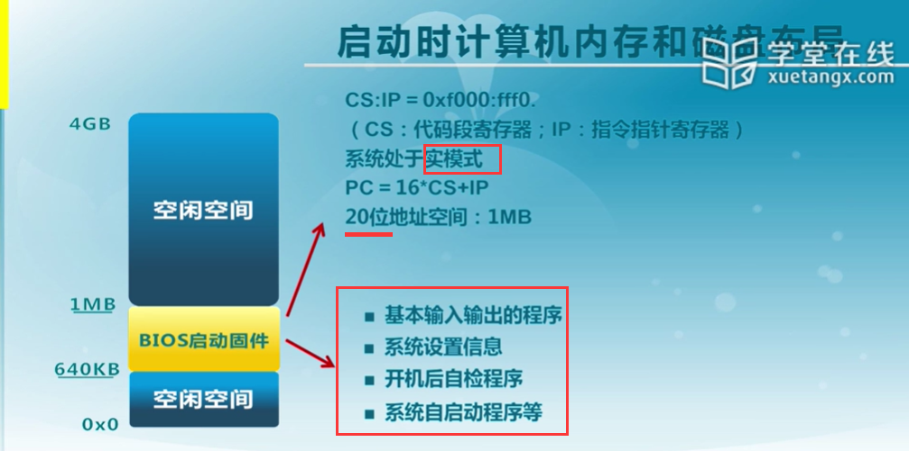

#### 加载程序的内存地址空间

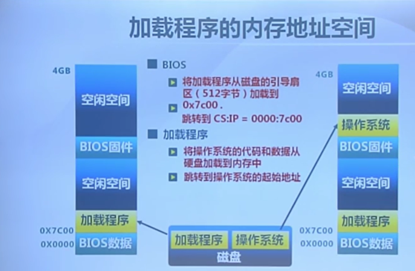

磁盘上有各种各样的文件系统，无法在BIOS中包含所有的文件系统格式，为了增加文件系统的灵活性，BIOS先将加载程序从磁盘的引导扇区加载到内存，在加载程序中识别磁盘上的文件系统，然后再读内核镜像并加载到内存，最后把控制权交给操作系统内核代码。

#### BIOS系统调用

BIOS以中断调用的方式提供了基本的I/O功能：

INT 10h：字符显示

INT 13h：磁盘扇区读写

INT 15h：检测内存大小

INT 16h：键盘输入

限制：只能在X86的实模式下工作

### 系统启动流程

#### 计算机启动流程

#### CPU初始化

CPU加电稳定后从0xFFFF0读第一条指令

- CS:IP=0xF0000:FFFF0
- 第一条指令是跳转指令

CPU初始状态是16位实模式，于是：

- CS:IP是16位寄存器
- 指令指针PC=16*CS+IP
- 最大地址空间是1MB

#### BIOS初始化

- 硬件自检POST
- 检测系统中内存和显卡等关键部件的存在和工作状态
- 查找并执行显卡等接口卡BIOS，进行设备初始化
- 执行系统BIOS，进行系统检测
  - 检测和配置系统中安装的即插即用设备
- 更新CMOS中的扩展系统配置数据ESCD
- 按指定启动顺序从软盘、硬盘或者光驱启动

#### 主引导记录MBR格式

启动代码：446字节

- 检查分区表正确性
- 加载并跳转到磁盘上的引导程序

硬盘分区表：64字节

- 描述分区状态和位置
- 每个分区描述信息占据16字节

结束标志字：2字节（0x55AA)

- 主引导记录的有效标志

#### 分区引导扇区格式

跳转指令：跳转到启动代码（与平台相关）

文件卷头：文件系统描述信息

启动代码：跳转到加载程序

结束标志：55AA

#### 加载程序（bootloader)

加载程序：从文件系统中读取启动配置信息

启动菜单：可选的操作系统内核列表和加载参数

操作系统内核：依据配置加载指定内核并跳转到内核执行

#### 系统启动规范

BIOS

- 固化到计算机主板上的程序
- 包括系统设置、自检程序和系统自启动程序
- BOIS-MBR（主引导记录）、BIOS-GPT（全局唯一标识分区表，解决多于四个分区的情况）、PXE（从网络启动）

UEFI

- 接口标准
- 在所有平台上一致的操作系统启动服务
- ==>安全性问题

### 中断、异常和系统调用

#### 内核的进入与退出

内核与外界打交道的途径如下：

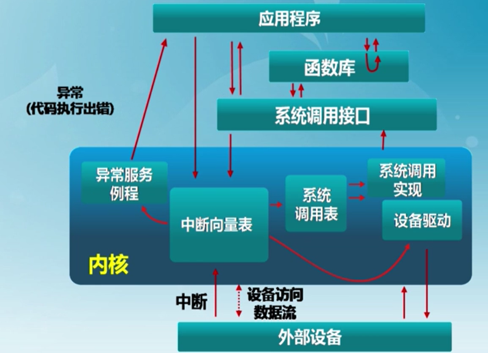

- 系统调用：应用程序主动向操作系统发出服务请求
- 异常：非法指令或者其他原因导致当前指令执行失败后的处理请求
- 中断：来自硬件设备的处理请求

#### 中断、异常和系统调用的比较

##### 源头

中断：外设

异常：应用程序意想不到的行为

系统调用：应用程序请求操作提供服务

##### 响应方式

中断：异步

异常：同步

系统调用：异步或者同步

##### 处理机制

中断：持续，对用户应用程序是透明的

异常：杀死或者重新执行意想不到的应用程序指令

系统调用：等待和持续

#### 中断处理机制

硬件处理：

- 在CPU初始化时设置中断使能标志
  - 依据内部或者外部事件**设置中断标志**
  - 依据中断向量**调用相应中断服务例程**

软件：

- 现场保存（编译器）
- 中断服务例程（服务例程）
- 清除中断标记（服务例程）
- 现场恢复（编译器）

#### 中断嵌套

硬件中断服务例程可以被打断：

- 不同硬件中断源可能会在硬件中断处理时出现
- 硬件中断服务例程需要临时禁止中断请求
- 中断请求会保持到CPU做出响应

异常服务例程可被打断：

- 异常服务例程执行时可能出现硬件中断

异常服务例程可嵌套：

- 异常服务例程可能出现缺页

#### 系统调用

系统调用使用INT 和 IRET 指令，用于堆栈切换和特权级的转换

函数调用使用CALL和RET指令，没有堆栈切换

##### 开销

系统调用比函数调用的开销大：

- 引导机制
- 建立内核堆栈
- 验证参数
- 内核态映射到用户态的地址空间：更新页面映射权限
- 内核态独立地址空间：TLB

系统调用的实现：

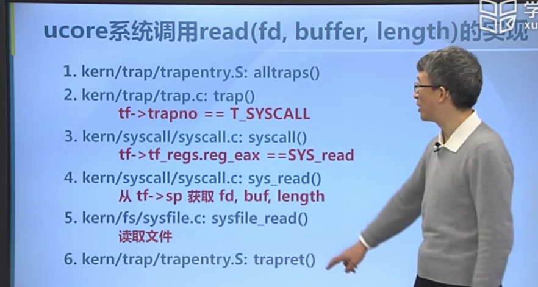

#### 课后错题

下列选项中，会导致用户进程从用户态切换到内核态的操作是（ ） 

1）整数除以0        2）sin()函数调用             3）read系统调用

答案：1、3

中断处理和子程序调用都需要压栈以保护现场。中断处理一定会保存而子程序调用不需要保存其内容的是（ ）

A. 程序计数器

B. 程序状态字寄存器 

C. 通用数据寄存器

D. 通用地址寄存器

答案：B

补充： 程序状态寄存器PSW是计算机系统的核心部件——运算器的一部分，PSW用来存放两类信息：一类是体现当前指令执行结果的各种状态信息，如有无进位（CY位），有无溢出（OV位），结果正负（SF位），结果是否为零（ZF位），奇偶标志位（P位）等；另一类是存放控制信息，如允许中断(IF位)，跟踪标志（TF位）等。 

### 物理内存管理：连续内存分配

#### 计算机体系结构和内存层次

计算机体系结构

- CPU:

- 内存：最小访问单位是8bit=1B

操作系统内存管理的目的

- 抽象：逻辑地址空间
- 保护：独立地址空间
- 共享：访问相同地址空间
- 虚拟化：更大地址空间

操作系统的内存管理方式

- 重定位
- 分段
- 分页
- 虚拟存储

#### 地址空间和地址生成

##### 地址空间定义

物理地址空间：硬件支持的地址空间

- 起始地址0，直到MAXsys（32位：0-4G-1）

逻辑地址空间：在CPU运行的进程看到的地址

- 起始地址为0，直到MAXprog

##### 地址生成时机和限制

- 编译时
  - 假设起始地址已知
  - 如果起始地址改变，必须重新编译
  - 例子：功能手机（老年机）
- 加载时
  - 编译时起始位置未知，编译器需要生成可重定位的代码
  - 加载时，生成绝对地址
  - 例子：智能手机
- 执行时
  - 执行时代码可移动
  - 需要地址转换的硬件支持
  - 例子：含有虚拟存储的系统

##### 地址生成过程

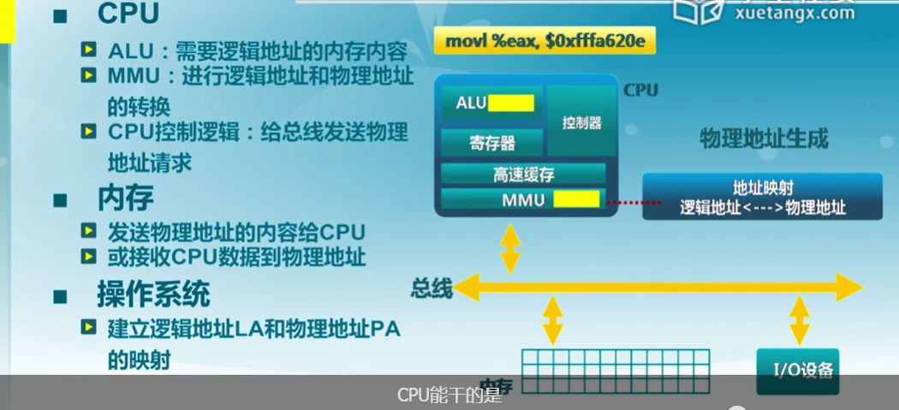

##### 地址检查

#### 连续内存分配

##### 内存碎片

连续内存分配：给进程分配一块不小于指定大小的连续的物理内存区域

内存碎片：空闲碎片不能被利用

- 外部碎片：分配单元之间的未被使用内存
- 内部碎片：分配单元内部的未被使用内存，取决于分配单元是否要取整

##### 动态分区分配

当程序被加载执行时，分配一个进程指定大小可变的分区（块、内存块），分区的地址是连续的

操作系统需要维护的数据结构：

- 所有进程的已分配分区
- 空闲分区：位置、大小

动态分区分配策略：

- 最先匹配（first-fit）
- 最佳匹配（best-fit）
- 最差匹配（last-fit）

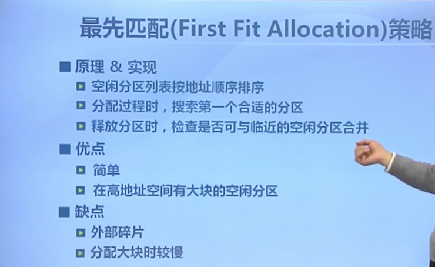

#### 碎片整理

通过调整进程占用的分区位置来减少或者避免分区碎片

碎片紧凑：

- 通过移动分配给进程的内存分区，以合并外部碎片
- 条件：所有的应用程序都是可动态重定位
- 需要考虑开销

分区对换：

- 通过抢占并回收处于等待状态进程的分区，以增大可用的内存空间
- 需要考虑交换哪个程序到外存？

#### 伙伴系统（Buddy System）

整个可分配的分区大小为2^u，当需要的分区大小为2^u-1<s≤2^u时，把整个块分配给该进程

- 如果s≤2^(i-1)-1，将大小为2^i的当前空闲分区划分为两个大小为2^(i-1)-1的空闲分区
- 重复划分过程，直到2^(i-1)<s<2^i，并把一个空闲分区分配给该进程

释放过程：

- 把释放的块放入空闲块数组
- 合并满足合并条件的空闲块，其中合并条件：大小相同2^i、地址相邻、起始地址较小的块的起始地址必须是2(i+1)的倍数

实例：Unix、Linux系统中内核存储分配

内碎片的最大为：2^s-1

伙伴系统的实现：

- 数据结构
  - 空闲块按大小和起始地址组织成二维数组
  - 初始状态：只有一个大小为2^u的空闲块
- 分配过程
  - 由小到大在空闲块数组中找最小的可用空闲块
  - 如果空闲块过大，对可用空闲块进行二等分，直到找到合适的可用空闲块

#### 课后错题

1.在使能分页机制的情况下，更合适的外碎片整理方法是( )

A.紧凑(compaction)

B.分区对换(Swapping in/out)

**C.都不是**

2.描述伙伴系统(Buddy System)特征正确的是()

**A.多个小空闲空间可合并为大的空闲空间**

**B.会产生外碎片**

**C.会产生内碎片**

D.都不对

解析：在伙伴系统中当空闲块满足一定条件时，多个小空闲空间可以合并成大的空闲空间；由于每次二分分配，可能会产生外碎片；由于每次分配的内存空间大小是2的整数幂，可能会产生内碎片

### 物理内存管理：非连续内存分配

#### 非连续分配的设计目标

连续分配的缺点：

- 分配给程序的物理内存必须连续
- 存在外碎片和内碎片
- 内存分配的动态修改困难
- => 内存利用率较低

非连续分配的设计目标：提高内存利用效率和管理灵活性

- 允许一个程序的使用非连续的物理地址空间
- 允许共享代码与数据
- 支持动态加载和动态链接

#### 段式存储管理

进程的段地址空间由多个段组成：

- 主代码段
- 子模块代码段
- 公用库代码段
- 堆栈段
- 堆数据
- 初始化数据段
- 符号表

更细粒度和灵活的分离与共享

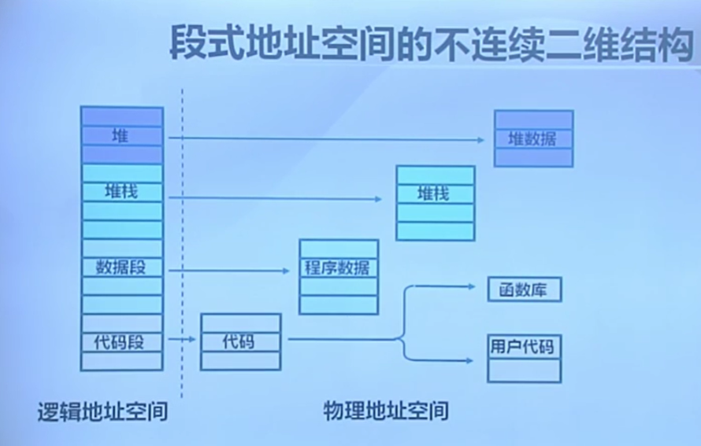

段的概念：

- 段表示访问方式和存储数据等属性相同的一段地址空间
- 对应一个连续的内存块
- 若干个段组成进程逻辑地址空间

段访问：逻辑地址由二元组(s,addr)表示

- s：段号
- addr：段内偏移

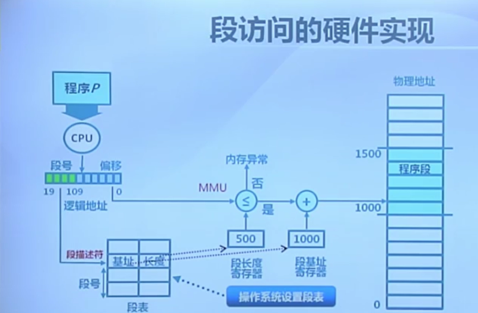

#### 页式存储管理

页帧： Frame

把物理地址空间划分为大小相同的基本分配单位（2的n次方）

页面：Page

把逻辑地址空间划分为相同大小的基本分配单位

=> 帧和页的大小必须是相同的

##### 帧（Frame）

内存物理地址的表示：二元组(f,o)

f：帧号（F位）  o：帧内偏移（S位）      物理地址=f*2^S+o

##### 页（Page）

进程逻辑地址的表示：二元组(p,o)

p：页号（P位）  o：页内偏移（S位）      虚拟地址=p*2^S+o

页内偏移=帧内偏移

通常：页号大小≠帧号大小

##### 页式存储中的地址映射

页到帧的映射

逻辑地址中的页号是连续的

物理地址中的帧号是不连续的

不是所有的页都有对应的帧

页表：保存了逻辑地址到物理地址之间的映射关系

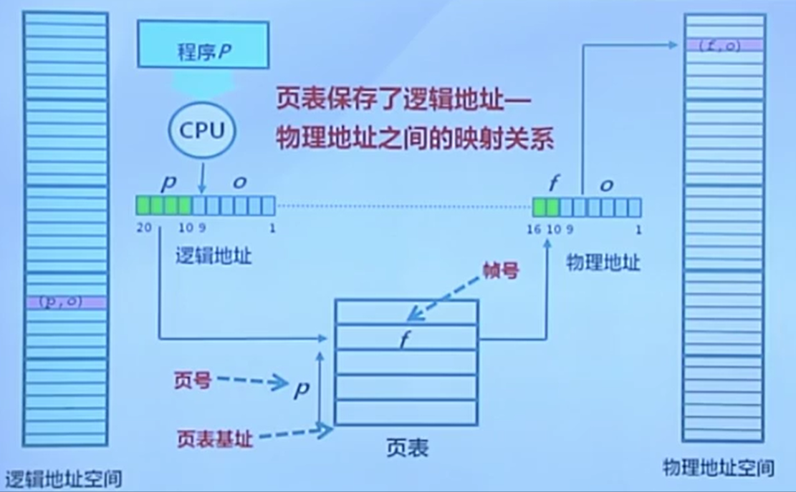

#### 页表

每个进程都有一个页表

- 每个页面对应一个页表项
- 随进程运行状态而动态变化
- 存放在页表基址寄存器（PTBR）

页表项组成：

- 帧号f
- 页表项标志：
  - 存在位：该页面是否有对应的物理页帧
  - 修改位
  - 引用位

##### 页式存储管理机制的性能问题

内存访问性能：访问一个内存单元需要2次内存访问（访问页表项和数据）

页表大小问题：页表可能非常大

如何处理？

- 缓存
- 间接访问

#### 快表和多级页表

对应于上述的两种解决方式，出现了快表和多级页表。

##### 快表TLB（Translation Look-aside Buffer）

缓存近期访问的页表项：

- TLB 使用关联存储实现，具备快速访问性能
- 如果TLB命中，物理页号可以很快被获取
- 如果TLB未命中，对应的表项被更新到TLB中

##### 多级页表

通过间接引用将页号分为k级：

- 建立页表“树”
- 减少每级页表的长度

访问次数：K+1次

访问过程：

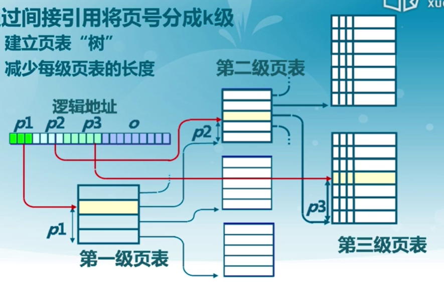

#### 反置页表

对用大地址空间（64-bit）系统，多级页表变得繁琐（访问内存次数大），逻辑地址空间增长速度快于物理地址空间

=> 页寄存器和反置页表：让页表与物理地址空间的大小相对应

每个帧与一个页寄存器关联，包括：

- 使用位：此帧是否被进程占用
- 占用页号：对应的页号p
- 保护位

页寄存器方案的特征:

- 优点：
  - 页表大小相对于物理内存而言比较小
  - 页表大小与逻辑地址空间大小无关
- 缺点：
  - 页表信息对调之后，需要依据帧号找对应的页号
  - 在页寄存器中搜索逻辑地址中的页号

 页寄存器机制中的地址转换：

- 对逻辑地址进行Hash映射，减少搜索范围
- 需要解决可能的冲突

用快表缓存页表项后的页寄存器搜索：

- 对逻辑地址进行Hash变换
- 在快表中查找对应的页表项
- 在有冲突时遍历冲突项链表
- 查找失败时，产生异常
- 受快表的容量和功耗限制

反置页表：基于Hash映射值查找对应页表项中的帧号，与页寄存器机制不同的是加入了进程表示PID一起做Hash，在快表中查找到符合的Hash值后检查PID和页号是否相同，若说明产生冲突，根据快表中存储的next字段遍历冲突链表，直到找到对应的物理帧号。

#### 段页式存储管理

段式存储在内存保护方面有优势，页式存储在内存利用和优化转移到后备存储方面有优势 ==> 段式和页式存储管理相结合

在段式存储管理的基础上，给每个段加一级页表

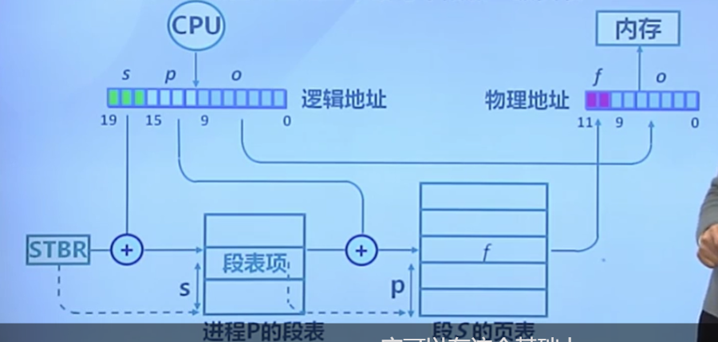

内存共享：

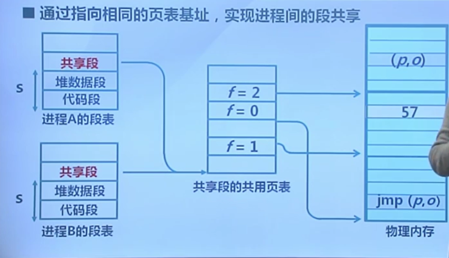

#### 课后错题

1.描述段管理机制正确的是( )

**A.段的大小可以不一致**

**B.段可以有重叠** 

**C.段可以有特权级** 

**D.段与段之间是可以不连续的**

2.描述页管理机制正确的是()

**A. 页表在内存中**

**B. 页可以是只读的**

**C. 页可以有特权级**

D. 上诉说法都不对

3.页表项标志位包括()

**A. 存在位(resident bit)**

**B. 修改位(dirty bit)**

**C. 引用位(clock/reference bit)**

**D. 只读位(read only OR read/write bit)** 

4.可有效应对大地址空间可采用的页表手段是()

**A. 多级页表**

**B. 反置页表**

C. 页寄存器方案

D. 单级页表

5.在ucore OS的管理下，如果CPU在ring3特权级执行访存指令，读属于ring0特权级的数据段中的内存单元，将出现的情况是（）

A. 产生外设中断

**B. 产生访存异常** 

C. CPU继续正常执行

D. 系统重启